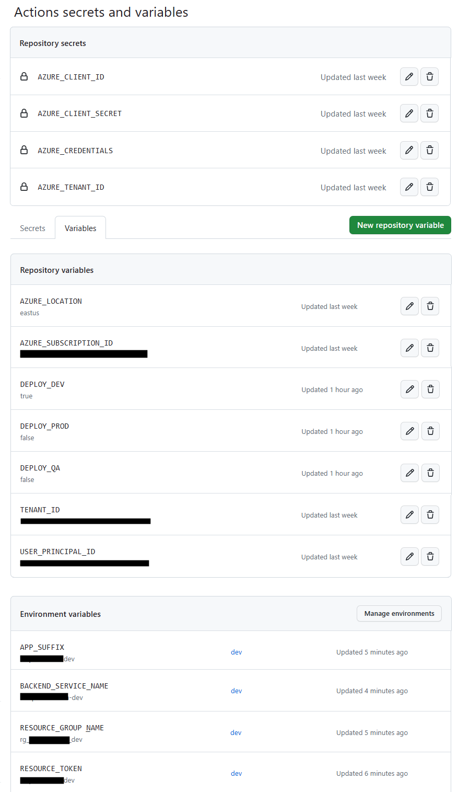

# GitHub Action Workflow Setup

## Workflow Credentials

The service principal that is running the workflows needs these rights granted at the subscription level in order to process the documents:

- Forms Recognizer
  - Cognitive Services OpenAI user
  - Cognitive Services User
- Search Service
  - Search Index Data Contributor
- Storage
  - Storage Blob Data Contributor

---

## Set up GitHub Secrets

The GitHub workflows in this project require several secrets set at the repository level.

---

### Azure Resource Creation Credentials

You need to set up the Azure Credentials secret in the GitHub Secrets at the Repository level before you do anything else.

See [https://docs.microsoft.com/en-us/azure/azure-resource-manager/templates/deploy-github-actions](https://docs.microsoft.com/en-us/azure/azure-resource-manager/templates/deploy-github-actions) for more info.

It should look something like this:

AZURE_CREDENTIALS:

``` bash
{
  "clientId": "<GUID>", 
  "clientSecret": "<GUID>", 
  "subscriptionId": "<GUID>", 
  "tenantId": "<GUID>"
}
```

The process also needs to do an azd auth login - use the same info provided above to create the following secrets.

``` bash
gh auth login

gh secret set AZURE_CLIENT_ID -b clientid-from-azure-credentials
gh secret set AZURE_CLIENT_SECRET -b clientsecret-from-azure-credentials
gh secret set AZURE_TENANT_ID -b tenantid-from-azure-credentials
```

---

### Bicep Configuration Values

These variables are used by the Bicep templates to configure the resource names that are deployed.  If used, make sure the APP_SUFFIX variable is unique to your deploy. It will be used as the basis for the website name and for all the other Azure resources, most of which must be globally unique.
To create these additional variables, customize and run this command:

Required Values:

``` bash
gh auth login

gh variable set AZURE_LOCATION -b eastus2
gh variable set AZURE_SUBSCRIPTION_ID -b yourSubscriptionId
gh variable set TENANT_ID -b servicePrincipalId-AD-TenantId
gh variable set USER_PRINCIPAL_ID -b youruserguid

gh variable set DEPLOY_DEV -b true
gh variable set DEPLOY_QA -b false
gh variable set DEPLOY_PROD -b false

gh variable set RESOURCE_GROUP_Name --env dev -b rg_<yourPreferredName>_dev
gh variable set RESOURCE_GROUP_Name --env qa -b rg_<yourPreferredName>_qa
gh variable set RESOURCE_GROUP_Name --env prod -b rg_<yourPreferredName>_prod

# if you use the random token, the deploy step needs it to be able to deploy to the proper resource
gh variable set RESOURCE_TOKEN --env dev -b <hashedkeydev>
gh variable set RESOURCE_TOKEN --env qa -b <hashedkeyqa>
gh variable set RESOURCE_TOKEN --env prod -b <hashedkeyprod>

# if you want to use a specific suffix for your resources instead of a random token, specify this value
gh variable set APP_SUFFIX --env dev -b xxxoaidev
gh variable set APP_SUFFIX --env qa -b xxxoaiqa
gh variable set APP_SUFFIX --env prod -b xxxoaiprod

# if you want to use a specific name for the web application
gh variable set BACKEND_SERVICE_NAME --env dev -b xxx-openai-search-dev
gh variable set BACKEND_SERVICE_NAME --env qa -b xxx-openai-search-qa
gh variable set BACKEND_SERVICE_NAME --env prod -b xxx-openai-search

# optional - if you have existing OpenAI resource specify it here
# note: you will have to update template-infra.yml to pass these variables in to main.bicep
gh variable set openAiServiceName -b youropenaiservice
gh variable set openAiResourceGroupName -b rg_services

# optional - if you have existing model deploys with different names
gh variable set AZURE_OPENAI_CHATGPT_DEPLOYMENT -b gpt35
gh variable set AZURE_OPENAI_GPT_DEPLOYMENT -b text-davinici-003

# optional - if you want specific names for other services, specify them here
# note: you will have to update template-infra.yml to pass these variables in to main.bicep
gh variable set openAiSkuName -b S0
gh variable set formRecognizerServiceName -b xxx
gh variable set formRecognizerSkuName -b S0
gh variable set searchServiceName -b xxx
gh variable set storageAccountName -b xxx

```

### Example of Secrets/Variables



---

## Purging Deleted Resources

If this deploy is run multiple times and resources have been deleted between runs, some of the resources are purge protected.  To remove them, run an az command or go into the portal to purge them manually. Go to one of these links below, click on the type of resource, then click on "Manage Deleted Resources" link to purge them.

### Cognitive Services Resources (i.e. OpenAI and Computer Vision)

[https://portal.azure.com/#view/Microsoft_Azure_ProjectOxford/CognitiveServicesHub/](https://portal.azure.com/#view/Microsoft_Azure_ProjectOxford/CognitiveServicesHub/)

### Applied AI Services Resources (i.e. Forms Recognizer)

[https://portal.azure.com/#view/Microsoft_Azure_ProjectOxford/AppliedAIHub/](https://portal.azure.com/#view/Microsoft_Azure_ProjectOxford/AppliedAIHub/)

---

## References

[Deploying ARM Templates with GitHub Actions](https://docs.microsoft.com/en-us/azure/azure-resource-manager/templates/deploy-github-actions)

[GitHub Secrets CLI](https://cli.github.com/manual/gh_secret_set)
