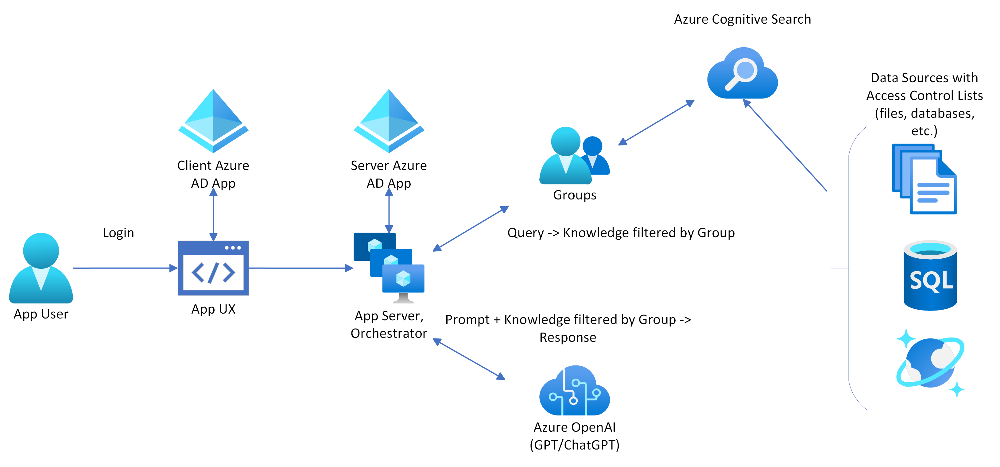

# Setting up optional login and document level access control

## Table of Contents

- [Requirements](#requirements)
- [Setting up Azure AD Apps](#setting-up-azure-ad-apps)
  - [Manual Setup](#manual-setup)
    - [Server App](#server-app)
    - [Client App](#client-app)
- [Optional Scripts](#optional-scripts)
  - [Azure Data Lake Storage Gen2 Setup](#azure-data-lake-storage-gen2-setup)
  - [Azure Data Lake Storage Gen2 Prep Docs](#azure-data-lake-storage-gen2-prep-docs)
  - [Manually managing Document Level Access Control](#manually-managing-document-level-access-control)
- [Environment Variables Reference](#environment-variables-reference)

This guide demonstrates how to add an optional login and document level access control system to the sample. This system can be used to restrict access to indexed data to specific users based on what [Azure Active Directory (Azure AD) groups](https://learn.microsoft.com/azure/active-directory/fundamentals/how-to-manage-groups) they are a part of, or their [user object id](https://learn.microsoft.com/partner-center/find-ids-and-domain-names#find-the-user-object-id).

## Requirements

**IMPORTANT:** In order to add optional login and document level access control, you'll need the following in addition to the normal sample requirements

* **Azure account permissions**: Your Azure account must have [permission to manage applications in Azure AD](https://learn.microsoft.com/azure/active-directory/develop/quickstart-register-app#prerequisites).

## Setting up Azure AD Apps

Two Azure AD apps must be registered in order to make the optional login and document level access control system work correctly.

### Manual Setup

The following instructions explain how to setup the two apps using the Azure Portal.

#### Setting up the Server App

* Sign in to the [Azure portal](https://portal.azure.com/).
* Select the Azure AD Service.
* In the left hand menu, select **Application Registrations**.
* Select **New Registration**.
  * In the **Name** section, enter a meaningful application name. This name will be displayed to users of the app, for example `Azure Search OpenAI Demo API`.
  * Under **Supported account types**, select **Accounts in this organizational directory only**.
* Select **Register** to create the application
* In the app's registration screen, find the **Application (client) ID**.
  * Run the following `azd` command to save this ID: `azd env set AZURE_SERVER_APP_ID <Application (client) ID>`.
* Select **Certificates & secrets** in the left hand menu.
* In the **Client secrets** section, select **New client secret**.
  * Type a description, for example `Azure Search OpenAI Demo Key`.
  * Select one of the available key durations.
  * The generated key value will be displayed after you select **Add**.
  * Copy the generated key value and run the following `azd` command to save this ID: `azd env set AZURE_SERVER_APP_SECRET <generated key value>`.
* Select **API Permissions** in the left hand menu. By default, the [delegated `User.Read`](https://learn.microsoft.com/graph/permissions-reference#user-permissions) permission should be present. This permission is required to read the signed-in user's profile to get the security information used for document level access control. If this permission is not present, it needs to be added to the application.
  * Select **Add a permission**, and then **Microsoft Graph**.
  * Select **Delegated permissions**.
  * Search for and and select `User.Read`.
  * Select **Add permissions**.
* Select **Expose an API** in the left hand menu. The server app works by using the [On Behalf Of Flow](https://learn.microsoft.com/azure/active-directory/develop/v2-oauth2-on-behalf-of-flow#protocol-diagram), which requires the server app to expose at least 1 API.
  * The application must define a URI to expose APIs. Select **Add** next to **Application ID URI**.
    * By default, the Application ID URI is set to `api://<application client id>`. Accept the default by selecting **Save**.
  * Under **Scopes defined by this API**, select **Add a scope**.
  * Fill in the values as indicated:
    * For **Scope name**, use **access_as_user**.
    * For **Who can consent?**, select **Admins and users**.
    * For **Admin consent display name**, type **Access Azure Search OpenAI Demo API**.
    * For **Admin consent description**, type **Allows the app to access Azure Search OpenAI Demo API as the signed-in user.**.
    * For **User consent display name**, type **Access Azure Search OpenAI Demo API**.
    * For **User consent description**, type **Allow the app to access Azure Search OpenAI Demo API on your behalf**.
    * Leave **State** set to **Enabled**.
    * Select **Add scope** at the bottom to save the scope.
* (Optional) Enable group claims. Include which Azure AD groups the user is part of as part of the login in the [optional claims](https://learn.microsoft.com/azure/active-directory/develop/optional-claims). The groups are used for [optional security filtering](https://learn.microsoft.com/azure/search/search-security-trimming-for-azure-search) in the search results.
  * In the left hand menu, select **Token configuration**
  * Under **Optional claims**, select **Add groups claim**
  * Select which [group types](https://learn.microsoft.com/azure/active-directory/hybrid/connect/how-to-connect-fed-group-claims) to include in the claim. Note that a [overage claim](https://learn.microsoft.com/azure/active-directory/develop/access-token-claims-reference#groups-overage-claim) will be emitted if the user is part of too many groups. In this case, the API server will use the [Microsoft Graph](https://learn.microsoft.com/graph/api/user-list-memberof?view=graph-rest-*0&tabs=http) to list the groups the user is part of instead of relying on the groups in the claim.
  * Select **Add** to save your changes

#### Client App

* Sign in to the [Azure portal](https://portal.azure.com/).
* Select the Azure AD Service.
* In the left hand menu, select **Application Registrations**.
* Select **New Registration**.
  * In the **Name** section, enter a meaningful application name. This name will be displayed to users of the app, for example `Azure Search OpenAI Demo Web App`.
  * Under **Supported account types**, select **Accounts in this organizational directory only**.
  * Under `Redirect URI (optional)` section, select `Single-page application (SPA)` in the combo-box and enter the following redirect URI:
    * If you are running the sample locally, use `http://localhost:50505/redirect`.
    * If you are running the sample, use the endpoint provided by `azd up`: `https://<your-endpoint>.azurewebsites.net/redirect`.
    * If you are running the sample from codespaces, use the codespaces endpoint: `https://<your-codespace>-50505.app.github.dev/`
* Select **Register** to create the application
* In the app's registration screen, find the **Application (client) ID**.
  * Run the following `azd` command to save this ID: `azd env set AZURE_CLIENT_APP_ID <Application (client) ID>`.
* In the left hand menu, select **Authentication**.
  * Under **Implicit grant and hybrid flows**, select **ID Tokens (used for implicit and hybrid flows)**
  * Select **Save**
* In the left hand menu, select **API permissions**. You will add permission to access the **access_as_user** API on the server app. This permission is required for the [On Behalf Of Flow](https://learn.microsoft.com/azure/active-directory/develop/v2-oauth2-on-behalf-of-flow#protocol-diagram) to work.
  * Select **Add a permission**, and then **My APIs**.
  * In the list of applications, select your server application **Azure Search OpenAI Demo API**
  * Ensure **Delegated permissions** is selected.
  * In the **Select permissions** section, select the **access_as_user** permission
  * Select **Add permissions**.

#### Configure Server App Known Client Applications

Consent from the user must be obtained for use of the client and server app. The client app can prompt the user for consent through a dialog when they log in. The server app has no ability to show a dialog for consent. Client apps can be [added to the list of known clients](https://learn.microsoft.com/en-us/azure/active-directory/develop/v2-oauth2-on-behalf-of-flow#gaining-consent-for-the-middle-tier-application) to access the server app, so a consent dialog is shown for the server app.

* Navigate to the server app registration
* In the left hand menu, select **Manifest**
* Replace `"knownClientApplications": []` with `"knownClientApplications": ["<client application id>"]`
* Select **Save**

#### Testing

Ensure you run `azd env set AZURE_USE_AUTHENTICATION` to enable the login UI once you have setup the two Azure AD apps before you deploy or run the application. The login UI will not appear unless all [required environment variables](#environment-variables-reference) have been setup.

In both the chat and ask a question modes, an optional **Use oid security filter** and **Use groups security filter** will appear. The oid (User ID) filter maps to the `oids` field and the groups (Group ID) filter maps to the `groups` field in the search index. Use the optional scripts included in the sample to manage values for these fields.

It's possible that your tenant admin has placed a restriction on consent to apps with [unverified publishers](https://learn.microsoft.com/azure/active-directory/develop/publisher-verification-overview). In this case, only admins may consent to the client and server apps, and normal user accounts are unable to use the login system until the admin consents on behalf of the entire organization.

## Optional scripts

Two optional scripts are provided that allow easier setup of sample data with document level access control.

### Azure Data Lake Storage Gen2 Setup

[Azure Data Lake Storage Gen2](https://learn.microsoft.com/en-us/azure/storage/blobs/data-lake-storage-introduction) implements an [access control model](https://learn.microsoft.com/en-us/azure/storage/blobs/data-lake-storage-access-control) that can be used for document level access control. The [adlsgen2setup.ps1](./scripts/adlsgen2setup.ps1) script uploads the sample data included in the [data](./data) folder to a Data Lake Storage Gen2 storage account.

In order to use this script, an existing Data Lake Storage Gen2 storage account. Run `azd env set AZURE_ADLS_GEN2_STORAGE_ACCOUNT <your-storage-account>` prior to running the script.

To run the script, run the following command: `./scripts/adlsgen2setup.ps1`. The script performs the following steps:
* Creates 3 example [groups](https://learn.microsoft.com/azure/active-directory/fundamentals/how-to-manage-groups): `GPTKB_AdminTest`, `GPTKB_EmployeeTest`, `GPTKB_HRTest`
* Creates a filesystem / container `gptkbcontainer` in the storage account.
* Creates two directories, `benefitinfo` and `employeeinfo` in the `gptkbcontainer` filesystem / container.
* Uploads the sample PDFs into both directories.
* [Recursively sets Access Control Lists (ACLs)](https://learn.microsoft.com/azure/storage/blobs/data-lake-storage-acl-cli) on the `benefitinfo` and `employeeinfo` for the following groups:
  * `GPTKB_AdminTest`: Can read all files in `gptkbcontainer`.
  * `GPTKB_EmployeeTest`: Can only read files in `employeeinfo`.
  * `GPTKB_HRTest`: Can read files in both `employeeinfo` and `benefitinfo`.

In order to use the sample access control, you need to join these groups in your Azure AD tenant.

Note that this optional scripts may not work in codespaces if your administrator has applied a [Conditional Access policy](https://learn.microsoft.com/azure/active-directory/conditional-access/overview) to your tenant.

### Azure Data Lake Storage Gen2 Prep Docs

Once a Data Lake Storage Gen2 storage account has been setup with sample data and access control lists, the [prepdocs.ps1](./scripts/prepdocs.ps1) can be used to automatically process PDFs in the storage account and store them with their [access control lists in the search index](https://learn.microsoft.com/azure/storage/blobs/data-lake-storage-access-control).

To run this script with a Data Lake Storage Gen2 account, first set the following environment variables:

* `AZURE_ADLS_GEN2_STORAGE_ACCOUNT`: Name of existing [Data Lake Storage Gen2 storage account](https://learn.microsoft.com/azure/storage/blobs/data-lake-storage-introduction).
* (Optional) `AZURE_ADLS_GEN2_FILESYSTEM`: Name of existing Data Lake Storage Gen2 filesystem / container in the storage account. If empty, `gptkbcontainer` is used.
* (Optional) `AZURE_ADLS_GEN2_FILESYSTEM_PATH`: Specific path in the Data Lake Storage Gen2 filesystem / container to process. Only PDFs contained in this path will be processed.

Once the environment variables are set, run the script using the following command: `./scripts/prepdocs.ps1` or `./scripts/prepdocs.sh`.

### Manually managing Document Level Access Control

Manually enable document level access control on a search index and manually set access control values using the [manageacl.ps1](./scripts/manageacl.ps1) script.

Run `azd up` or manually set the `AZURE_SEARCH_SERVICE` and `AZURE_SEARCH_INDEX` environment variables prior to running the script.

To run the script, the following parameters are used:
* `./scripts/manageacls.ps1 --enable-acls`: Creates the required `oids` (User ID) and `groups` (Group IDs) [security filter](https://learn.microsoft.com/azure/search/search-security-trimming-for-azure-search) fields for document level access control on your index. Does nothing if these fields already exist
* `./scripts/manageacls.ps1 --document [name-of-pdf.pdf] --acl-type [oids or groups]--acl-action view`: Prints access control values associated with either User IDs or Group IDs for a specific document. Example to view all Group IDs from the Benefit_Options PDF: `./scripts/manageacls.ps1 --document Benefit_Options.pdf --acl-type oids --acl-action view`.
* `./scripts/manageacls.ps1 --document [name-of-pdf.pdf] --acl-type [oids or groups]--acl-action add --acl [ID of group or user]`: Adds an access control value associated with either User IDs or Group IDs for a specific document. Example to add a Group ID to the Benefit_Options PDF: `./scripts/manageacls.ps1 --document Benefit_Options.pdf --acl-type groups --acl-action add --acl xxxxxxxx-xxxx-xxxx-xxxx-xxxxxxxxxxxx`.
* `./scripts/manageacls.ps1 --document [name-of-pdf.pdf] --acl-type [oids or groups]--acl-action remove_all`: Removes all access control values associated with either User IDs or Group IDs for a specific document. Example to remove all Group IDs from the Benefit_Options PDF: `./scripts/manageacls.ps1 --document Benefit_Options.pdf --acl-type groups --acl-action remove_all`.
* `./scripts/manageacls.ps1 --document [name-of-pdf.pdf] --acl-type [oids or groups]--acl-action remove --acl [ID of group or user]`: Removes an access control value associated with either User IDs or Group IDs for a specific document. Example to remove a specific User ID from the Benefit_Options PDF: `./scripts/manageacls.ps1 --document Benefit_Options.pdf --acl-type oids --acl-action remove --acl xxxxxxxx-xxxx-xxxx-xxxx-xxxxxxxxxxxx`.

## Environment Variables Reference

The following environment variables are used to setup the optional login and document level access control:

* `AZURE_USE_AUTHENTICATION`: Enables Azure AD based optional login and document level access control. Set to true before running `azd up`.
* `AZURE_SERVER_APP_ID`: (Required) Application ID of the Azure AD app for the API server.
* `AZURE_SERVER_APP_SECRET`: [Client secret](https://learn.microsoft.com/en-us/azure/active-directory/develop/v2-oauth2-client-creds-grant-flow) used by the API server to authenticate using the Azure AD API server app.
* `AZURE_CLIENT_APP_ID`: Application ID of the Azure AD app for the client UI.
* `AZURE_TENANT_ID`: [Tenant ID](https://learn.microsoft.com/azure/active-directory/fundamentals/how-to-find-tenant) associated with the Azure AD used for login and document level access control. This is set automatically by `azd up`.
* `AZURE_ADLS_GEN2_STORAGE_ACCOUNT`: (Optional) Name of existing [Data Lake Storage Gen2 storage account](https://learn.microsoft.com/azure/storage/blobs/data-lake-storage-introduction) for storing sample data with [access control lists](https://learn.microsoft.com/azure/storage/blobs/data-lake-storage-access-control). Only used with the optional Data Lake Storage Gen2 [setup](#azure-data-lake-storage-gen2-setup) and [prep docs](#azure-data-lake-storage-gen2-prep-docs) scripts.
* `AZURE_ADLS_GEN2_STORAGE_FILESYSTEM`: (Optional) Name of existing [Data Lake Storage Gen2 filesystem](https://learn.microsoft.com/azure/storage/blobs/data-lake-storage-introduction) for storing sample data with [access control lists](https://learn.microsoft.com/azure/storage/blobs/data-lake-storage-access-control). Only used with the optional Data Lake Storage Gen2 [setup](#azure-data-lake-storage-gen2-setup) and [prep docs](#azure-data-lake-storage-gen2-prep-docs) scripts.
* `AZURE_ADLS_GEN2_STORAGE_FILESYSTEM_PATH`: (Optional) Name of existing path in a [Data Lake Storage Gen2 filesystem](https://learn.microsoft.com/azure/storage/blobs/data-lake-storage-introduction) for storing sample data with [access control lists](https://learn.microsoft.com/azure/storage/blobs/data-lake-storage-access-control). Only used with the optional Data Lake Storage Gen2 [prep docs](#azure-data-lake-storage-gen2-prep-docs) script.
