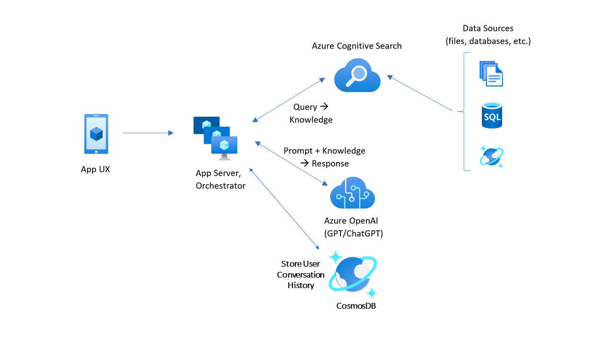
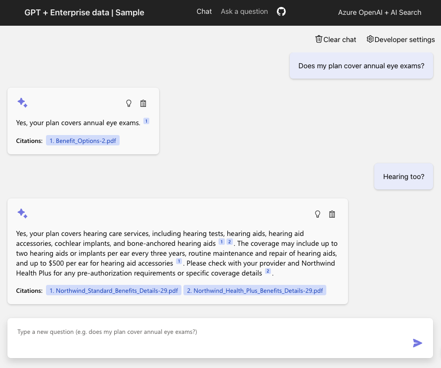

# ChatGPT + Enterprise data with Azure OpenAI and Cognitive Search

This sample demonstrates a few approaches for creating ChatGPT-like experiences over your own data using the Retrieval Augmented Generation pattern. It uses Azure OpenAI Service to access the ChatGPT model (gpt-35-turbo), and Azure Cognitive Search for data indexing and retrieval.

The repo includes sample data so it's ready to try end to end. In this sample application we use a fictitious company called Contoso Electronics, and the experience allows its employees to ask questions about the benefits, internal policies, as well as job descriptions and roles.

## Features

* Chat and Q&A interfaces
* Explores various options to help users evaluate the trustworthiness of responses with citations, tracking of source content, etc.
* Shows possible approaches for data preparation, prompt construction, and orchestration of interaction between model (ChatGPT) and retriever (Cognitive Search)
* Settings directly in the UX to tweak the behavior and experiment with options

## Getting Started

> **IMPORTANT:** In order to deploy and run this example, you'll need an **Azure subscription with access enabled for the Azure OpenAI service**. You can request access [here](https://aka.ms/oaiapply).

### Prerequisites

- Azure Developer CLI (install from [here](https://aka.ms/azure-dev/install))
- Python (install from [here](https://www.python.org/downloads/))
    - **Imporant**: Python and the pip package manager must be in the path in Windows for the setup scripts to work.
- Node.js (install from [here](https://nodejs.org/en/download/))
- Git (install from [here](https://git-scm.com/downloads))
- Powershell (pwsh) (install from [here](https://github.com/powershell/powershell))
   - **Imporant**: Ensure you can run pwsh.exe from a PowerShell command. If this fails, you likely need to upgrade PowerShell.

### Installation

Starting from scratch:
1. Create a new folder and switch to it in the terminal
2. Run "azd up -t azure-search-openai-demo"
    * For the target location, the regions that currently support the models used in this sample are East US or South Central US. For an up-to-date list of regions and models, check [here](https://learn.microsoft.com/en-us/azure/cognitive-services/openai/concepts/models)

Deploying or re-deploying a local clone of the repo:
* Simply run "azd up"

Running locally:
* Run `./app/start.cmd` or run the "VS Code Task: Start App" to start the project locally.

** AZURE RESOURCE COSTS ** by default this sample will create Azure App Service and Azure Cognitive Search resources that have a monthly cost. You can switch them to free versions of each of them if you want to avoid this cost by changing the parameters file under the infra folder (though there are some limits to consider; for example, you can have up to 1 free Cognitive Search resource per subscription.)

### Quickstart

* In Azure: navigate to the Azure WebApp deployed by azd. The URL is printed out when azd completes (as "Endpoint"), or you can find it in the Azure portal.
* Running locally: navigate to 127.0.0.1:5000

Once in the web app:
* Try different topics in chat or Q&A context. For chat, try follow up questions, clarifications, ask to simplify or elaborate on answer, etc.
* Explore citations and sources
* Click on "settings" to try different options, tweak prompts, etc.

## Resources

* [Revolutionize your Enterprise Data with ChatGPT: Next-gen Apps w/ Azure OpenAI and Cognitive Search](https://aka.ms/entgptsearchblog)
* [Azure Cognitive Search](https://learn.microsoft.com/azure/search/search-what-is-azure-search)
* [Azure OpenAI Service](https://learn.microsoft.com/azure/cognitive-services/openai/overview)

### Note
>Note: The PDF documents used in this demo contain information generated using a language model (Azure OpenAI Service). The information contained in these documents is only for demonstration purposes and does not reflect the opinions or beliefs of Microsoft. Microsoft makes no representations or warranties of any kind, express or implied, about the completeness, accuracy, reliability, suitability or availability with respect to the information contained in this document. All rights reserved to Microsoft.

### FAQ

***Question***: Why do we need to break up the PDFs into chunks when Azure Cognitive Search supports searching large documents?

***Answer***: Chunking allows us to limit the amount of information we send to OpenAI due to token limits. By breaking up the content, it allows us to easily find potential chunks of text that we can inject into OpenAI. The menthod of chunking we use leverages a sliding window of text such that sentences that end one chunk will start the next. This allows us to reduce the chance of losing the context of the text.

