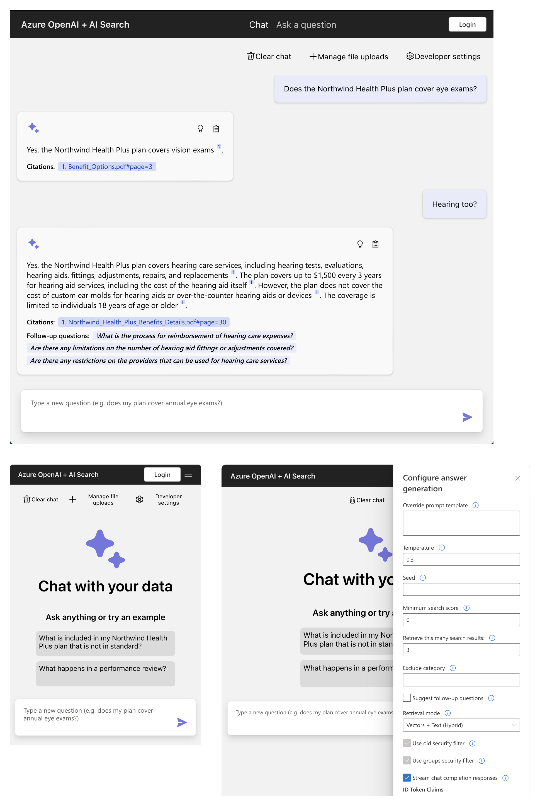

<!--
---
name: RAG chat app with your data (Python)
description: Chat with your domain data using Azure OpenAI and Azure AI Search.
languages:
- python
- typescript
- bicep
- azdeveloper
products:
- azure-openai
- azure-cognitive-search
- azure-app-service
- azure
page_type: sample
urlFragment: azure-search-openai-demo
---
-->

# RAG chat app with Azure OpenAI and Azure AI Search (Python)

This solution creates a ChatGPT-like frontend experience over your own documents using RAG (Retrieval Augmented Generation). It uses Azure OpenAI Service to access GPT models, and Azure AI Search for data indexing and retrieval.

This solution's backend is written in Python. There are also [**JavaScript**](https://aka.ms/azai/js/code), [**.NET**](https://aka.ms/azai/net/code), and [**Java**](https://aka.ms/azai/java/code) samples based on this one. Learn more about [developing AI apps using Azure AI Services](https://aka.ms/azai).

[](https://github.com/codespaces/new?hide_repo_select=true&ref=main&repo=599293758&machine=standardLinux32gb&devcontainer_path=.devcontainer%2Fdevcontainer.json&location=WestUs2)
[](https://vscode.dev/redirect?url=vscode://ms-vscode-remote.remote-containers/cloneInVolume?url=https://github.com/azure-samples/azure-search-openai-demo)

## Important Security Notice

This template, the application code and configuration it contains, has been built to showcase Microsoft Azure specific services and tools. We strongly advise our customers not to make this code part of their production environments without implementing or enabling additional security features. See our [productionizing guide](docs/productionizing.md) for tips, and consult the [Azure OpenAI Landing Zone reference architecture](https://techcommunity.microsoft.com/blog/azurearchitectureblog/azure-openai-landing-zone-reference-architecture/3882102) for more best practices.

## Table of Contents

- [Features](#features)
- [Azure account requirements](#azure-account-requirements)
  - [Cost estimation](#cost-estimation)
- [Getting Started](#getting-started)
  - [GitHub Codespaces](#github-codespaces)
  - [VS Code Dev Containers](#vs-code-dev-containers)
  - [Local environment](#local-environment)
- [Deploying](#deploying)
  - [Deploying again](#deploying-again)
- [Running the development server](#running-the-development-server)
- [Using the app](#using-the-app)
- [Clean up](#clean-up)
- [Guidance](#guidance)
  - [Resources](#resources)



[📺 Watch a video overview of the app.](https://youtu.be/3acB0OWmLvM)

This sample demonstrates a few approaches for creating ChatGPT-like experiences over your own data using the Retrieval Augmented Generation pattern. It uses Azure OpenAI Service to access a GPT model (gpt-4.1-mini), and Azure AI Search for data indexing and retrieval.

The repo includes sample data so it's ready to try end to end. In this sample application we use a fictitious company called Contoso Electronics, and the experience allows its employees to ask questions about the benefits, internal policies, as well as job descriptions and roles.

## Features

- Chat (multi-turn) and Q&A (single turn) interfaces
- Renders citations and thought process for each answer
- Includes settings directly in the UI to tweak the behavior and experiment with options
- Integrates Azure AI Search for indexing and retrieval of documents, with support for [many document formats](/docs/data_ingestion.md#supported-document-formats) as well as [integrated vectorization](/docs/data_ingestion.md#overview-of-integrated-vectorization)
- Optional usage of [GPT-4 with vision](/docs/gpt4v.md) to reason over image-heavy documents
- Optional addition of [speech input/output](/docs/deploy_features.md#enabling-speech-inputoutput) for accessibility
- Optional automation of [user login and data access](/docs/login_and_acl.md) via Microsoft Entra
- Performance tracing and monitoring with Application Insights

### Architecture Diagram


## Azure account requirements

**IMPORTANT:** In order to deploy and run this example, you'll need:

- **Azure account**. If you're new to Azure, [get an Azure account for free](https://azure.microsoft.com/free/cognitive-search/) and you'll get some free Azure credits to get started. See [guide to deploying with the free trial](docs/deploy_freetrial.md).
- **Azure account permissions**:
  - Your Azure account must have `Microsoft.Authorization/roleAssignments/write` permissions, such as [Role Based Access Control Administrator](https://learn.microsoft.com/azure/role-based-access-control/built-in-roles#role-based-access-control-administrator-preview), [User Access Administrator](https://learn.microsoft.com/azure/role-based-access-control/built-in-roles#user-access-administrator), or [Owner](https://learn.microsoft.com/azure/role-based-access-control/built-in-roles#owner). If you don't have subscription-level permissions, you must be granted [RBAC](https://learn.microsoft.com/azure/role-based-access-control/built-in-roles#role-based-access-control-administrator-preview) for an existing resource group and [deploy to that existing group](docs/deploy_existing.md#resource-group).
  - Your Azure account also needs `Microsoft.Resources/deployments/write` permissions on the subscription level.

### Cost estimation

Pricing varies per region and usage, so it isn't possible to predict exact costs for your usage.
However, you can try the [Azure pricing calculator](https://azure.com/e/e3490de2372a4f9b909b0d032560e41b) for the resources below.

- Azure Container Apps: Default host for app deployment as of 10/28/2024. See more details in [the ACA deployment guide](docs/azure_container_apps.md). Consumption plan with 1 CPU core, 2 GB RAM, minimum of 0 replicas. Pricing with Pay-as-You-Go. [Pricing](https://azure.microsoft.com/pricing/details/container-apps/)
- Azure Container Registry: Basic tier. [Pricing](https://azure.microsoft.com/pricing/details/container-registry/)
- Azure App Service: Only provisioned if you deploy to Azure App Service following [the App Service deployment guide](docs/azure_app_service.md).  Basic Tier with 1 CPU core, 1.75 GB RAM. Pricing per hour. [Pricing](https://azure.microsoft.com/pricing/details/app-service/linux/)
- Azure OpenAI: Standard tier, GPT and Ada models. Pricing per 1K tokens used, and at least 1K tokens are used per question. [Pricing](https://azure.microsoft.com/pricing/details/cognitive-services/openai-service/)
- Azure AI Document Intelligence: SO (Standard) tier using pre-built layout. Pricing per document page, sample documents have 261 pages total. [Pricing](https://azure.microsoft.com/pricing/details/form-recognizer/)
- Azure AI Search: Basic tier, 1 replica, free level of semantic search. Pricing per hour. [Pricing](https://azure.microsoft.com/pricing/details/search/)
- Azure Blob Storage: Standard tier with ZRS (Zone-redundant storage). Pricing per storage and read operations. [Pricing](https://azure.microsoft.com/pricing/details/storage/blobs/)
- Azure Cosmos DB: Only provisioned if you enabled [chat history with Cosmos DB](docs/deploy_features.md#enabling-persistent-chat-history-with-azure-cosmos-db). Serverless tier. Pricing per request unit and storage. [Pricing](https://azure.microsoft.com/pricing/details/cosmos-db/)
- Azure AI Vision: Only provisioned if you enabled [GPT-4 with vision](docs/gpt4v.md). Pricing per 1K transactions. [Pricing](https://azure.microsoft.com/pricing/details/cognitive-services/computer-vision/)
- Azure AI Content Understanding: Only provisioned if you enabled [media description](docs/deploy_features.md#enabling-media-description-with-azure-content-understanding). Pricing per 1K images. [Pricing](https://azure.microsoft.com/pricing/details/content-understanding/)
- Azure Monitor: Pay-as-you-go tier. Costs based on data ingested. [Pricing](https://azure.microsoft.com/pricing/details/monitor/)

To reduce costs, you can switch to free SKUs for various services, but those SKUs have limitations.
See this guide on [deploying with minimal costs](docs/deploy_lowcost.md) for more details.

⚠️ To avoid unnecessary costs, remember to take down your app if it's no longer in use,
either by deleting the resource group in the Portal or running `azd down`.

## Getting Started

You have a few options for setting up this project.
The easiest way to get started is GitHub Codespaces, since it will setup all the tools for you,
but you can also [set it up locally](#local-environment) if desired.

### GitHub Codespaces

You can run this repo virtually by using GitHub Codespaces, which will open a web-based VS Code in your browser:

[](https://github.com/codespaces/new?hide_repo_select=true&ref=main&repo=599293758&machine=standardLinux32gb&devcontainer_path=.devcontainer%2Fdevcontainer.json&location=WestUs2)

Once the codespace opens (this may take several minutes), open a terminal window.

### VS Code Dev Containers

A related option is VS Code Dev Containers, which will open the project in your local VS Code using the [Dev Containers extension](https://marketplace.visualstudio.com/items?itemName=ms-vscode-remote.remote-containers):

1. Start Docker Desktop (install it if not already installed)
2. Open the project:
    [](https://vscode.dev/redirect?url=vscode://ms-vscode-remote.remote-containers/cloneInVolume?url=https://github.com/azure-samples/azure-search-openai-demo)

3. In the VS Code window that opens, once the project files show up (this may take several minutes), open a terminal window.

### Local environment

1. Install the required tools:

    - [Azure Developer CLI](https://aka.ms/azure-dev/install)
    - [Python 3.9, 3.10, or 3.11](https://www.python.org/downloads/)
      - **Important**: Python and the pip package manager must be in the path in Windows for the setup scripts to work.
      - **Important**: Ensure you can run `python --version` from console. On Ubuntu, you might need to run `sudo apt install python-is-python3` to link `python` to `python3`.
    - [Node.js 20+](https://nodejs.org/download/)
    - [Git](https://git-scm.com/downloads)
    - [Powershell 7+ (pwsh)](https://github.com/powershell/powershell) - For Windows users only.
      - **Important**: Ensure you can run `pwsh.exe` from a PowerShell terminal. If this fails, you likely need to upgrade PowerShell.

2. Create a new folder and switch to it in the terminal.
3. Run this command to download the project code:

    ```shell
    azd init -t azure-search-openai-demo
    ```

    Note that this command will initialize a git repository, so you do not need to clone this repository.

## Deploying

The steps below will provision Azure resources and deploy the application code to Azure Container Apps. To deploy to Azure App Service instead, follow [the app service deployment guide](docs/azure_app_service.md).

1. Login to your Azure account:

    ```shell
    azd auth login
    ```

    For GitHub Codespaces users, if the previous command fails, try:

   ```shell
    azd auth login --use-device-code
    ```

1. Create a new azd environment:

    ```shell
    azd env new
    ```

    Enter a name that will be used for the resource group.
    This will create a new folder in the `.azure` folder, and set it as the active environment for any calls to `azd` going forward.
1. (Optional) This is the point where you can customize the deployment by setting environment variables, in order to [use existing resources](docs/deploy_existing.md), [enable optional features (such as auth or vision)](docs/deploy_features.md), or [deploy low-cost options](docs/deploy_lowcost.md), or [deploy with the Azure free trial](docs/deploy_freetrial.md).
1. Run `azd up` - This will provision Azure resources and deploy this sample to those resources, including building the search index based on the files found in the `./data` folder.
    - **Important**: Beware that the resources created by this command will incur immediate costs, primarily from the AI Search resource. These resources may accrue costs even if you interrupt the command before it is fully executed. You can run `azd down` or delete the resources manually to avoid unnecessary spending.
    - You will be prompted to select two locations, one for the majority of resources and one for the OpenAI resource, which is currently a short list. That location list is based on the [OpenAI model availability table](https://learn.microsoft.com/azure/cognitive-services/openai/concepts/models#model-summary-table-and-region-availability) and may become outdated as availability changes.
1. After the application has been successfully deployed you will see a URL printed to the console.  Click that URL to interact with the application in your browser.
It will look like the following:


> NOTE: It may take 5-10 minutes after you see 'SUCCESS' for the application to be fully deployed. If you see a "Python Developer" welcome screen or an error page, then wait a bit and refresh the page.

### Deploying again

If you've only changed the backend/frontend code in the `app` folder, then you don't need to re-provision the Azure resources. You can just run:

```shell
azd deploy
```

If you've changed the infrastructure files (`infra` folder or `azure.yaml`), then you'll need to re-provision the Azure resources. You can do that by running:

```shell
azd up
```

## Running the development server

You can only run a development server locally **after** having successfully run the `azd up` command. If you haven't yet, follow the [deploying](#deploying) steps above.

1. Run `azd auth login` if you have not logged in recently.
2. Start the server:

  Windows:

  ```shell
  ./app/start.ps1
  ```

  Linux/Mac:

  ```shell
  ./app/start.sh
  ```

  VS Code: Run the "VS Code Task: Start App" task.

It's also possible to enable hotloading or the VS Code debugger.
See more tips in [the local development guide](docs/localdev.md).

## Using the app

- In Azure: navigate to the Azure WebApp deployed by azd. The URL is printed out when azd completes (as "Endpoint"), or you can find it in the Azure portal.
- Running locally: navigate to 127.0.0.1:50505

Once in the web app:

- Try different topics in chat or Q&A context. For chat, try follow up questions, clarifications, ask to simplify or elaborate on answer, etc.
- Explore citations and sources
- Click on "settings" to try different options, tweak prompts, etc.

## Clean up

To clean up all the resources created by this sample:

1. Run `azd down`
2. When asked if you are sure you want to continue, enter `y`
3. When asked if you want to permanently delete the resources, enter `y`

The resource group and all the resources will be deleted.

## Guidance

You can find extensive documentation in the [docs](docs/README.md) folder:

- Deploying:
  - [Troubleshooting deployment](docs/deploy_troubleshooting.md)
    - [Debugging the app on App Service](docs/appservice.md)
  - [Deploying with azd: deep dive and CI/CD](docs/azd.md)
  - [Deploying with existing Azure resources](docs/deploy_existing.md)
  - [Deploying from a free account](docs/deploy_lowcost.md)
  - [Enabling optional features](docs/deploy_features.md)
    - [All features](docs/deploy_features.md)
    - [Login and access control](docs/login_and_acl.md)
    - [GPT-4 Turbo with Vision](docs/gpt4v.md)
    - [Reasoning](docs/reasoning.md)
    - [Private endpoints](docs/deploy_private.md)
    - [Agentic retrieval](docs/agentic_retrieval.md)
  - [Sharing deployment environments](docs/sharing_environments.md)
- [Local development](docs/localdev.md)
- [Customizing the app](docs/customization.md)
- [HTTP Protocol](docs/http_protocol.md)
- [Data ingestion](docs/data_ingestion.md)
- [Evaluation](docs/evaluation.md)
- [Safety evaluation](docs/safety_evaluation.md)
- [Monitoring with Application Insights](docs/monitoring.md)
- [Productionizing](docs/productionizing.md)
- [Alternative RAG chat samples](docs/other_samples.md)

### Resources

- [📖 Docs: Get started using the chat with your data sample](https://learn.microsoft.com/azure/developer/python/get-started-app-chat-template?toc=%2Fazure%2Fdeveloper%2Fai%2Ftoc.json&bc=%2Fazure%2Fdeveloper%2Fai%2Fbreadcrumb%2Ftoc.json&tabs=github-codespaces)
- [📖 Blog: Revolutionize your Enterprise Data with ChatGPT: Next-gen Apps w/ Azure OpenAI and AI Search](https://techcommunity.microsoft.com/blog/azure-ai-services-blog/revolutionize-your-enterprise-data-with-chatgpt-next-gen-apps-w-azure-openai-and/3762087)
- [📖 Docs: Azure AI Search](https://learn.microsoft.com/azure/search/search-what-is-azure-search)
- [📖 Docs: Azure OpenAI Service](https://learn.microsoft.com/azure/cognitive-services/openai/overview)
- [📖 Docs: Comparing Azure OpenAI and OpenAI](https://learn.microsoft.com/azure/cognitive-services/openai/overview#comparing-azure-openai-and-openai/)
- [📖 Blog: Access Control in Generative AI applications with Azure AI Search](https://techcommunity.microsoft.com/blog/azure-ai-services-blog/access-control-in-generative-ai-applications-with-azure-ai-search/3956408)
- [📺 Talk: Quickly build and deploy OpenAI apps on Azure, infused with your own data](https://www.youtube.com/watch?v=j8i-OM5kwiY)
- [📺 Talks: AI Chat App Hack series](https://www.youtube.com/playlist?list=PL5lwDBUC0ag6_dGZst5m3G72ewfwXLcXV)

### Getting help

This is a sample built to demonstrate the capabilities of modern Generative AI apps and how they can be built in Azure.
For help with deploying this sample, please post in [GitHub Issues](/issues). If you're a Microsoft employee, you can also post in [our Teams channel](https://aka.ms/azai-python-help).

This repository is supported by the maintainers, _not_ by Microsoft Support,
so please use the support mechanisms described above, and we will do our best to help you out.

### Note

>Note: The PDF documents used in this demo contain information generated using a language model (Azure OpenAI Service). The information contained in these documents is only for demonstration purposes and does not reflect the opinions or beliefs of Microsoft. Microsoft makes no representations or warranties of any kind, express or implied, about the completeness, accuracy, reliability, suitability or availability with respect to the information contained in this document. All rights reserved to Microsoft.
