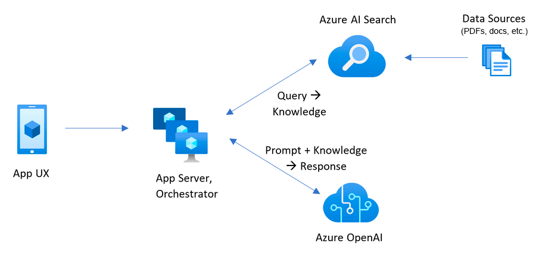
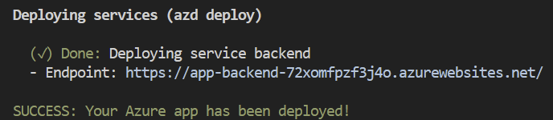

<!--
---
name: Aplikacja czatu RAG z Twoimi danymi (Python)
description: Czatuj z danymi swojej domeny używając Azure OpenAI i Azure AI Search.
languages:
- python
- typescript
- bicep
- azdeveloper
products:
- azure-openai
- azure-cognitive-search
- azure-app-service
- azure
page_type: sample
urlFragment: azure-search-openai-demo
---
-->

# Aplikacja czatu RAG z Azure OpenAI i Azure AI Search (Python)

To rozwiązanie tworzy interfejs podobny do ChatGPT nad Twoimi własnymi dokumentami przy użyciu wzorca RAG (Retrieval Augmented Generation). Wykorzystuje Azure OpenAI Service do dostępu do modeli GPT oraz Azure AI Search do indeksowania i wyszukiwania danych.

Backend tego rozwiązania został napisany w Pythonie. Dostępne są również przykłady w [**JavaScript**](https://aka.ms/azai/js/code), [**.NET**](https://aka.ms/azai/net/code) i [**Java**](https://aka.ms/azai/java/code) oparte na tym samym rozwiązaniu. Dowiedz się więcej o [tworzeniu aplikacji AI przy użyciu Azure AI Services](https://aka.ms/azai).

[](https://github.com/codespaces/new?hide_repo_select=true&ref=main&repo=599293758&machine=standardLinux32gb&devcontainer_path=.devcontainer%2Fdevcontainer.json&location=WestUs2)
[](https://vscode.dev/redirect?url=vscode://ms-vscode-remote.remote-containers/cloneInVolume?url=https://github.com/azure-samples/azure-search-openai-demo)

## Ważne informacje dotyczące bezpieczeństwa

Ten szablon, kod aplikacji i zawarta w nim konfiguracja zostały zbudowane w celu zaprezentowania konkretnych usług i narzędzi Microsoft Azure. Zdecydowanie zalecamy naszym klientom, aby nie umieszczali tego kodu w swoich środowiskach produkcyjnych bez wdrożenia lub włączenia dodatkowych funkcji bezpieczeństwa. Zobacz nasz [przewodnik po produkcjonizacji](docs/productionizing.md) (w języku angielskim) po wskazówki i zapoznaj się z [architekturą referencyjną Azure OpenAI Landing Zone](https://techcommunity.microsoft.com/blog/azurearchitectureblog/azure-openai-landing-zone-reference-architecture/3882102) po więcej dobrych praktyk.

## Spis treści

- [Funkcje](#funkcje)
- [Wymagania dotyczące konta Azure](#wymagania-dotyczące-konta-azure)
  - [Szacowanie kosztów](#szacowanie-kosztów)
- [Pierwsze kroki](#pierwsze-kroki)
  - [GitHub Codespaces](#github-codespaces)
  - [VS Code Dev Containers](#vs-code-dev-containers)
  - [Środowisko lokalne](#środowisko-lokalne)
- [Wdrażanie](#wdrażanie)
  - [Ponowne wdrażanie](#ponowne-wdrażanie)
- [Uruchamianie serwera deweloperskiego](#uruchamianie-serwera-deweloperskiego)
- [Korzystanie z aplikacji](#korzystanie-z-aplikacji)
- [Czyszczenie zasobów](#czyszczenie-zasobów)
- [Wskazówki](#wskazówki)
  - [Zasoby](#zasoby)


[📺 Zobacz film prezentujący aplikację.](https://youtu.be/3acB0OWmLvM)

Ten przykład demonstruje kilka podejść do tworzenia doświadczeń podobnych do ChatGPT nad własnymi danymi przy użyciu wzorca Retrieval Augmented Generation. Wykorzystuje Azure OpenAI Service do dostępu do modelu GPT (gpt-4.1-mini) oraz Azure AI Search do indeksowania i wyszukiwania danych.

Repozytorium zawiera przykładowe dane, więc jest gotowe do użycia od razu. W tej przykładowej aplikacji używamy fikcyjnej firmy o nazwie Zava, a doświadczenie pozwala jej pracownikom zadawać pytania dotyczące świadczeń, wewnętrznych polityk, a także opisów stanowisk i ról.

## Funkcje

- Interfejsy czatu (wieloetapowy) i Q&A (pojedyncze pytanie)
- Wyświetlanie cytatów i procesu myślenia dla każdej odpowiedzi
- Ustawienia bezpośrednio w interfejsie użytkownika do modyfikowania zachowania i eksperymentowania z opcjami
- Integracja z Azure AI Search do indeksowania i wyszukiwania dokumentów, z obsługą [wielu formatów dokumentów](/docs/data_ingestion.md#supported-document-formats) oraz [chmurowego pozyskiwania danych](/docs/data_ingestion.md#cloud-data-ingestion)
- Opcjonalne użycie [modeli multimodalnych](/docs/multimodal.md) do rozumowania nad dokumentami zawierającymi dużo obrazów
- Opcjonalne dodanie [wejścia/wyjścia mowy](/docs/deploy_features.md#enabling-speech-inputoutput) dla dostępności
- Opcjonalna automatyzacja [logowania użytkownika i dostępu do danych](/docs/login_and_acl.md) za pośrednictwem Microsoft Entra
- Śledzenie wydajności i monitorowanie za pomocą Application Insights

### Diagram architektury



## Wymagania dotyczące konta Azure

**WAŻNE:** Aby wdrożyć i uruchomić ten przykład, potrzebujesz:

- **Konta Azure**. Jeśli jesteś nowy w Azure, [uzyskaj bezpłatne konto Azure](https://azure.microsoft.com/free/cognitive-search/) i otrzymasz darmowe środki Azure na rozpoczęcie. Zobacz [przewodnik po wdrażaniu z bezpłatną wersją próbną](docs/deploy_freetrial.md).
- **Uprawnień konta Azure**:
  - Twoje konto Azure musi mieć uprawnienia `Microsoft.Authorization/roleAssignments/write`, takie jak [Administrator kontroli dostępu opartej na rolach](https://learn.microsoft.com/azure/role-based-access-control/built-in-roles#role-based-access-control-administrator-preview), [Administrator dostępu użytkowników](https://learn.microsoft.com/azure/role-based-access-control/built-in-roles#user-access-administrator) lub [Właściciel](https://learn.microsoft.com/azure/role-based-access-control/built-in-roles#owner). Jeśli nie masz uprawnień na poziomie subskrypcji, musisz otrzymać [RBAC](https://learn.microsoft.com/azure/role-based-access-control/built-in-roles#role-based-access-control-administrator-preview) dla istniejącej grupy zasobów i [wdrożyć do tej istniejącej grupy](docs/deploy_existing.md#resource-group).
  - Twoje konto Azure wymaga również uprawnień `Microsoft.Resources/deployments/write` na poziomie subskrypcji.

### Szacowanie kosztów

Ceny różnią się w zależności od regionu i użycia, dlatego nie jest możliwe przewidzenie dokładnych kosztów dla Twojego użycia.
Możesz jednak wypróbować [kalkulator cen Azure](https://azure.com/e/e3490de2372a4f9b909b0d032560e41b) dla poniższych zasobów.

- Azure Container Apps: Domyślny host dla wdrożenia aplikacji od 28.10.2024. Zobacz więcej szczegółów w [przewodniku wdrażania ACA](docs/azure_container_apps.md). Plan zużycia z 1 rdzeniem CPU, 2 GB RAM, minimum 0 replik. Cennik Pay-as-You-Go. [Cennik](https://azure.microsoft.com/pricing/details/container-apps/)
- Azure Container Registry: Warstwa Basic. [Cennik](https://azure.microsoft.com/pricing/details/container-registry/)
- Azure App Service: Udostępniany tylko wtedy, gdy wdrażasz do Azure App Service zgodnie z [przewodnikiem wdrażania App Service](docs/azure_app_service.md). Warstwa Basic z 1 rdzeniem CPU, 1,75 GB RAM. Cennik za godzinę. [Cennik](https://azure.microsoft.com/pricing/details/app-service/linux/)
- Azure OpenAI: Warstwa Standard, modele GPT i Ada. Cennik za 1000 tokenów użytych, przy czym co najmniej 1000 tokenów jest używanych na pytanie. [Cennik](https://azure.microsoft.com/pricing/details/cognitive-services/openai-service/)
- Azure AI Document Intelligence: Warstwa SO (Standard) wykorzystująca wstępnie zbudowany układ. Cennik za stronę dokumentu, przykładowe dokumenty mają łącznie 261 stron. [Cennik](https://azure.microsoft.com/pricing/details/form-recognizer/)
- Azure AI Search: Warstwa Basic, 1 replika, darmowy poziom wyszukiwania semantycznego. Cennik za godzinę. [Cennik](https://azure.microsoft.com/pricing/details/search/)
- Azure Blob Storage: Warstwa Standard z ZRS (magazyn strefowo nadmiarowy). Cennik za przechowywanie i operacje odczytu. [Cennik](https://azure.microsoft.com/pricing/details/storage/blobs/)
- Azure Cosmos DB: Udostępniany tylko wtedy, gdy włączysz [historię czatu z Cosmos DB](docs/deploy_features.md#enabling-persistent-chat-history-with-azure-cosmos-db). Warstwa Serverless. Cennik za jednostkę żądania i przechowywanie. [Cennik](https://azure.microsoft.com/pricing/details/cosmos-db/)
- Azure AI Vision: Udostępniany tylko wtedy, gdy włączysz [podejście multimodalne](docs/multimodal.md). Cennik za 1000 transakcji. [Cennik](https://azure.microsoft.com/pricing/details/cognitive-services/computer-vision/)
- Azure AI Content Understanding: Udostępniany tylko wtedy, gdy włączysz [opis multimediów](docs/deploy_features.md#enabling-media-description-with-azure-content-understanding). Cennik za 1000 obrazów. [Cennik](https://azure.microsoft.com/pricing/details/content-understanding/)
- Azure Monitor: Warstwa Pay-as-you-go. Koszty oparte na pozyskanych danych. [Cennik](https://azure.microsoft.com/pricing/details/monitor/)

Aby obniżyć koszty, możesz przełączyć się na darmowe SKU dla różnych usług, ale te SKU mają ograniczenia.
Zobacz ten przewodnik dotyczący [wdrażania z minimalnymi kosztami](docs/deploy_lowcost.md) po więcej szczegółów.

⚠️ Aby uniknąć niepotrzebnych kosztów, pamiętaj o usunięciu aplikacji, jeśli nie jest już używana,
poprzez usunięcie grupy zasobów w Portalu lub uruchomienie `azd down`.

## Pierwsze kroki

Masz kilka opcji konfiguracji tego projektu.
Najprostszym sposobem na rozpoczęcie jest GitHub Codespaces, ponieważ skonfiguruje wszystkie narzędzia za Ciebie,
ale możesz również [skonfigurować go lokalnie](#środowisko-lokalne), jeśli chcesz.

### GitHub Codespaces

Możesz uruchomić to repozytorium wirtualnie za pomocą GitHub Codespaces, który otworzy VS Code w przeglądarce:

[](https://github.com/codespaces/new?hide_repo_select=true&ref=main&repo=599293758&machine=standardLinux32gb&devcontainer_path=.devcontainer%2Fdevcontainer.json&location=WestUs2)

Po otwarciu codespace (może to potrwać kilka minut), otwórz okno terminala.

### VS Code Dev Containers

Powiązaną opcją jest VS Code Dev Containers, który otworzy projekt w lokalnym VS Code przy użyciu [rozszerzenia Dev Containers](https://marketplace.visualstudio.com/items?itemName=ms-vscode-remote.remote-containers):

1. Uruchom Docker Desktop (zainstaluj, jeśli nie jest jeszcze zainstalowany)
2. Otwórz projekt:
    [](https://vscode.dev/redirect?url=vscode://ms-vscode-remote.remote-containers/cloneInVolume?url=https://github.com/azure-samples/azure-search-openai-demo)

3. W oknie VS Code, które się otworzy, gdy pojawią się pliki projektu (może to potrwać kilka minut), otwórz okno terminala.

### Środowisko lokalne

1. Zainstaluj wymagane narzędzia:

    - [Azure Developer CLI](https://aka.ms/azure-dev/install)
    - [Python 3.10, 3.11, 3.12, 3.13 lub 3.14](https://www.python.org/downloads/)
      - **Ważne**: Python i menedżer pakietów pip muszą być w ścieżce w systemie Windows, aby skrypty konfiguracyjne działały.
      - **Ważne**: Upewnij się, że możesz uruchomić `python --version` z konsoli. W Ubuntu możesz potrzebować uruchomić `sudo apt install python-is-python3`, aby połączyć `python` z `python3`.
    - [Node.js 20+](https://nodejs.org/download/)
    - [Git](https://git-scm.com/downloads)
    - [Powershell 7+ (pwsh)](https://github.com/powershell/powershell) - Tylko dla użytkowników Windows.
      - **Ważne**: Upewnij się, że możesz uruchomić `pwsh.exe` z terminala PowerShell. Jeśli to się nie powiedzie, prawdopodobnie musisz zaktualizować PowerShell.

2. Utwórz nowy folder i przejdź do niego w terminalu.
3. Uruchom to polecenie, aby pobrać kod projektu:

    ```shell
    azd init -t azure-search-openai-demo
    ```

    Zauważ, że to polecenie zainicjuje repozytorium git, więc nie musisz klonować tego repozytorium.

## Wdrażanie

Poniższe kroki będą aprowizować zasoby Azure i wdrożą kod aplikacji do Azure Container Apps. Aby wdrożyć do Azure App Service zamiast tego, postępuj zgodnie z [przewodnikiem wdrażania App Service](docs/azure_app_service.md).

1. Zaloguj się na swoje konto Azure:

    ```shell
    azd auth login
    ```

    Dla użytkowników GitHub Codespaces, jeśli poprzednie polecenie się nie powiedzie, spróbuj:

   ```shell
    azd auth login --use-device-code
    ```

1. Utwórz nowe środowisko azd:

    ```shell
    azd env new
    ```

    Wprowadź nazwę, która będzie używana dla grupy zasobów.
    To utworzy nowy folder w folderze `.azure` i ustawi go jako aktywne środowisko dla wszelkich wywołań `azd` w przyszłości.
1. (Opcjonalnie) To jest moment, w którym możesz dostosować wdrożenie, ustawiając zmienne środowiskowe, aby [użyć istniejących zasobów](docs/deploy_existing.md), [włączyć opcjonalne funkcje (takie jak uwierzytelnianie lub wizja)](docs/deploy_features.md) lub [wdrożyć opcje niskokosztowe](docs/deploy_lowcost.md), lub [wdrożyć z bezpłatną wersją próbną Azure](docs/deploy_freetrial.md).
1. Uruchom `azd up` - To będzie aprowizować zasoby Azure i wdrożyć ten przykład do tych zasobów, w tym budowanie indeksu wyszukiwania na podstawie plików znajdujących się w folderze `./data`.
    - **Ważne**: Pamiętaj, że zasoby utworzone przez to polecenie będą generować natychmiastowe koszty, głównie z zasobu AI Search. Te zasoby mogą generować koszty, nawet jeśli przerwiesz polecenie przed jego pełnym wykonaniem. Możesz uruchomić `azd down` lub ręcznie usunąć zasoby, aby uniknąć niepotrzebnych wydatków.
    - Zostaniesz poproszony o wybór dwóch lokalizacji, jednej dla większości zasobów i jednej dla zasobu OpenAI, który jest obecnie krótką listą. Ta lista lokalizacji opiera się na [tabeli dostępności modeli OpenAI](https://learn.microsoft.com/azure/cognitive-services/openai/concepts/models#model-summary-table-and-region-availability) i może stać się nieaktualna wraz ze zmianą dostępności.
1. Po pomyślnym wdrożeniu aplikacji zobaczysz adres URL wydrukowany w konsoli. Kliknij ten adres URL, aby wejść w interakcję z aplikacją w przeglądarce.
Będzie wyglądać następująco:



> UWAGA: Może upłynąć 5-10 minut po zobaczeniu 'SUCCESS', zanim aplikacja zostanie w pełni wdrożona. Jeśli zobaczysz ekran powitalny "Python Developer" lub stronę błędu, poczekaj chwilę i odśwież stronę.

### Ponowne wdrażanie

Jeśli zmieniłeś tylko kod backendu/frontendu w folderze `app`, nie musisz ponownie aprowizować zasobów Azure. Możesz po prostu uruchomić:

```shell
azd deploy
```

Jeśli zmieniłeś pliki infrastruktury (folder `infra` lub `azure.yaml`), będziesz musiał ponownie aprowizować zasoby Azure. Możesz to zrobić, uruchamiając:

```shell
azd up
```

## Uruchamianie serwera deweloperskiego

Możesz uruchomić serwer deweloperski lokalnie **tylko po** pomyślnym uruchomieniu polecenia `azd up`. Jeśli jeszcze tego nie zrobiłeś, wykonaj powyższe kroki [wdrażania](#wdrażanie).

1. Uruchom `azd auth login`, jeśli nie zalogowałeś się ostatnio.
2. Uruchom serwer:

  Windows:

  ```shell
  ./app/start.ps1
  ```

  Linux/Mac:

  ```shell
  ./app/start.sh
  ```

  VS Code: Uruchom zadanie "VS Code Task: Start App".

Możliwe jest również włączenie hotloadingu lub debuggera VS Code.
Zobacz więcej wskazówek w [przewodniku rozwoju lokalnego](docs/localdev.md).

## Korzystanie z aplikacji

- W Azure: przejdź do Azure WebApp wdrożonej przez azd. URL jest drukowany, gdy azd się kończy (jako "Endpoint"), lub możesz go znaleźć w portalu Azure.
- Działająca lokalnie: przejdź do 127.0.0.1:50505

Po wejściu do aplikacji internetowej:

- Wypróbuj różne tematy w kontekście czatu lub Q&A. W przypadku czatu spróbuj zadawać pytania uzupełniające, wyjaśnienia, proś o uproszczenie lub rozwinięcie odpowiedzi itp.
- Przeglądaj cytaty i źródła
- Kliknij "ustawienia", aby wypróbować różne opcje, dostosować prompty itp.

## Czyszczenie zasobów

Aby wyczyścić wszystkie zasoby utworzone przez ten przykład:

1. Uruchom `azd down`
2. Gdy zostaniesz zapytany, czy na pewno chcesz kontynuować, wprowadź `y`
3. Gdy zostaniesz zapytany, czy chcesz trwale usunąć zasoby, wprowadź `y`

Grupa zasobów i wszystkie zasoby zostaną usunięte.

## Wskazówki

Obszerną dokumentację znajdziesz w folderze [docs](docs/README.md):

- Wdrażanie:
  - [Rozwiązywanie problemów z wdrażaniem](docs/deploy_troubleshooting.md)
    - [Debugowanie aplikacji na App Service](docs/appservice.md)
  - [Wdrażanie z azd: szczegółowy opis i CI/CD](docs/azd.md)
  - [Wdrażanie z istniejącymi zasobami Azure](docs/deploy_existing.md)
  - [Wdrażanie z darmowego konta](docs/deploy_lowcost.md)
  - [Włączanie opcjonalnych funkcji](docs/deploy_features.md)
    - [Wszystkie funkcje](docs/deploy_features.md)
    - [Logowanie i kontrola dostępu](docs/login_and_acl.md)
    - [Multimodalne](docs/multimodal.md)
    - [Rozumowanie](docs/reasoning.md)
    - [Prywatne punkty końcowe](docs/deploy_private.md)
    - [Agentowe wyszukiwanie](docs/agentic_retrieval.md)
  - [Udostępnianie środowisk wdrożeniowych](docs/sharing_environments.md)
- [Rozwój lokalny](docs/localdev.md)
- [Dostosowywanie aplikacji](docs/customization.md)
- [Architektura aplikacji](docs/architecture.md)
- [Protokół HTTP](docs/http_protocol.md)
- [Pozyskiwanie danych](docs/data_ingestion.md)
- [Ocena](docs/evaluation.md)
- [Ocena bezpieczeństwa](docs/safety_evaluation.md)
- [Monitorowanie za pomocą Application Insights](docs/monitoring.md)
- [Produkcjonizacja](docs/productionizing.md)
- [Alternatywne przykłady czatu RAG](docs/other_samples.md)

### Zasoby

- [📖 Dokumentacja: Rozpocznij korzystanie z przykładu czatu z własnymi danymi](https://learn.microsoft.com/azure/developer/python/get-started-app-chat-template?toc=%2Fazure%2Fdeveloper%2Fai%2Ftoc.json&bc=%2Fazure%2Fdeveloper%2Fai%2Fbreadcrumb%2Ftoc.json&tabs=github-codespaces)
- [📖 Blog: Zrewolucjonizuj dane swojej firmy za pomocą ChatGPT: aplikacje nowej generacji z Azure OpenAI i AI Search](https://techcommunity.microsoft.com/blog/azure-ai-services-blog/revolutionize-your-enterprise-data-with-chatgpt-next-gen-apps-w-azure-openai-and/3762087)
- [📖 Dokumentacja: Azure AI Search](https://learn.microsoft.com/azure/search/search-what-is-azure-search)
- [📖 Dokumentacja: Azure OpenAI Service](https://learn.microsoft.com/azure/cognitive-services/openai/overview)
- [📖 Dokumentacja: Porównanie Azure OpenAI i OpenAI](https://learn.microsoft.com/azure/cognitive-services/openai/overview#comparing-azure-openai-and-openai/)
- [📖 Blog: Kontrola dostępu w aplikacjach generatywnej AI z Azure AI Search](https://techcommunity.microsoft.com/blog/azure-ai-services-blog/access-control-in-generative-ai-applications-with-azure-ai-search/3956408)
- [📺 Wystąpienie: Szybko buduj i wdrażaj aplikacje OpenAI na Azure, wzbogacone o Twoje własne dane](https://www.youtube.com/watch?v=j8i-OM5kwiY)
- [📺 Wideo: Seria szczegółowych informacji o RAG](https://techcommunity.microsoft.com/blog/azuredevcommunityblog/rag-deep-dive-watch-all-the-recordings/4383171)

### Uzyskiwanie pomocy

To jest przykład zbudowany w celu zademonstrowania możliwości nowoczesnych aplikacji generatywnej AI i sposobu ich budowy w Azure.
Aby uzyskać pomoc w wdrażaniu tego przykładu, opublikuj post w [GitHub Issues](/issues). Jeśli jesteś pracownikiem Microsoft, możesz również opublikować post na [naszym kanale Teams](https://aka.ms/azai-python-help).

To repozytorium jest wspierane przez opiekunów, _nie_ przez Microsoft Support,
więc użyj mechanizmów wsparcia opisanych powyżej, a zrobimy wszystko, co w naszej mocy, aby Ci pomóc.

W przypadku ogólnych pytań dotyczących tworzenia rozwiązań AI na Azure,
dołącz do społeczności deweloperów Azure AI Foundry:

[](https://aka.ms/foundry/discord)
[](https://aka.ms/foundry/forum)

### Uwaga

>Uwaga: Dokumenty PDF użyte w tej demonstracji zawierają informacje wygenerowane przy użyciu modelu językowego (Azure OpenAI Service). Informacje zawarte w tych dokumentach służą wyłącznie do celów demonstracyjnych i nie odzwierciedlają opinii ani przekonań Microsoft. Microsoft nie udziela żadnych oświadczeń ani gwarancji jakiegokolwiek rodzaju, wyraźnych ani dorozumianych, dotyczących kompletności, dokładności, niezawodności, przydatności lub dostępności w odniesieniu do informacji zawartych w tym dokumencie. Wszelkie prawa zastrzeżone dla Microsoft.
