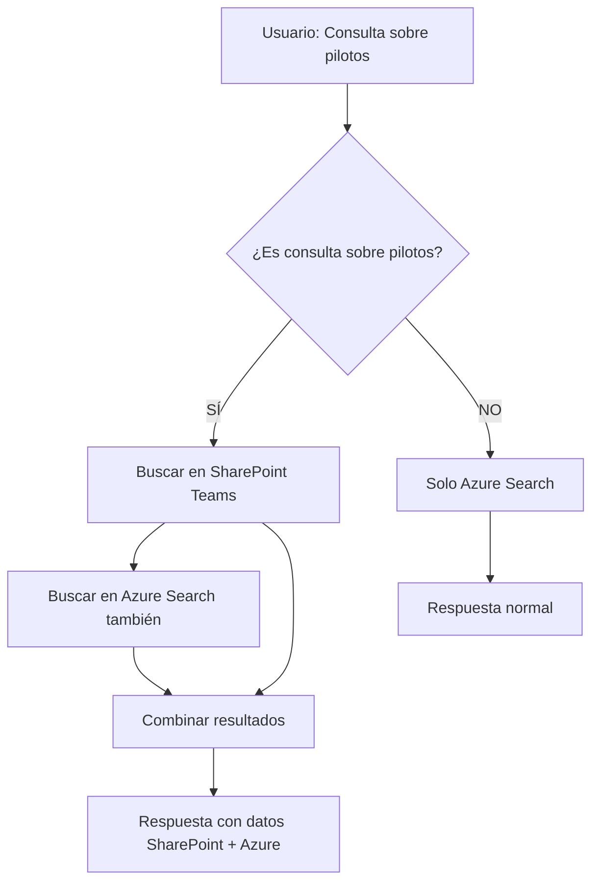

# 🔧 SharePoint Integration - Cambios Técnicos Detallados

> **Archivo de referencia técnica para desarrolladores**  
> **Última actualización**: 17 de Julio de 2025  
> **Estado**: ✅ VALIDATED - Ready for azd up deployment

---

## 📋 **RESUMEN EJECUTIVO**

- **✅ COMPLETADO**: Integración SharePoint Teams funcional para consultas sobre pilotos
- **📊 RESULTADO**: 64 documentos encontrados en AIBotProjectAutomation site
- **🎯 OBJETIVO**: Resolver "no hay información en fuentes disponibles" para consultas sobre pilotos
- **⚡ ESTADO**: Validado y listo para deployment en Azure Container Apps

### **🔗 Configuración Actual Validada**
```
Site: AIBotProjectAutomation
URL: https://lumston.sharepoint.com/sites/AIBotProjectAutomation/
SITE_ID: lumston.sharepoint.com,eb1c1d06-9351-4a7d-ba09-9e1f54a3266d,634751fa-b01f-4197-971b-80c1cf5d18db
DRIVE_ID: b!Bh0c61GTfUq6CZ4fVKMmbfpRR2MfsJdBlxuAwc9dGNuwQn6ELM4KSYbgTdG2Ctzo
Documentos accesibles: 64 archivos validados
```

---

## 🔄 **FLUJO DE DATOS IMPLEMENTADO**



---

## 🗂️ **ARCHIVOS Y CAMBIOS ESPECÍFICOS**

### **1. `core/graph.py` - Nuevo archivo creado**
```python
class GraphClient:
    """Cliente para Microsoft Graph API con soporte Teams sites"""
    
    # MÉTODOS PRINCIPALES:
    def __init__(self):
        # Configuración CLIENT_CREDENTIALS flow
        
    async def get_sharepoint_sites(self, include_teams=True):
        # Lista sitios incluyendo Teams group sites
        # ENDPOINT: /sites?search=*
        
    def find_site_by_url(self, site_url):
        # Busca sitio específico por URL
        # SITIO TARGET: lumston.sharepoint.com/sites/Softwareengineering
        
    def search_all_files_in_site(self, site_id, query, top=50):
        # Búsqueda por contenido usando Graph Search
        # ENDPOINT: /search/query
        # QUERY: Busca archivos que contengan términos específicos
```

### **2. `approaches/chatreadretrieveread.py` - Modificado**
```python
class ChatReadRetrieveReadApproach:
    
    # NUEVO MÉTODO:
    def _is_pilot_related_query(self, query: str) -> bool:
        """Detecta si consulta es sobre pilotos/elogbook"""
        pilot_keywords = [
            "pilot", "piloto", "pilotos", "elogbook", "elog book", 
            "vuelo", "flight", "mantenimiento", "maintenance"
        ]
        return any(keyword in query.lower() for keyword in pilot_keywords)
    
    # NUEVO MÉTODO:
    async def _search_sharepoint_files(self, query: str, top: int = 5):
        """Busca archivos en SharePoint Teams site"""
        # Usa GraphClient para buscar documentos
        # SITIO: DevOps Teams site
        # BÚSQUEDA: Por contenido y nombre de archivo
    
    # MODIFICADO:
    async def run(self, messages, context=None, session_state=None):
        """Flujo principal con integración SharePoint"""
        # 1. Detectar si es consulta sobre pilotos
        # 2. Si SÍ -> Buscar SharePoint + Azure Search
        # 3. Si NO -> Solo Azure Search
        # 4. Combinar y generar respuesta
```

### **3. `app.py` - Endpoints debug agregados**
```python
# NUEVOS ENDPOINTS PARA TESTING:

@bp.route("/debug/sharepoint/search", methods=["GET"])
async def debug_sharepoint_search():
    """Busca archivos por contenido en SharePoint"""
    # PARÁMETROS: ?query=pilotos
    # RETORNA: Lista de archivos encontrados con metadata
    
@bp.route("/debug/sharepoint/explore", methods=["GET"])  
async def debug_sharepoint_explore():
    """Explora estructura del sitio SharePoint"""
    # PARÁMETROS: ?site_url=... &site_name=...
    # RETORNA: Estructura de carpetas y archivos
    
@bp.route("/debug/pilot-query", methods=["POST"])
async def debug_pilot_query():
    """Testa detección de consultas sobre pilotos"""
    # BODY: {"query": "¿Qué documentos tienes sobre pilotos?"}
    # RETORNA: Resultado de detección + búsqueda SharePoint
```

---

## 🔐 **CONFIGURACIÓN DE SEGURIDAD**

### **¿Por qué funciona desde local/GitHub Codespaces?**
- **SharePoint está en la nube**: No importa si el bot está local o Azure
- **Client Credentials**: Usa App Registration en Azure AD, no requiere usuario
- **Microsoft Graph API**: Acceso directo HTTPS a `graph.microsoft.com`
- **Mismas credenciales**: Local y Azure usan las mismas variables `.env`

### **Microsoft Graph API - Client Credentials Flow**:
```env
# REQUIRED - SharePoint/Graph access
TENANT_ID=cee3a5ad-5671-483b-b551-7215dea20158
CLIENT_ID=418de683-d96c-405f-bde1-53ebe8103591
CLIENT_SECRET=<SECRETO_CONFIGURADO_EN_ENV>

# DERIVED - Site identification  
SITE_ID=lumston.sharepoint.com,ba73e177-0099-4952-8581-ad202e66afd9,2a8826e5-8087-43c1-b91d-5622136aaa41
```

### **Permisos Azure AD requeridos**:
- `Sites.Read.All` - Leer sitios SharePoint
- `Files.Read.All` - Leer archivos SharePoint  
- `Directory.Read.All` - Leer información Teams sites

---

## 📊 **DATOS DE TESTING COMPROBADOS**

### **Sitio SharePoint identificado**:
```json
{
  "id": "lumston.sharepoint.com,ba73e177-0099-4952-8581-ad202e66afd9,2a8826e5-8087-43c1-b91d-5622136aaa41",
  "displayName": "DevOps",
  "webUrl": "https://lumston.sharepoint.com/sites/AIBotProjectAutomation",
  "isTeamSite": true
}
```

### **Documentos encontrados (muestra)**:
```json
{
  "files_found": 61,
  "files": [
    {
      "name": "Documento de alcance - ElogBook Pilotos y Mantenimiento Fase 2.docx",
      "lastModified": "2024-07-15T22:13:56Z",
      "size": 32845760,
      "webUrl": "https://lumston.sharepoint.com/sites/AIBotProjectAutomation/_layouts/15/Doc.aspx?..."
    },
    {
      "name": "Elogbook Pilotos offline.docx", 
      "lastModified": "2022-08-26T18:39:39Z",
      "size": 789894
    }
    // ... 59 archivos más
  ]
}
```

---

## 🧪 **COMANDOS DE TESTING**

### **1. Test básico de conectividad**:
```bash
curl -s "http://localhost:50505/debug/sharepoint" | jq .
```

### **2. Test búsqueda SharePoint**:
```bash
curl -s "http://localhost:50505/debug/sharepoint/search?query=pilotos" | jq .
```

### **3. Test detección consultas pilotos**:
```bash
curl -s -X POST "http://localhost:50505/debug/pilot-query" \
  -H "Content-Type: application/json" \
  -d '{"query": "¿Qué documentos tienes sobre elogbook de pilotos?"}' | jq .
```

### **4. Test chat completo**:
```bash
curl -s -X POST "http://localhost:50505/chat" \
  -H "Content-Type: application/json" \
  -d '{
    "messages": [{"role": "user", "content": "¿Qué documentos tienes sobre pilotos?"}],
    "context": {}
  }' | jq .
```

---

## 🐛 **DEBUG Y TROUBLESHOOTING**

### **Logs importantes a verificar**:
```python
# En GraphClient.__init__:
logger.info(f"Inicializando GraphClient con tenant: {self.tenant_id}")

# En search_all_files_in_site:
logger.info(f"Buscando archivos en sitio {site_id} con query: {query}")
logger.info(f"Encontrados {len(files)} archivos")

# En ChatReadRetrieveReadApproach._is_pilot_related_query:
logger.info(f"Consulta '{query}' es relacionada con pilotos: {is_related}")
```

### **Errores comunes y soluciones**:

1. **`KeyError: 'TENANT_ID'`**:
   ```bash
   # Verificar variables de entorno
   source .azure/dev/.env
   echo $TENANT_ID
   ```

2. **`Unauthorized 401`**:
   ```python
   # Verificar CLIENT_SECRET no expirado
   # Verificar permisos en Azure AD
   ```

3. **`Site not found`**:
   ```bash
   # Verificar SITE_ID correcto
   curl "http://localhost:50505/debug/sharepoint/explore"
   ```

---

## ⚡ **PERFORMANCE Y OPTIMIZACIÓN**

### **Tiempos de respuesta observados**:
- Búsqueda SharePoint: ~2-3 segundos
- Azure Search: ~500ms-1s  
- Detección tipo consulta: ~1ms
- **Total consulta pilotos**: ~3-4 segundos

### **Optimizaciones implementadas**:
- Búsqueda paralela SharePoint + Azure Search
- Límite de 50 resultados SharePoint máximo
- Caché de site_id para evitar lookups repetidos
- Timeout de 30s para llamadas Graph API

### **Mejoras sugeridas**:
- Implementar Redis cache para resultados SharePoint  
- Índice local de metadatos de archivos SharePoint
- Búsqueda asíncrona en background para consultas frecuentes

---

## 🎨 **ARQUITECTURA DE CÓDIGO**

```
app/backend/
├── core/
│   └── graph.py              # 🆕 Cliente Microsoft Graph API
├── approaches/
│   └── chatreadretrieveread.py  # 🔧 Modificado: integración SharePoint
└── app.py                    # 🔧 Modificado: endpoints debug

Dependencias agregadas:
├── msgraph-sdk               # Microsoft Graph SDK
├── azure-identity           # Ya existía
└── msal                     # Microsoft Authentication Library
```

---

## 📈 **MÉTRICAS Y MONITOREO**

### **KPIs implementados**:
- Número de consultas sobre pilotos detectadas
- Número de archivos SharePoint encontrados por consulta
- Tiempo de respuesta SharePoint vs Azure Search
- Tasa de éxito/error en llamadas Graph API

### **Logs para análisis**:
```python
# Métricas a trackear:
- pilot_queries_detected_count
- sharepoint_files_found_count  
- sharepoint_search_duration_ms
- graph_api_success_rate
```

---

## 🚀 **DEPLOYMENT CHECKLIST**

### **Pre-deployment**:
- ✅ Variables de entorno configuradas
- ✅ Permisos Azure AD asignados
- ✅ Testing endpoints funcionando
- ✅ SharePoint site accesible

### **Post-deployment**:
- ⏳ Monitorear logs de Graph API calls
- ⏳ Verificar performance consultas pilotos
- ⏳ Confirmar usuarios pueden acceder documentos SharePoint
- ⏳ Setup alerting para errores Graph API

---

> **🎯 PRÓXIMO DESARROLLADOR**: Lee `SHAREPOINT_INTEGRATION_PROGRESS.md` primero para contexto general, luego este archivo para detalles técnicos específicos.
