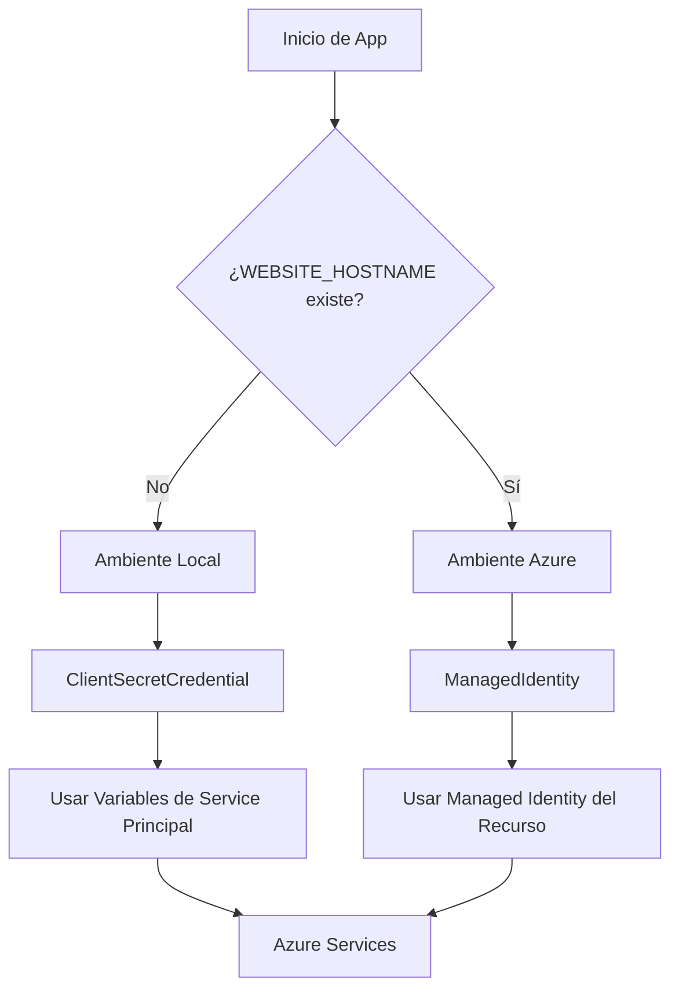

# Arquitectura y Autenticación - Azure Search OpenAI Demo

## 📋 Resumen

Este documento describe la arquitectura de autenticación del sistema y cómo funciona en diferentes ambientes.

## 🏗️ Arquitectura de Credenciales

### Sistema Dual de Autenticación

El sistema implementa un patrón robusto que **automáticamente** selecciona el tipo de credencial según el ambiente:

```python
# core/azure_credential.py
def get_azure_credential_async():
    """
    Selecciona automáticamente la credencial correcta:
    - Desarrollo Local: ClientSecretCredential 
    - Azure (Producción): ManagedIdentity
    """
```

### Ambientes Soportados

| Ambiente | Credencial | Variables Requeridas | Detección |
|----------|------------|---------------------|-----------|
| **Desarrollo Local** | `ClientSecretCredential` | `AZURE_CLIENT_ID`, `AZURE_CLIENT_SECRET`, `AZURE_TENANT_ID` | Ausencia de `WEBSITE_HOSTNAME` |
| **Azure Container Apps** | `ManagedIdentity` | Managed Identity configurado | Presencia de `WEBSITE_HOSTNAME` o `RUNNING_IN_PRODUCTION` |
| **Azure App Service** | `ManagedIdentity` | Managed Identity configurado | Presencia de `WEBSITE_HOSTNAME` |

### Flujo de Autenticación



## 🔐 Configuración de Permisos RBAC

### Permisos para Azure OpenAI

| Rol | Scope | Propósito |
|-----|-------|-----------|
| `Cognitive Services OpenAI User` | `/subscriptions/.../providers/Microsoft.CognitiveServices/accounts/oai-*` | Acceso a modelos GPT y embeddings |

### Permisos para Azure Search

| Rol | Scope | Propósito |
|-----|-------|-----------|
| `Search Index Data Reader` | `/subscriptions/.../providers/Microsoft.Search/searchServices/srch-*` | Leer índices de búsqueda |
| `Search Index Data Contributor` | `/subscriptions/.../providers/Microsoft.Search/searchServices/srch-*` | Escribir en índices de búsqueda |
| `Search Service Contributor` | `/subscriptions/.../providers/Microsoft.Search/searchServices/srch-*` | Administrar servicio de búsqueda |

### Comando para Asignación de Permisos

```bash
# Para Azure OpenAI
az role assignment create \
  --role "Cognitive Services OpenAI User" \
  --assignee <PRINCIPAL_ID> \
  --scope /subscriptions/<SUB_ID>/resourceGroups/<RG>/providers/Microsoft.CognitiveServices/accounts/<OPENAI_SERVICE>

# Para Azure Search  
az role assignment create \
  --role "Search Index Data Contributor" \
  --assignee <PRINCIPAL_ID> \
  --scope /subscriptions/<SUB_ID>/resourceGroups/<RG>/providers/Microsoft.Search/searchServices/<SEARCH_SERVICE>
```

## 🔧 Variables de Entorno

### Variables Básicas de Azure

```bash
# Requeridas en TODOS los ambientes
AZURE_TENANT_ID=cee3a5ad-5671-483b-b551-7215dea20158
AZURE_SUBSCRIPTION_ID=c8b53560-9ecb-4276-8177-f44b97abba0b
AZURE_RESOURCE_GROUP=rg-volaris-dev-eus-001

# SOLO para desarrollo local
AZURE_CLIENT_ID=418de683-d96c-405f-bde1-53ebe8103591
AZURE_CLIENT_SECRET=E4b8Q~... (secret)

# Para override de API keys (opcional)
AZURE_OPENAI_API_KEY_OVERRIDE=a03bfa55c41... (para testing)
```

### Variables de Servicios

```bash
# Azure OpenAI
AZURE_OPENAI_SERVICE=oai-volaris-dev-eus-001
AZURE_OPENAI_CHATGPT_DEPLOYMENT=gpt-4.1-mini
AZURE_OPENAI_EMB_DEPLOYMENT=text-embedding-3-large

# Azure Search  
AZURE_SEARCH_SERVICE=srch-volaris-dev-eus-001
AZURE_SEARCH_INDEX=idx-volaris-dev-eus-001

# SharePoint
AZURE_CLIENT_APP_ID=418de683-d96c-405f-bde1-53ebe8103591
SHAREPOINT_SITE_ID=lumston.sharepoint.com,eb1c1d06-9351-4a7d-ba09-9e1f54a3266d,634751fa-b01f-4197-971b-80c1cf5d18db
```

## 🚀 Detección de Ambiente

### Código de Detección

```python
# app.py líneas 1404-1405
RUNNING_ON_AZURE = (
    os.getenv("WEBSITE_HOSTNAME") is not None or 
    os.getenv("RUNNING_IN_PRODUCTION") is not None
)
```

### Variables de Detección

| Variable | Ambiente | Fuente |
|----------|----------|--------|
| `WEBSITE_HOSTNAME` | Azure App Service | Automática |
| `RUNNING_IN_PRODUCTION` | Azure Container Apps | `main.bicep` |

## 🛠️ Validación y Diagnósticos

### Health Check Endpoints

- `GET /health` - Health check básico
- `GET /health/full-checklist` - Diagnóstico completo con validación RBAC

### Herramientas de Diagnóstico

```bash
# Diagnóstico local
python -m diagnostics.deployment_checklist env search openai rbac

# Diagnóstico remoto
curl https://api-volaris-dev-eus-001.whiteglacier-cc1b580c.eastus.azurecontainerapps.io/health/full-checklist
```

## 🔍 Troubleshooting

### Errores Comunes

| Error | Causa | Solución |
|-------|-------|----------|
| `AuthenticationError` | Permisos RBAC faltantes | Asignar roles correctos |
| `403 Forbidden` | Managed Identity sin permisos | Verificar role assignments |
| `ManagedIdentityCredential authentication unavailable` | Ambiente mal detectado | Verificar variables de detección |

### Validación de Permisos

```bash
# Verificar permisos del principal
az role assignment list --assignee <PRINCIPAL_ID> --output table

# Verificar permisos en recurso específico
az role assignment list --scope <RESOURCE_SCOPE> --output table
```

## 📁 Archivos Relacionados

- `app/backend/core/azure_credential.py` - Lógica de selección de credenciales
- `app/backend/app.py` - Configuración de clientes Azure (líneas 1394-1610)
- `app/backend/diagnostics/` - Herramientas de validación
- `.azure/dev/.env` - Variables de entorno de desarrollo

## 🔗 Referencias

- [Azure Authentication Best Practices](https://learn.microsoft.com/azure/active-directory/develop/authentication-vs-authorization)
- [Managed Identity Overview](https://learn.microsoft.com/azure/active-directory/managed-identities-azure-resources/overview)
- [Azure RBAC Documentation](https://learn.microsoft.com/azure/role-based-access-control/)
