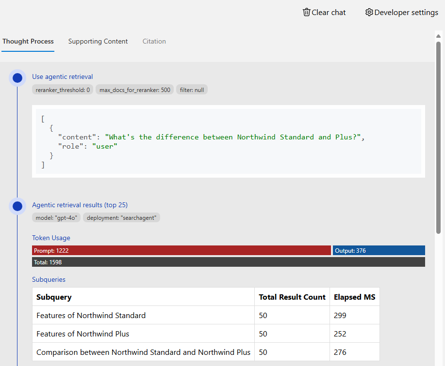

# RAG chat: Using agentic retrieval

This repository includes an optional feature that uses [agentic retrieval from Azure AI Search](https://learn.microsoft.com/azure/search/search-agentic-retrieval-concept) to find the most relevant content given a user's conversation history. The agentic retrieval feature uses a LLM to analyze the conversation and generate multiple search queries to find relevant content. This can improve the quality of the responses, especially for complex or multi-faceted questions.

## Deployment

1. **Enable agentic retrieval:**

   Set the azd environment variable to enable the agentic retrieval feature:

   ```shell
   azd env set USE_AGENTIC_KNOWLEDGEBASE true
   ```

2. **(Optional) Customize the agentic retrieval model**

   You can configure which model agentic retrieval uses. By default, gpt-4.1-mini is used.

   To change the model, set the following environment variables appropriately:

   ```shell
   azd env set AZURE_OPENAI_KNOWLEDGEBASE_DEPLOYMENT knowledgebase
   azd env set AZURE_OPENAI_KNOWLEDGEBASE_MODEL gpt-4.1-mini
   azd env set AZURE_OPENAI_KNOWLEDGEBASE_MODEL_VERSION 2025-04-14
   ```

   You can only change it to one of the [supported models](https://learn.microsoft.com/azure/search/search-agentic-retrieval-how-to-create#supported-models).

3. **(Optional) Choose the default retrieval reasoning effort**

   Agentic retrieval can run in `minimal`, `low`, or `medium` reasoning modes. The default is now `minimal`, which keeps token usage and latency low by summarizing the user's final message into a single search query before running retrieval.

   Override the default by setting the following environment variable:

   ```shell
   azd env set AZURE_SEARCH_KNOWLEDGEBASE_RETRIEVAL_REASONING_EFFORT low
   ```

   Use `minimal` for the lightest planning, `low` for additional query expansion, or `medium` for the most exhaustive (and most expensive) retrieval plans.

4. **(Optional) Enable web or SharePoint knowledge sources**

   By default, agentic retrieval only searches the documents in your search index. You can optionally enable additional knowledge sources:

   **Web source:** Enables searching the public web for information.

   ```shell
   azd env set USE_WEB_SOURCE true
   ```

   > [!NOTE]
   > Web source requires the agent to use answer synthesis mode, which disables certain UI customizations including streaming, follow-up questions, and LLM parameter options.
   > ⚠️ The Microsoft Data Protection Addendum doesn't apply to data sent to Web Knowledge Source. [Learn more in the Web Knowledge source documentation](https://learn.microsoft.com/azure/search/agentic-knowledge-source-how-to-web)

   **SharePoint source:** Enables searching SharePoint documents. Requires authentication to be enabled and uses the logged-in user's token via on-behalf-of flow.

   ```shell
   azd env set USE_SHAREPOINT_SOURCE true
   ```

   > [!NOTE]
   > SharePoint source requires that users have a Microsoft Copilot license.
   > [See licensing requirements for the Sharepoint knowledge source](https://learn.microsoft.com/microsoft-365-copilot/extensibility/api/ai-services/retrieval/overview#licensing).

   These sources can be used independently or together. When enabled, the agentic retrieval agent will search all configured sources and merge results based on the configured merge strategy.

5. **Update the infrastructure and application:**

   Execute `azd up` to provision the infrastructure changes (only the new model, if you ran `up` previously) and deploy the application code with the updated environment variables. The post-provision script will configure Azure AI Search with a Knowledge agent pointing at the search index.

6. **Try out the feature:**

   Open the web app and start a new chat. Agentic retrieval will be used to find all sources.

7. **Review the query plan**

   Agentic retrieval uses additional billed tokens behind the scenes for the planning process.
   To see the token usage, select the lightbulb icon on a chat answer. This will open the "Thought process" tab, which shows the amount of tokens used by and the queries produced by the planning process

   
