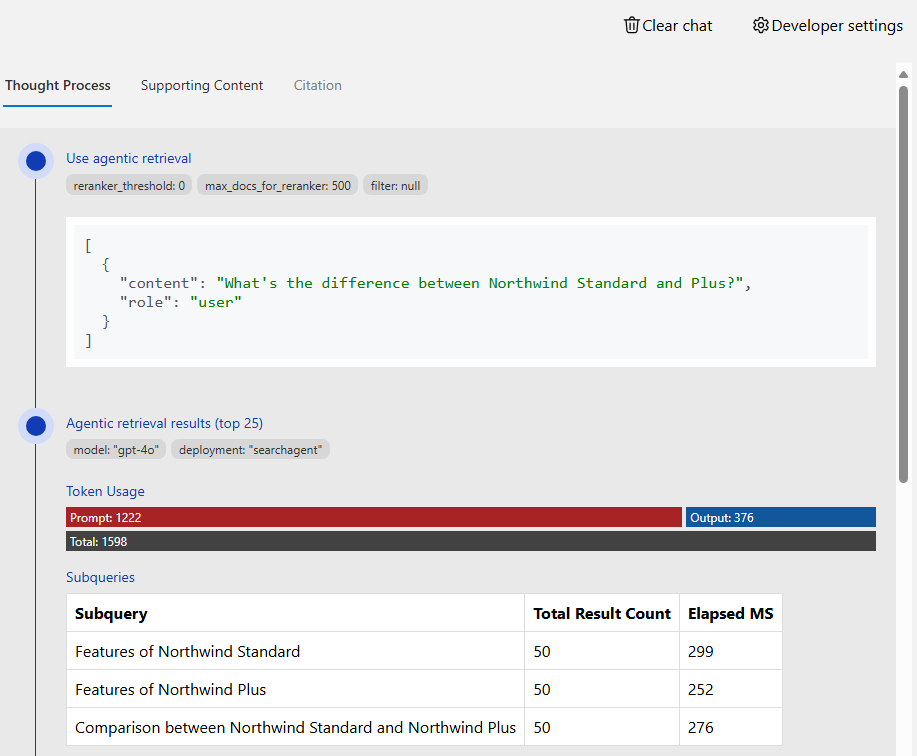

# Czat RAG: Używanie agentowego wyszukiwania

To repozytorium zawiera opcjonalną funkcję, która wykorzystuje [agentowe wyszukiwanie z Azure AI Search](https://learn.microsoft.com/azure/search/search-agentic-retrieval-concept), aby znaleźć najbardziej odpowiednią treść na podstawie historii rozmów użytkownika. Funkcja agentowego wyszukiwania wykorzystuje LLM do analizy rozmowy i generowania wielu zapytań wyszukiwania w celu znalezienia odpowiedniej treści. Może to poprawić jakość odpowiedzi, szczególnie w przypadku złożonych lub wieloaspektowych pytań.

## Wdrożenie

1. **Włącz agentowe wyszukiwanie:**

   Ustaw zmienną środowiskową azd, aby włączyć funkcję agentowego wyszukiwania:

   ```shell
   azd env set USE_AGENTIC_KNOWLEDGEBASE true
   ```

2. **(Opcjonalnie) Dostosuj model agentowego wyszukiwania**

   Możesz skonfigurować, który model używa agentowe wyszukiwanie. Domyślnie używany jest gpt-4.1-mini.

   Aby zmienić model, ustaw odpowiednio następujące zmienne środowiskowe:

   ```shell
   azd env set AZURE_OPENAI_KNOWLEDGEBASE_DEPLOYMENT knowledgebase
   azd env set AZURE_OPENAI_KNOWLEDGEBASE_MODEL gpt-4.1-mini
   azd env set AZURE_OPENAI_KNOWLEDGEBASE_MODEL_VERSION 2025-04-14
   ```

   Możesz zmienić go tylko na jeden z [obsługiwanych modeli](https://learn.microsoft.com/azure/search/search-agentic-retrieval-how-to-create#supported-models).

3. **(Opcjonalnie) Wybierz domyślny wysiłek rozumowania wyszukiwania**

   Agentowe wyszukiwanie może działać w trybach rozumowania `minimal`, `low` lub `medium`. Domyślnie jest teraz `minimal`, który utrzymuje niskie użycie tokenów i opóźnienie, podsumowując końcową wiadomość użytkownika do pojedynczego zapytania wyszukiwania przed uruchomieniem wyszukiwania.

   Zastąp wartość domyślną, ustawiając następującą zmienną środowiskową:

   ```shell
   azd env set AZURE_SEARCH_KNOWLEDGEBASE_RETRIEVAL_REASONING_EFFORT low
   ```

   Użyj `minimal` dla najlżejszego planowania, `low` dla dodatkowej ekspansji zapytań lub `medium` dla najbardziej wyczerpującego (i najdroższego) planu wyszukiwania.

4. **(Opcjonalnie) Włącz źródła wiedzy z sieci lub SharePoint**

   Domyślnie agentowe wyszukiwanie przeszukuje tylko dokumenty w indeksie wyszukiwania. Możesz opcjonalnie włączyć dodatkowe źródła wiedzy:

   **Źródło sieciowe:** Umożliwia wyszukiwanie w publicznej sieci w poszukiwaniu informacji.

   ```shell
   azd env set USE_WEB_SOURCE true
   ```

   > [!NOTE]
   > Źródło sieciowe wymaga, aby agent używał trybu syntezy odpowiedzi, co wyłącza niektóre dostosowania interfejsu użytkownika, w tym strumieniowanie, pytania uzupełniające i opcje parametrów LLM.
   > ⚠️ Dodatek do ochrony danych Microsoft nie ma zastosowania do danych wysyłanych do źródła wiedzy sieciowej. [Dowiedz się więcej w dokumentacji źródła wiedzy sieciowej](https://learn.microsoft.com/azure/search/agentic-knowledge-source-how-to-web)

   **Źródło SharePoint:** Umożliwia wyszukiwanie dokumentów SharePoint. Wymaga włączenia uwierzytelniania i używa tokenu zalogowanego użytkownika za pośrednictwem przepływu w imieniu użytkownika.

   ```shell
   azd env set USE_SHAREPOINT_SOURCE true
   ```

   > [!NOTE]
   > Źródło SharePoint wymaga, aby użytkownicy mieli licencję Microsoft Copilot.
   > [Zobacz wymagania licencyjne dla źródła wiedzy SharePoint](https://learn.microsoft.com/microsoft-365-copilot/extensibility/api/ai-services/retrieval/overview#licensing).

   Te źródła mogą być używane niezależnie lub razem. Po włączeniu agent agentowego wyszukiwania przeszuka wszystkie skonfigurowane źródła i połączy wyniki na podstawie skonfigurowanej strategii scalania.

5. **Zaktualizuj infrastrukturę i aplikację:**

   Wykonaj `azd up`, aby aprowizować zmiany w infrastrukturze (tylko nowy model, jeśli wcześniej uruchomiłeś `up`) i wdrożyć kod aplikacji ze zaktualizowanymi zmiennymi środowiskowymi. Skrypt po aprowizacji skonfiguruje Azure AI Search z agentem wiedzy wskazującym na indeks wyszukiwania.

6. **Wypróbuj funkcję:**

   Otwórz aplikację internetową i rozpocznij nowy czat. Agentowe wyszukiwanie zostanie użyte do znalezienia wszystkich źródeł.

7. **Przejrzyj plan zapytania**

   Agentowe wyszukiwanie używa dodatkowych płatnych tokenów w tle dla procesu planowania.
   Aby zobaczyć użycie tokenów, wybierz ikonę żarówki na odpowiedzi czatu. To otworzy zakładkę "Thought process", która pokazuje liczbę tokenów użytych przez i zapytania wygenerowane przez proces planowania

   
