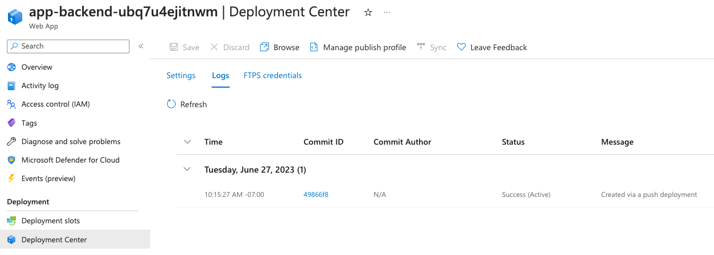
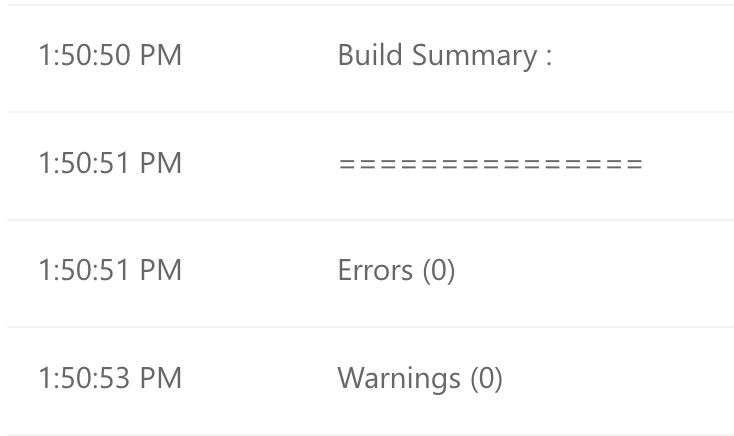
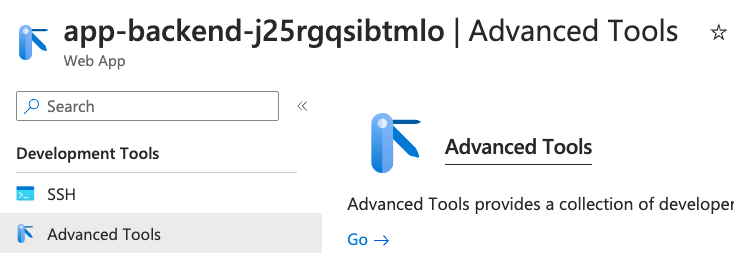
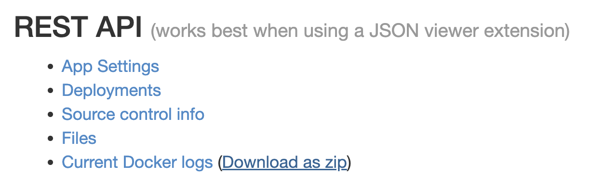
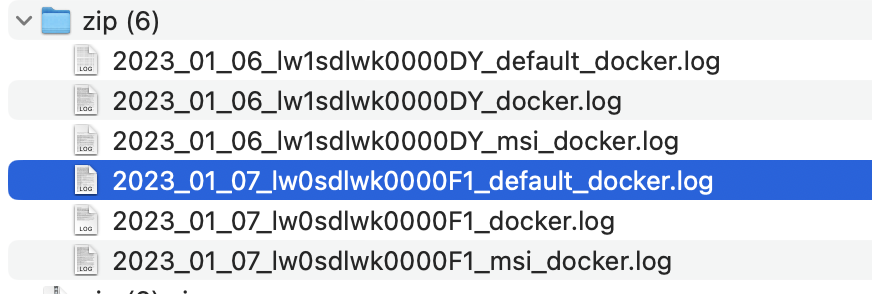
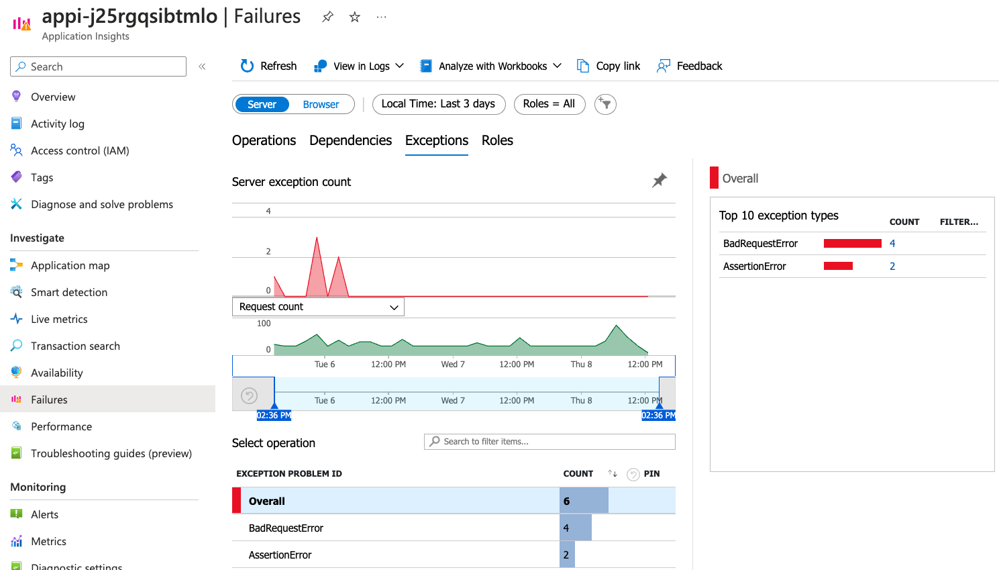

# Debugging the app on App Service

When you run `azd up` or `azd deploy`, it deploys your application to App Service,
and displays the deployed endpoint in the console.

If you encounter an error with that deployed app, you can debug the deployment using the tips below.

- [Debugging failed Azure App Service deployments](#debugging-failed-azure-app-service-deployments)
- [Checking the deployment logs for errors](#checking-the-deployment-logs-for-errors)
- [Checking the app logs for errors](#checking-the-app-logs-for-errors)
- [Checking Azure Monitor for errors](#checking-azure-monitor-for-errors)
- [Configuring log levels](#configuring-log-levels)

## Debugging failed Azure App Service deployments

If you see a 500 error upon visiting your app after deployment, something went wrong
during either the deployment or the server start script.

We recommend always waiting 10 minutes, to give the server time to properly startup.

If you still see a 500 error after 10 minutes:

1. [Check the deployment logs](#checking-the-deployment-logs-for-errors)
2. [Look for errors in the app logs](#checking-the-app-logs-for-errors)
3. [Look for errors in Azure Monitor](#checking-azure-monitor-for-errors)

## Checking the deployment logs for errors

In the Azure portal, navigate to your App Service.

Select _Deployment Center_ from the side navigation menu, then select _Logs_.
You should see a timestamped list of recent deploys:



Check whether the status of the most recent deploy is "Success (Active)" or "Failed". If it's success, the deployment logs might still reveal issues, and if it's failed, the logs should certainly reveal the issue.

Click the commit ID to open the logs for the most recent deploy. First scroll down to see if any errors or warnings are reported at the end. This is what you'll hopefully see if all went well:



Now scroll back up to find the timestamp with the label "Running oryx build".
[Oryx](https://github.com/microsoft/Oryx) is the open source tool that builds apps for App Service, Functions, and other platforms, across all the supported MS languages. Click the _Show logs_ link next to that label. That will pop open detailed logs at the bottom. Scroll down.

<details>
<summary>Expand to see the logs for a successful Oryx build for the application.</summary>

```plaintext
Command: oryx build /tmp/zipdeploy/extracted -o /home/site/wwwroot --platform python --platform-version 3.11 -p virtualenv_name=antenv --log-file /tmp/build-debug.log  -i /tmp/8dc28dad0e10acb --compress-destination-dir | tee /tmp/oryx-build.log
Operation performed by Microsoft Oryx, https://github.com/Microsoft/Oryx
You can report issues at https://github.com/Microsoft/Oryx/issues

Oryx Version: 0.2.20230508.1, Commit: 7fe2bf39b357dd68572b438a85ca50b5ecfb4592, ReleaseTagName: 20230508.1

Build Operation ID: 7440a33100749a32
Repository Commit : b09bff8b-da36-4d70-9e2f-c7b9131d85bc
OS Type           : bullseye
Image Type        : githubactions

Detecting platforms...
Detected following platforms:
  python: 3.11.7
Version '3.11.7' of platform 'python' is not installed. Generating script to install it...

Using intermediate directory '/tmp/8dc28dad0e10acb'.

Copying files to the intermediate directory...
Done in 27 sec(s).

Source directory     : /tmp/8dc28dad0e10acb
Destination directory: /home/site/wwwroot


Downloading and extracting 'python' version '3.11.7' to '/tmp/oryx/platforms/python/3.11.7'...
Detected image debian flavor: bullseye.
Downloaded in 5 sec(s).
Verifying checksum...
Extracting contents...
performing sha512 checksum for: python...
Done in 48 sec(s).

image detector file exists, platform is python..
OS detector file exists, OS is bullseye..
Python Version: /tmp/oryx/platforms/python/3.11.7/bin/python3.11
Creating directory for command manifest file if it does not exist
Removing existing manifest file
Python Virtual Environment: antenv
Creating virtual environment...
Activating virtual environment...
Running pip install...
[19:21:31+0000] Collecting aiofiles==23.2.1 (from -r requirements.txt (line 7))
[19:21:31+0000]   Obtaining dependency information for aiofiles==23.2.1 from https://files.pythonhosted.org/packages/c5/19/5af6804c4cc0fed83f47bff6e413a98a36618e7d40185cd36e69737f3b0e/aiofiles-23.2.1-py3-none-any.whl.metadata
[19:21:31+0000]   Downloading aiofiles-23.2.1-py3-none-any.whl.metadata (9.7 kB)
[19:21:35+0000] Collecting aiohttp==3.9.3 (from -r requirements.txt (line 9))
[19:21:35+0000]   Obtaining dependency information for aiohttp==3.9.3 from https://files.pythonhosted.org/packages/84/bb/74c9f32e1a76fab04b54ed6cd4b0dc4a07bd9dc6f3bb37f630149a9c3068/aiohttp-3.9.3-cp311-cp311-manylinux_2_17_x86_64.manylinux2014_x86_64.whl.metadata
[19:21:35+0000]   Downloading aiohttp-3.9.3-cp311-cp311-manylinux_2_17_x86_64.manylinux2014_x86_64.whl.metadata (7.4 kB)
[19:21:35+0000] Collecting aiosignal==1.3.1 (from -r requirements.txt (line 11))
[19:21:35+0000]   Downloading aiosignal-1.3.1-py3-none-any.whl (7.6 kB)
[19:21:36+0000] Collecting annotated-types==0.6.0 (from -r requirements.txt (line 13))
[19:21:36+0000]   Obtaining dependency information for annotated-types==0.6.0 from https://files.pythonhosted.org/packages/28/78/d31230046e58c207284c6b2c4e8d96e6d3cb4e52354721b944d3e1ee4aa5/annotated_types-0.6.0-py3-none-any.whl.metadata
[19:21:36+0000]   Downloading annotated_types-0.6.0-py3-none-any.whl.metadata (12 kB)
[19:21:36+0000] Collecting anyio==4.2.0 (from -r requirements.txt (line 15))
[19:21:36+0000]   Obtaining dependency information for anyio==4.2.0 from https://files.pythonhosted.org/packages/bf/cd/d6d9bb1dadf73e7af02d18225cbd2c93f8552e13130484f1c8dcfece292b/anyio-4.2.0-py3-none-any.whl.metadata
[19:21:36+0000]   Downloading anyio-4.2.0-py3-none-any.whl.metadata (4.6 kB)
[19:21:36+0000] Collecting asgiref==3.7.2 (from -r requirements.txt (line 19))
[19:21:36+0000]   Obtaining dependency information for asgiref==3.7.2 from https://files.pythonhosted.org/packages/9b/80/b9051a4a07ad231558fcd8ffc89232711b4e618c15cb7a392a17384bbeef/asgiref-3.7.2-py3-none-any.whl.metadata
[19:21:36+0000]   Downloading asgiref-3.7.2-py3-none-any.whl.metadata (9.2 kB)
[19:21:36+0000] Collecting attrs==23.2.0 (from -r requirements.txt (line 21))
[19:21:36+0000]   Obtaining dependency information for attrs==23.2.0 from https://files.pythonhosted.org/packages/e0/44/827b2a91a5816512fcaf3cc4ebc465ccd5d598c45cefa6703fcf4a79018f/attrs-23.2.0-py3-none-any.whl.metadata
[19:21:36+0000]   Downloading attrs-23.2.0-py3-none-any.whl.metadata (9.5 kB)
[19:21:36+0000] Collecting azure-common==1.1.28 (from -r requirements.txt (line 23))
[19:21:36+0000]   Downloading azure_common-1.1.28-py2.py3-none-any.whl (14 kB)
[19:21:36+0000] Collecting azure-core==1.29.7 (from -r requirements.txt (line 27))
[19:21:36+0000]   Obtaining dependency information for azure-core==1.29.7 from https://files.pythonhosted.org/packages/ff/29/dbc7182bc207530c7b5858d59f429158465f878845d64a038afc1aa61e35/azure_core-1.29.7-py3-none-any.whl.metadata
[19:21:36+0000]   Downloading azure_core-1.29.7-py3-none-any.whl.metadata (36 kB)
[19:21:36+0000] Collecting azure-core-tracing-opentelemetry==1.0.0b11 (from -r requirements.txt (line 37))
[19:21:36+0000]   Obtaining dependency information for azure-core-tracing-opentelemetry==1.0.0b11 from https://files.pythonhosted.org/packages/e6/6e/3ef6dfba8e0faa4692caa6d103c721ccba6ac37a24744848a3a10bb3fe89/azure_core_tracing_opentelemetry-1.0.0b11-py3-none-any.whl.metadata
[19:21:36+0000]   Downloading azure_core_tracing_opentelemetry-1.0.0b11-py3-none-any.whl.metadata (8.5 kB)
[19:21:37+0000] Collecting azure-identity==1.15.0 (from -r requirements.txt (line 39))
[19:21:37+0000]   Obtaining dependency information for azure-identity==1.15.0 from https://files.pythonhosted.org/packages/30/10/5dbf755b368d10a28d55b06ac1f12512a13e88874a23db82defdea9a8cd9/azure_identity-1.15.0-py3-none-any.whl.metadata
[19:21:37+0000]   Downloading azure_identity-1.15.0-py3-none-any.whl.metadata (75 kB)
[19:21:37+0000]      ━━━━━━━━━━━━━━━━��━━━━━━━━━━━━━━━━━━━━━━━ 75.4/75.4 kB 6.2 MB/s eta 0:00:00
[19:21:37+0000] Collecting azure-keyvault-secrets==4.7.0 (from -r requirements.txt (line 41))
[19:21:37+0000]   Downloading azure_keyvault_secrets-4.7.0-py3-none-any.whl (348 kB)
[19:21:37+0000]      ━━━━━━━━━━━━━━━━━━━━━━━━━━━━━━━━━━━━━━ 348.6/348.6 kB 19.6 MB/s eta 0:00:00
[19:21:37+0000] Collecting azure-monitor-opentelemetry==1.2.0 (from -r requirements.txt (line 43))
[19:21:37+0000]   Obtaining dependency information for azure-monitor-opentelemetry==1.2.0 from https://files.pythonhosted.org/packages/66/72/5a6bac11b8f3bd60825f19c144c4c770c46951165f8ee5fc10ab3eaadf59/azure_monitor_opentelemetry-1.2.0-py3-none-any.whl.metadata
[19:21:37+0000]   Downloading azure_monitor_opentelemetry-1.2.0-py3-none-any.whl.metadata (19 kB)
[19:21:37+0000] Collecting azure-monitor-opentelemetry-exporter==1.0.0b21 (from -r requirements.txt (line 45))
[19:21:37+0000]   Obtaining dependency information for azure-monitor-opentelemetry-exporter==1.0.0b21 from https://files.pythonhosted.org/packages/4a/0d/18cb0da98b49c9a6724f6cae46a7e59b8325cda476bde13b64404a428ae8/azure_monitor_opentelemetry_exporter-1.0.0b21-py2.py3-none-any.whl.metadata
[19:21:37+0000]   Downloading azure_monitor_opentelemetry_exporter-1.0.0b21-py2.py3-none-any.whl.metadata (31 kB)
[19:21:37+0000] Collecting azure-search-documents==11.6.0b1 (from -r requirements.txt (line 47))
[19:21:37+0000]   Obtaining dependency information for azure-search-documents==11.6.0b1 from https://files.pythonhosted.org/packages/7c/f6/b138d9a252f80db69c052c65410bc972dca375e29c71c472e27d0bae327d/azure_search_documents-11.6.0b1-py3-none-any.whl.metadata
[19:21:37+0000]   Downloading azure_search_documents-11.6.0b1-py3-none-any.whl.metadata (23 kB)
[19:21:37+0000] Collecting azure-storage-blob==12.19.0 (from -r requirements.txt (line 49))
[19:21:37+0000]   Obtaining dependency information for azure-storage-blob==12.19.0 from https://files.pythonhosted.org/packages/f6/82/24b0d7cf67ea63af86f11092756b8fe2adc1d55323241dc4107f5f5748e2/azure_storage_blob-12.19.0-py3-none-any.whl.metadata
[19:21:37+0000]   Downloading azure_storage_blob-12.19.0-py3-none-any.whl.metadata (26 kB)
[19:21:37+0000] Collecting blinker==1.7.0 (from -r requirements.txt (line 51))
[19:21:37+0000]   Obtaining dependency information for blinker==1.7.0 from https://files.pythonhosted.org/packages/fa/2a/7f3714cbc6356a0efec525ce7a0613d581072ed6eb53eb7b9754f33db807/blinker-1.7.0-py3-none-any.whl.metadata
[19:21:37+0000]   Downloading blinker-1.7.0-py3-none-any.whl.metadata (1.9 kB)
[19:21:37+0000] Collecting certifi==2023.11.17 (from -r requirements.txt (line 55))
[19:21:37+0000]   Obtaining dependency information for certifi==2023.11.17 from https://files.pythonhosted.org/packages/64/62/428ef076be88fa93716b576e4a01f919d25968913e817077a386fcbe4f42/certifi-2023.11.17-py3-none-any.whl.metadata
[19:21:37+0000]   Downloading certifi-2023.11.17-py3-none-any.whl.metadata (2.2 kB)
[19:21:39+0000] Collecting cffi==1.16.0 (from -r requirements.txt (line 61))
[19:21:39+0000]   Obtaining dependency information for cffi==1.16.0 from https://files.pythonhosted.org/packages/9b/89/a31c81e36bbb793581d8bba4406a8aac4ba84b2559301c44eef81f4cf5df/cffi-1.16.0-cp311-cp311-manylinux_2_17_x86_64.manylinux2014_x86_64.whl.metadata
[19:21:39+0000]   Downloading cffi-1.16.0-cp311-cp311-manylinux_2_17_x86_64.manylinux2014_x86_64.whl.metadata (1.5 kB)
[19:21:40+0000] Collecting charset-normalizer==3.3.2 (from -r requirements.txt (line 63))
[19:21:40+0000]   Obtaining dependency information for charset-normalizer==3.3.2 from https://files.pythonhosted.org/packages/40/26/f35951c45070edc957ba40a5b1db3cf60a9dbb1b350c2d5bef03e01e61de/charset_normalizer-3.3.2-cp311-cp311-manylinux_2_17_x86_64.manylinux2014_x86_64.whl.metadata
[19:21:40+0000]   Downloading charset_normalizer-3.3.2-cp311-cp311-manylinux_2_17_x86_64.manylinux2014_x86_64.whl.metadata (33 kB)
[19:21:40+0000] Collecting click==8.1.7 (from -r requirements.txt (line 65))
[19:21:40+0000]   Obtaining dependency information for click==8.1.7 from https://files.pythonhosted.org/packages/00/2e/d53fa4befbf2cfa713304affc7ca780ce4fc1fd8710527771b58311a3229/click-8.1.7-py3-none-any.whl.metadata
[19:21:40+0000]   Downloading click-8.1.7-py3-none-any.whl.metadata (3.0 kB)
[19:21:43+0000] Collecting cryptography==42.0.1 (from -r requirements.txt (line 70))
[19:21:43+0000]   Obtaining dependency information for cryptography==42.0.1 from https://files.pythonhosted.org/packages/f8/46/2776ca9b602f79633fdf69824b5e18c94f2e0c5f09a94fc69e5b0887c14d/cryptography-42.0.1-cp39-abi3-manylinux_2_28_x86_64.whl.metadata
[19:21:43+0000]   Downloading cryptography-42.0.1-cp39-abi3-manylinux_2_28_x86_64.whl.metadata (5.3 kB)
[19:21:43+0000] Collecting deprecated==1.2.14 (from -r requirements.txt (line 78))
[19:21:43+0000]   Obtaining dependency information for deprecated==1.2.14 from https://files.pythonhosted.org/packages/20/8d/778b7d51b981a96554f29136cd59ca7880bf58094338085bcf2a979a0e6a/Deprecated-1.2.14-py2.py3-none-any.whl.metadata
[19:21:43+0000]   Downloading Deprecated-1.2.14-py2.py3-none-any.whl.metadata (5.4 kB)
[19:21:43+0000] Collecting distro==1.9.0 (from -r requirements.txt (line 80))
[19:21:43+0000]   Obtaining dependency information for distro==1.9.0 from https://files.pythonhosted.org/packages/12/b3/231ffd4ab1fc9d679809f356cebee130ac7daa00d6d6f3206dd4fd137e9e/distro-1.9.0-py3-none-any.whl.metadata
[19:21:44+0000]   Downloading distro-1.9.0-py3-none-any.whl.metadata (6.8 kB)
[19:21:44+0000] Collecting ecdsa==0.18.0 (from -r requirements.txt (line 82))
[19:21:44+0000]   Downloading ecdsa-0.18.0-py2.py3-none-any.whl (142 kB)
[19:21:44+0000]      ━━━━━━━━━━━━━━━━━━━━━━━━━━━━━━━━━━━━━━━ 142.9/142.9 kB 3.7 MB/s eta 0:00:00
[19:21:44+0000] Collecting fixedint==0.1.6 (from -r requirements.txt (line 84))
[19:21:44+0000]   Downloading fixedint-0.1.6-py3-none-any.whl (12 kB)
[19:21:45+0000] Collecting flask==3.0.1 (from -r requirements.txt (line 86))
[19:21:45+0000]   Obtaining dependency information for flask==3.0.1 from https://files.pythonhosted.org/packages/bd/0e/63738e88e981ae57c23bad6c499898314a1110a4141f77d7bd929b552fb4/flask-3.0.1-py3-none-any.whl.metadata
[19:21:45+0000]   Downloading flask-3.0.1-py3-none-any.whl.metadata (3.6 kB)
[19:21:47+0000] Collecting frozenlist==1.4.1 (from -r requirements.txt (line 88))
[19:21:47+0000]   Obtaining dependency information for frozenlist==1.4.1 from https://files.pythonhosted.org/packages/b3/c9/0bc5ee7e1f5cc7358ab67da0b7dfe60fbd05c254cea5c6108e7d1ae28c63/frozenlist-1.4.1-cp311-cp311-manylinux_2_5_x86_64.manylinux1_x86_64.manylinux_2_17_x86_64.manylinux2014_x86_64.whl.metadata
[19:21:47+0000]   Downloading frozenlist-1.4.1-cp311-cp311-manylinux_2_5_x86_64.manylinux1_x86_64.manylinux_2_17_x86_64.manylinux2014_x86_64.whl.metadata (12 kB)
[19:21:47+0000] Collecting h11==0.14.0 (from -r requirements.txt (line 92))
[19:21:47+0000]   Downloading h11-0.14.0-py3-none-any.whl (58 kB)
[19:21:47+0000]      ━━━━━━━━━━━━━━━━━━━━━━━━━━━━━━━━━━━━━━━━ 58.3/58.3 kB 2.5 MB/s eta 0:00:00
[19:21:48+0000] Collecting h2==4.1.0 (from -r requirements.txt (line 98))
[19:21:48+0000]   Downloading h2-4.1.0-py3-none-any.whl (57 kB)
[19:21:48+0000]      ━━━━━━━━━━━━━━━━━━━━━━━━━━━━━━━━━━━━━━━ 57.5/57.5 kB 627.9 kB/s eta 0:00:00
[19:21:48+0000] Collecting hpack==4.0.0 (from -r requirements.txt (line 100))
[19:21:48+0000]   Downloading hpack-4.0.0-py3-none-any.whl (32 kB)
[19:21:49+0000] Collecting httpcore==1.0.2 (from -r requirements.txt (line 102))
[19:21:49+0000]   Obtaining dependency information for httpcore==1.0.2 from https://files.pythonhosted.org/packages/56/ba/78b0a99c4da0ff8b0f59defa2f13ca4668189b134bd9840b6202a93d9a0f/httpcore-1.0.2-py3-none-any.whl.metadata
[19:21:49+0000]   Downloading httpcore-1.0.2-py3-none-any.whl.metadata (20 kB)
[19:21:50+0000] Collecting httpx==0.26.0 (from -r requirements.txt (line 104))
[19:21:50+0000]   Obtaining dependency information for httpx==0.26.0 from https://files.pythonhosted.org/packages/39/9b/4937d841aee9c2c8102d9a4eeb800c7dad25386caabb4a1bf5010df81a57/httpx-0.26.0-py3-none-any.whl.metadata
[19:21:50+0000]   Downloading httpx-0.26.0-py3-none-any.whl.metadata (7.6 kB)
[19:21:50+0000] Collecting hypercorn==0.16.0 (from -r requirements.txt (line 106))
[19:21:50+0000]   Obtaining dependency information for hypercorn==0.16.0 from https://files.pythonhosted.org/packages/17/9e/700d764316399c20fbe8e98c6fff903b5d3f950043cc2fcbd0831a42c953/hypercorn-0.16.0-py3-none-any.whl.metadata
[19:21:50+0000]   Downloading hypercorn-0.16.0-py3-none-any.whl.metadata (5.4 kB)
[19:21:50+0000] Collecting hyperframe==6.0.1 (from -r requirements.txt (line 108))
[19:21:50+0000]   Downloading hyperframe-6.0.1-py3-none-any.whl (12 kB)
[19:21:51+0000] Collecting idna==3.6 (from -r requirements.txt (line 110))
[19:21:51+0000]   Obtaining dependency information for idna==3.6 from https://files.pythonhosted.org/packages/c2/e7/a82b05cf63a603df6e68d59ae6a68bf5064484a0718ea5033660af4b54a9/idna-3.6-py3-none-any.whl.metadata
[19:21:51+0000]   Downloading idna-3.6-py3-none-any.whl.metadata (9.9 kB)
[19:21:51+0000] Collecting importlib-metadata==6.11.0 (from -r requirements.txt (line 116))
[19:21:51+0000]   Obtaining dependency information for importlib-metadata==6.11.0 from https://files.pythonhosted.org/packages/59/9b/ecce94952ab5ea74c31dcf9ccf78ccd484eebebef06019bf8cb579ab4519/importlib_metadata-6.11.0-py3-none-any.whl.metadata
[19:21:51+0000]   Downloading importlib_metadata-6.11.0-py3-none-any.whl.metadata (4.9 kB)
[19:21:52+0000] Collecting isodate==0.6.1 (from -r requirements.txt (line 118))
[19:21:52+0000]   Downloading isodate-0.6.1-py2.py3-none-any.whl (41 kB)
[19:21:52+0000]      ━━━━━━━━━━━━━━━━━━━━━━━━━━━━━━━━━━━━━━━━ 41.7/41.7 kB 1.8 MB/s eta 0:00:00
[19:21:52+0000] Collecting itsdangerous==2.1.2 (from -r requirements.txt (line 124))
[19:21:52+0000]   Downloading itsdangerous-2.1.2-py3-none-any.whl (15 kB)
[19:21:52+0000] Collecting jinja2==3.1.3 (from -r requirements.txt (line 128))
[19:21:52+0000]   Obtaining dependency information for jinja2==3.1.3 from https://files.pythonhosted.org/packages/30/6d/6de6be2d02603ab56e72997708809e8a5b0fbfee080735109b40a3564843/Jinja2-3.1.3-py3-none-any.whl.metadata
[19:21:52+0000]   Downloading Jinja2-3.1.3-py3-none-any.whl.metadata (3.3 kB)
[19:21:53+0000] Collecting markupsafe==2.1.4 (from -r requirements.txt (line 132))
[19:21:53+0000]   Obtaining dependency information for markupsafe==2.1.4 from https://files.pythonhosted.org/packages/d3/0a/c6dfffacc5a9a17c97019cb7cbec67e5abfb65c59a58ecba270fa224f88d/MarkupSafe-2.1.4-cp311-cp311-manylinux_2_17_x86_64.manylinux2014_x86_64.whl.metadata
[19:21:53+0000]   Downloading MarkupSafe-2.1.4-cp311-cp311-manylinux_2_17_x86_64.manylinux2014_x86_64.whl.metadata (3.0 kB)
[19:21:53+0000] Collecting msal==1.26.0 (from -r requirements.txt (line 137))
[19:21:53+0000]   Obtaining dependency information for msal==1.26.0 from https://files.pythonhosted.org/packages/b7/61/2756b963e84db6946e4b93a8e288595106286fc11c7129fcb869267ead67/msal-1.26.0-py2.py3-none-any.whl.metadata
[19:21:53+0000]   Downloading msal-1.26.0-py2.py3-none-any.whl.metadata (11 kB)
[19:21:54+0000] Collecting msal-extensions==1.1.0 (from -r requirements.txt (line 142))
[19:21:54+0000]   Obtaining dependency information for msal-extensions==1.1.0 from https://files.pythonhosted.org/packages/78/8d/ecd0eb93196f25c722ba1b923fd54d190366feccfa5b159d48dacf2b1fee/msal_extensions-1.1.0-py3-none-any.whl.metadata
[19:21:54+0000]   Downloading msal_extensions-1.1.0-py3-none-any.whl.metadata (7.7 kB)
[19:21:54+0000] Collecting msrest==0.7.1 (from -r requirements.txt (line 144))
[19:21:54+0000]   Downloading msrest-0.7.1-py3-none-any.whl (85 kB)
[19:21:54+0000]      ━━━━━━━━━━━━━━━━━━━��━━━━━━━━━━━━━━━━━━━━ 85.4/85.4 kB 6.2 MB/s eta 0:00:00
[19:21:59+0000] Collecting multidict==6.0.4 (from -r requirements.txt (line 146))
[19:21:59+0000]   Downloading multidict-6.0.4-cp311-cp311-manylinux_2_17_x86_64.manylinux2014_x86_64.whl (117 kB)
[19:21:59+0000]      ━━━━━━━━━━━━━━━━━━━━━━━━━━━━━━━━━━━━━━━ 117.4/117.4 kB 2.2 MB/s eta 0:00:00
[19:22:05+0000] Collecting numpy==1.26.3 (from -r requirements.txt (line 150))
[19:22:05+0000]   Obtaining dependency information for numpy==1.26.3 from https://files.pythonhosted.org/packages/5a/62/007b63f916aca1d27f5fede933fda3315d931ff9b2c28b9c2cf388cd8edb/numpy-1.26.3-cp311-cp311-manylinux_2_17_x86_64.manylinux2014_x86_64.whl.metadata
[19:22:05+0000]   Downloading numpy-1.26.3-cp311-cp311-manylinux_2_17_x86_64.manylinux2014_x86_64.whl.metadata (61 kB)
[19:22:05+0000]      ━━━━━━━━━━━━━━━━━━━━━━━━━���━━━━━━━━━━━━━━ 61.2/61.2 kB 5.6 MB/s eta 0:00:00
[19:22:05+0000] Collecting oauthlib==3.2.2 (from -r requirements.txt (line 155))
[19:22:05+0000]   Downloading oauthlib-3.2.2-py3-none-any.whl (151 kB)
[19:22:05+0000]      ━━━━━━━━━━━━━━━━━━━━━━━━━━━━━━━━━━━━━━━ 151.7/151.7 kB 7.9 MB/s eta 0:00:00
[19:22:06+0000] Collecting openai[datalib]==1.10.0 (from -r requirements.txt (line 157))
[19:22:06+0000]   Obtaining dependency information for openai[datalib]==1.10.0 from https://files.pythonhosted.org/packages/46/85/8681046cd9cc13a36ac76e4a1b047338c90dbeab2e9b14fb36de7f314c93/openai-1.10.0-py3-none-any.whl.metadata
[19:22:06+0000]   Downloading openai-1.10.0-py3-none-any.whl.metadata (18 kB)
[19:22:06+0000] Collecting opentelemetry-api==1.22.0 (from -r requirements.txt (line 159))
[19:22:06+0000]   Obtaining dependency information for opentelemetry-api==1.22.0 from https://files.pythonhosted.org/packages/fc/2e/a8509051aa446783e24ee03d74bd268c07d5d25a8d48686cfcf3429d5d32/opentelemetry_api-1.22.0-py3-none-any.whl.metadata
[19:22:06+0000]   Downloading opentelemetry_api-1.22.0-py3-none-any.whl.metadata (1.4 kB)
[19:22:07+0000] Collecting opentelemetry-instrumentation==0.43b0 (from -r requirements.txt (line 177))
[19:22:07+0000]   Obtaining dependency information for opentelemetry-instrumentation==0.43b0 from https://files.pythonhosted.org/packages/91/f0/4a9f7cbcc697273d847040a9e4f98ceb07b642e1fe5fed56a0fb6b567665/opentelemetry_instrumentation-0.43b0-py3-none-any.whl.metadata
[19:22:07+0000]   Downloading opentelemetry_instrumentation-0.43b0-py3-none-any.whl.metadata (5.9 kB)
[19:22:08+0000] Collecting opentelemetry-instrumentation-aiohttp-client==0.43b0 (from -r requirements.txt (line 191))
[19:22:08+0000]   Obtaining dependency information for opentelemetry-instrumentation-aiohttp-client==0.43b0 from https://files.pythonhosted.org/packages/23/75/ce33cd15bc706b1e170e5ce65235a8418e3332ad543419b902a9d24f079f/opentelemetry_instrumentation_aiohttp_client-0.43b0-py3-none-any.whl.metadata
[19:22:08+0000]   Downloading opentelemetry_instrumentation_aiohttp_client-0.43b0-py3-none-any.whl.metadata (2.2 kB)
[19:22:08+0000] Collecting opentelemetry-instrumentation-asgi==0.43b0 (from -r requirements.txt (line 193))
[19:22:08+0000]   Obtaining dependency information for opentelemetry-instrumentation-asgi==0.43b0 from https://files.pythonhosted.org/packages/71/cd/a0456c8e4441d9ef5b412a3ffdf97629a81adeb331f8bb645df4f9153dd8/opentelemetry_instrumentation_asgi-0.43b0-py3-none-any.whl.metadata
[19:22:08+0000]   Downloading opentelemetry_instrumentation_asgi-0.43b0-py3-none-any.whl.metadata (2.1 kB)
[19:22:08+0000] Collecting opentelemetry-instrumentation-dbapi==0.43b0 (from -r requirements.txt (line 197))
[19:22:08+0000]   Obtaining dependency information for opentelemetry-instrumentation-dbapi==0.43b0 from https://files.pythonhosted.org/packages/6d/96/f46bffb40e71f0abd82ad24ecfa7a8e29b6abca631f7d049d80afee83ff9/opentelemetry_instrumentation_dbapi-0.43b0-py3-none-any.whl.metadata
[19:22:08+0000]   Downloading opentelemetry_instrumentation_dbapi-0.43b0-py3-none-any.whl.metadata (1.9 kB)
[19:22:09+0000] Collecting opentelemetry-instrumentation-django==0.43b0 (from -r requirements.txt (line 199))
[19:22:09+0000]   Obtaining dependency information for opentelemetry-instrumentation-django==0.43b0 from https://files.pythonhosted.org/packages/11/66/a6b5aadb04b5daf002fcbe97bb6bc83416c53b81a608de0e9ad886c59643/opentelemetry_instrumentation_django-0.43b0-py3-none-any.whl.metadata
[19:22:09+0000]   Downloading opentelemetry_instrumentation_django-0.43b0-py3-none-any.whl.metadata (2.3 kB)
[19:22:09+0000] Collecting opentelemetry-instrumentation-fastapi==0.43b0 (from -r requirements.txt (line 201))
[19:22:09+0000]   Obtaining dependency information for opentelemetry-instrumentation-fastapi==0.43b0 from https://files.pythonhosted.org/packages/1d/51/429d04b8694fec2f87184ced4beeab1dd6db194a9444b0a6fca1675338b2/opentelemetry_instrumentation_fastapi-0.43b0-py3-none-any.whl.metadata
[19:22:09+0000]   Downloading opentelemetry_instrumentation_fastapi-0.43b0-py3-none-any.whl.metadata (2.3 kB)
[19:22:10+0000] Collecting opentelemetry-instrumentation-flask==0.43b0 (from -r requirements.txt (line 203))
[19:22:10+0000]   Obtaining dependency information for opentelemetry-instrumentation-flask==0.43b0 from https://files.pythonhosted.org/packages/21/eb/4b0d6f98d2767c7117ebe497bcc58f00e70cc6b4ce97b99bd3eccf3d6644/opentelemetry_instrumentation_flask-0.43b0-py3-none-any.whl.metadata
[19:22:10+0000]   Downloading opentelemetry_instrumentation_flask-0.43b0-py3-none-any.whl.metadata (2.4 kB)
[19:22:10+0000] Collecting opentelemetry-instrumentation-httpx==0.43b0 (from -r requirements.txt (line 205))
[19:22:10+0000]   Obtaining dependency information for opentelemetry-instrumentation-httpx==0.43b0 from https://files.pythonhosted.org/packages/7e/ed/a8d3951650145d7d7997c83e35c59c02c8bf632c24ff2e07ab065ad7dd48/opentelemetry_instrumentation_httpx-0.43b0-py3-none-any.whl.metadata
[19:22:10+0000]   Downloading opentelemetry_instrumentation_httpx-0.43b0-py3-none-any.whl.metadata (7.1 kB)
[19:22:11+0000] Collecting opentelemetry-instrumentation-psycopg2==0.43b0 (from -r requirements.txt (line 207))
[19:22:11+0000]   Obtaining dependency information for opentelemetry-instrumentation-psycopg2==0.43b0 from https://files.pythonhosted.org/packages/0a/4e/f2085da8254b0f019a5dd57f737395c39274a23c25bf3dfe4030a4169325/opentelemetry_instrumentation_psycopg2-0.43b0-py3-none-any.whl.metadata
[19:22:11+0000]   Downloading opentelemetry_instrumentation_psycopg2-0.43b0-py3-none-any.whl.metadata (2.1 kB)
[19:22:11+0000] Collecting opentelemetry-instrumentation-requests==0.43b0 (from -r requirements.txt (line 209))
[19:22:11+0000]   Obtaining dependency information for opentelemetry-instrumentation-requests==0.43b0 from https://files.pythonhosted.org/packages/3b/a9/98618c6383cad51313f448412cadd0bed43634f0287eaf67a3e71a536f9c/opentelemetry_instrumentation_requests-0.43b0-py3-none-any.whl.metadata
[19:22:11+0000]   Downloading opentelemetry_instrumentation_requests-0.43b0-py3-none-any.whl.metadata (2.7 kB)
[19:22:12+0000] Collecting opentelemetry-instrumentation-urllib==0.43b0 (from -r requirements.txt (line 213))
[19:22:12+0000]   Obtaining dependency information for opentelemetry-instrumentation-urllib==0.43b0 from https://files.pythonhosted.org/packages/29/8a/c184945b2628ed44b9357e0df84dfc0974efd4e1360b3d89d2180ebfb3c0/opentelemetry_instrumentation_urllib-0.43b0-py3-none-any.whl.metadata
[19:22:12+0000]   Downloading opentelemetry_instrumentation_urllib-0.43b0-py3-none-any.whl.metadata (3.4 kB)
[19:22:12+0000] Collecting opentelemetry-instrumentation-urllib3==0.43b0 (from -r requirements.txt (line 215))
[19:22:12+0000]   Obtaining dependency information for opentelemetry-instrumentation-urllib3==0.43b0 from https://files.pythonhosted.org/packages/a0/54/3e6fc502e06d6c4cba23f314426951225f950b1af3c2e6decb780cd64ff1/opentelemetry_instrumentation_urllib3-0.43b0-py3-none-any.whl.metadata
[19:22:12+0000]   Downloading opentelemetry_instrumentation_urllib3-0.43b0-py3-none-any.whl.metadata (3.6 kB)
[19:22:13+0000] Collecting opentelemetry-instrumentation-wsgi==0.43b0 (from -r requirements.txt (line 217))
[19:22:13+0000]   Obtaining dependency information for opentelemetry-instrumentation-wsgi==0.43b0 from https://files.pythonhosted.org/packages/4a/37/6315abd394778d76b9bf206980436a8539cc13ddcd0bced709f4d9c3d1e8/opentelemetry_instrumentation_wsgi-0.43b0-py3-none-any.whl.metadata
[19:22:13+0000]   Downloading opentelemetry_instrumentation_wsgi-0.43b0-py3-none-any.whl.metadata (2.1 kB)
[19:22:13+0000] Collecting opentelemetry-resource-detector-azure==0.1.3 (from -r requirements.txt (line 221))
[19:22:13+0000]   Obtaining dependency information for opentelemetry-resource-detector-azure==0.1.3 from https://files.pythonhosted.org/packages/99/c4/6790b15d360d0a14c5fb3a754d713470758da8a3635d90502aabb52febe2/opentelemetry_resource_detector_azure-0.1.3-py3-none-any.whl.metadata
[19:22:13+0000]   Downloading opentelemetry_resource_detector_azure-0.1.3-py3-none-any.whl.metadata (4.6 kB)
[19:22:14+0000] Collecting opentelemetry-sdk==1.22.0 (from -r requirements.txt (line 223))
[19:22:14+0000]   Obtaining dependency information for opentelemetry-sdk==1.22.0 from https://files.pythonhosted.org/packages/ff/94/588f49e0dd9a62ec46102736d2378330032a55e19c79ff7e4febea7ebed1/opentelemetry_sdk-1.22.0-py3-none-any.whl.metadata
[19:22:14+0000]   Downloading opentelemetry_sdk-1.22.0-py3-none-any.whl.metadata (1.5 kB)
[19:22:14+0000] Collecting opentelemetry-semantic-conventions==0.43b0 (from -r requirements.txt (line 227))
[19:22:14+0000]   Obtaining dependency information for opentelemetry-semantic-conventions==0.43b0 from https://files.pythonhosted.org/packages/e0/26/69be0f1a56a362c68fa0c7632d841b1b8f29d809bc6b1b897387c9f46973/opentelemetry_semantic_conventions-0.43b0-py3-none-any.whl.metadata
[19:22:14+0000]   Downloading opentelemetry_semantic_conventions-0.43b0-py3-none-any.whl.metadata (2.3 kB)
[19:22:15+0000] Collecting opentelemetry-util-http==0.43b0 (from -r requirements.txt (line 241))
[19:22:15+0000]   Obtaining dependency information for opentelemetry-util-http==0.43b0 from https://files.pythonhosted.org/packages/74/91/a87a59baeeb917a93f2cc86fa670cf533328d18a2d09b0cef4f65e8b83e9/opentelemetry_util_http-0.43b0-py3-none-any.whl.metadata
[19:22:15+0000]   Downloading opentelemetry_util_http-0.43b0-py3-none-any.whl.metadata (2.5 kB)
[19:22:15+0000] Collecting packaging==23.2 (from -r requirements.txt (line 252))
[19:22:15+0000]   Obtaining dependency information for packaging==23.2 from https://files.pythonhosted.org/packages/ec/1a/610693ac4ee14fcdf2d9bf3c493370e4f2ef7ae2e19217d7a237ff42367d/packaging-23.2-py3-none-any.whl.metadata
[19:22:15+0000]   Downloading packaging-23.2-py3-none-any.whl.metadata (3.2 kB)
[19:22:20+0000] Collecting pandas==2.2.0 (from -r requirements.txt (line 256))
[19:22:20+0000]   Obtaining dependency information for pandas==2.2.0 from https://files.pythonhosted.org/packages/5b/7e/9fd11ba8e86a8add8f2ff4e11c7111f65ec6fd1b547222160bb969e2bf5e/pandas-2.2.0-cp311-cp311-manylinux_2_17_x86_64.manylinux2014_x86_64.whl.metadata
[19:22:20+0000]   Downloading pandas-2.2.0-cp311-cp311-manylinux_2_17_x86_64.manylinux2014_x86_64.whl.metadata (19 kB)
[19:22:21+0000] Collecting pandas-stubs==2.1.4.231227 (from -r requirements.txt (line 258))
[19:22:21+0000]   Obtaining dependency information for pandas-stubs==2.1.4.231227 from https://files.pythonhosted.org/packages/c0/6d/c5c23926fcc7526a5df32a8f3b3540948be8dd4c25f4a097f9091d40535c/pandas_stubs-2.1.4.231227-py3-none-any.whl.metadata
[19:22:21+0000]   Downloading pandas_stubs-2.1.4.231227-py3-none-any.whl.metadata (9.6 kB)
[19:22:26+0000] Collecting pillow==10.2.0 (from -r requirements.txt (line 260))
[19:22:26+0000]   Obtaining dependency information for pillow==10.2.0 from https://files.pythonhosted.org/packages/66/9c/2e1877630eb298bbfd23f90deeec0a3f682a4163d5ca9f178937de57346c/pillow-10.2.0-cp311-cp311-manylinux_2_28_x86_64.whl.metadata
[19:22:26+0000]   Downloading pillow-10.2.0-cp311-cp311-manylinux_2_28_x86_64.whl.metadata (9.7 kB)
[19:22:27+0000] Collecting portalocker==2.8.2 (from -r requirements.txt (line 262))
[19:22:27+0000]   Obtaining dependency information for portalocker==2.8.2 from https://files.pythonhosted.org/packages/17/9e/87671efcca80ba6203811540ed1f9c0462c1609d2281d7b7f53cef05da3d/portalocker-2.8.2-py3-none-any.whl.metadata
[19:22:27+0000]   Downloading portalocker-2.8.2-py3-none-any.whl.metadata (8.5 kB)
[19:22:28+0000] Collecting priority==2.0.0 (from -r requirements.txt (line 264))
[19:22:28+0000]   Downloading priority-2.0.0-py3-none-any.whl (8.9 kB)
[19:22:28+0000] Collecting pyasn1==0.5.1 (from -r requirements.txt (line 266))
[19:22:28+0000]   Obtaining dependency information for pyasn1==0.5.1 from https://files.pythonhosted.org/packages/d1/75/4686d2872bf2fc0b37917cbc8bbf0dd3a5cdb0990799be1b9cbf1e1eb733/pyasn1-0.5.1-py2.py3-none-any.whl.metadata
[19:22:29+0000]   Downloading pyasn1-0.5.1-py2.py3-none-any.whl.metadata (8.6 kB)
[19:22:29+0000] Collecting pycparser==2.21 (from -r requirements.txt (line 270))
[19:22:29+0000]   Downloading pycparser-2.21-py2.py3-none-any.whl (118 kB)
[19:22:29+0000]      ━━━━━━━━━━━━━━━━━━━━━━━━━━━━━━━━━━━━━━━ 118.7/118.7 kB 3.6 MB/s eta 0:00:00
[19:22:31+0000] Collecting pydantic==2.6.0 (from -r requirements.txt (line 272))
[19:22:31+0000]   Obtaining dependency information for pydantic==2.6.0 from https://files.pythonhosted.org/packages/e4/37/3ffe6e7daa1ea1b4bf5228807a92ccbae538cf57c0c50b93564c310c11a8/pydantic-2.6.0-py3-none-any.whl.metadata
[19:22:31+0000]   Downloading pydantic-2.6.0-py3-none-any.whl.metadata (81 kB)
[19:22:31+0000]      ━━━━━━━━━━━━━━━━━━━━━━━━━━━━━━━━━━━━━━━━ 81.8/81.8 kB 3.6 MB/s eta 0:00:00
[19:22:39+0000] Collecting pydantic-core==2.16.1 (from -r requirements.txt (line 274))
[19:22:39+0000]   Obtaining dependency information for pydantic-core==2.16.1 from https://files.pythonhosted.org/packages/98/19/955b83b6e33b7ac27914860069a918fe49b29c13bc149dc7bb7c60954812/pydantic_core-2.16.1-cp311-cp311-manylinux_2_17_x86_64.manylinux2014_x86_64.whl.metadata
[19:22:39+0000]   Downloading pydantic_core-2.16.1-cp311-cp311-manylinux_2_17_x86_64.manylinux2014_x86_64.whl.metadata (6.5 kB)
[19:22:39+0000] Collecting pyjwt[crypto]==2.8.0 (from -r requirements.txt (line 276))
[19:22:39+0000]   Obtaining dependency information for pyjwt[crypto]==2.8.0 from https://files.pythonhosted.org/packages/2b/4f/e04a8067c7c96c364cef7ef73906504e2f40d690811c021e1a1901473a19/PyJWT-2.8.0-py3-none-any.whl.metadata
[19:22:39+0000]   Downloading PyJWT-2.8.0-py3-none-any.whl.metadata (4.2 kB)
[19:22:39+0000] Collecting python-dateutil==2.8.2 (from -r requirements.txt (line 278))
[19:22:39+0000]   Downloading python_dateutil-2.8.2-py2.py3-none-any.whl (247 kB)
[19:22:39+0000]      ━━━━━━━━━━━━━━━━━━━━━━━━━━━━━━━━━━━━━━ 247.7/247.7 kB 19.2 MB/s eta 0:00:00
[19:22:40+0000] Collecting python-jose[cryptography]==3.3.0 (from -r requirements.txt (line 280))
[19:22:40+0000]   Downloading python_jose-3.3.0-py2.py3-none-any.whl (33 kB)
[19:22:40+0000] Collecting pytz==2023.4 (from -r requirements.txt (line 282))
[19:22:40+0000]   Obtaining dependency information for pytz==2023.4 from https://files.pythonhosted.org/packages/3b/dd/9b84302ba85ac6d3d3042d3e8698374838bde1c386b4adb1223d7a0efd4e/pytz-2023.4-py2.py3-none-any.whl.metadata
[19:22:40+0000]   Downloading pytz-2023.4-py2.py3-none-any.whl.metadata (22 kB)
[19:22:41+0000] Collecting quart==0.19.4 (from -r requirements.txt (line 284))
[19:22:41+0000]   Obtaining dependency information for quart==0.19.4 from https://files.pythonhosted.org/packages/9a/2c/681b4fcecefd98627a90dd5aecdc6b57ba18c9ce07e173d86a0b1274f20b/quart-0.19.4-py3-none-any.whl.metadata
[19:22:41+0000]   Downloading quart-0.19.4-py3-none-any.whl.metadata (5.7 kB)
[19:22:42+0000] Collecting quart-cors==0.7.0 (from -r requirements.txt (line 288))
[19:22:42+0000]   Obtaining dependency information for quart-cors==0.7.0 from https://files.pythonhosted.org/packages/60/fc/1ffe9042df05d48f5eaac4116708fee3f7bb18b696380cc4e3797c8fd510/quart_cors-0.7.0-py3-none-any.whl.metadata
[19:22:42+0000]   Downloading quart_cors-0.7.0-py3-none-any.whl.metadata (9.4 kB)
[19:22:50+0000] Collecting regex==2023.12.25 (from -r requirements.txt (line 290))
[19:22:50+0000]   Obtaining dependency information for regex==2023.12.25 from https://files.pythonhosted.org/packages/8d/6b/2f6478814954c07c04ba60b78d688d3d7bab10d786e0b6c1db607e4f6673/regex-2023.12.25-cp311-cp311-manylinux_2_17_x86_64.manylinux2014_x86_64.whl.metadata
[19:22:50+0000]   Downloading regex-2023.12.25-cp311-cp311-manylinux_2_17_x86_64.manylinux2014_x86_64.whl.metadata (40 kB)
[19:22:50+0000]      ━━━━━━━━━━━━━━━━━━━━━━━━━━━━━━━━━━━━━━━ 40.9/40.9 kB 504.8 kB/s eta 0:00:00
[19:22:50+0000] Collecting requests==2.31.0 (from -r requirements.txt (line 292))
[19:22:50+0000]   Obtaining dependency information for requests==2.31.0 from https://files.pythonhosted.org/packages/70/8e/0e2d847013cb52cd35b38c009bb167a1a26b2ce6cd6965bf26b47bc0bf44/requests-2.31.0-py3-none-any.whl.metadata
[19:22:50+0000]   Downloading requests-2.31.0-py3-none-any.whl.metadata (4.6 kB)
[19:22:51+0000] Collecting requests-oauthlib==1.3.1 (from -r requirements.txt (line 299))
[19:22:51+0000]   Downloading requests_oauthlib-1.3.1-py2.py3-none-any.whl (23 kB)
[19:22:51+0000] Collecting rsa==4.9 (from -r requirements.txt (line 301))
[19:22:51+0000]   Downloading rsa-4.9-py3-none-any.whl (34 kB)
[19:22:51+0000] Collecting six==1.16.0 (from -r requirements.txt (line 303))
[19:22:52+0000]   Downloading six-1.16.0-py2.py3-none-any.whl (11 kB)
[19:22:53+0000] Collecting sniffio==1.3.0 (from -r requirements.txt (line 309))
[19:22:53+0000]   Downloading sniffio-1.3.0-py3-none-any.whl (10 kB)
[19:22:53+0000] Collecting tenacity==8.2.3 (from -r requirements.txt (line 314))
[19:22:53+0000]   Obtaining dependency information for tenacity==8.2.3 from https://files.pythonhosted.org/packages/f4/f1/990741d5bb2487d529d20a433210ffa136a367751e454214013b441c4575/tenacity-8.2.3-py3-none-any.whl.metadata
[19:22:53+0000]   Downloading tenacity-8.2.3-py3-none-any.whl.metadata (1.0 kB)
[19:22:54+0000] Collecting tiktoken==0.5.2 (from -r requirements.txt (line 316))
[19:22:54+0000]   Obtaining dependency information for tiktoken==0.5.2 from https://files.pythonhosted.org/packages/fb/a9/237dc2db35e6ec0fb7dd63e3d10ebe0377559203bd2a87e12a4adbfc8585/tiktoken-0.5.2-cp311-cp311-manylinux_2_17_x86_64.manylinux2014_x86_64.whl.metadata
[19:22:54+0000]   Downloading tiktoken-0.5.2-cp311-cp311-manylinux_2_17_x86_64.manylinux2014_x86_64.whl.metadata (6.6 kB)
[19:22:55+0000] Collecting tqdm==4.66.1 (from -r requirements.txt (line 318))
[19:22:55+0000]   Obtaining dependency information for tqdm==4.66.1 from https://files.pythonhosted.org/packages/00/e5/f12a80907d0884e6dff9c16d0c0114d81b8cd07dc3ae54c5e962cc83037e/tqdm-4.66.1-py3-none-any.whl.metadata
[19:22:55+0000]   Downloading tqdm-4.66.1-py3-none-any.whl.metadata (57 kB)
[19:22:55+0000]      ━━━━━━━━━━━━━━━━━━━━━━━━━━━━━━━━━━━━━━━━ 57.6/57.6 kB 2.4 MB/s eta 0:00:00
[19:22:55+0000] Collecting types-pillow==10.2.0.20240206 (from -r requirements.txt (line 320))
[19:22:55+0000]   Obtaining dependency information for types-pillow==10.2.0.20240206 from https://files.pythonhosted.org/packages/54/a1/9c24f95c637f5ed77f0a1de9077a06af018acc0d3ffe9bb0843abc13619c/types_Pillow-10.2.0.20240206-py3-none-any.whl.metadata
[19:22:56+0000]   Downloading types_Pillow-10.2.0.20240206-py3-none-any.whl.metadata (1.6 kB)
[19:22:56+0000] Collecting types-pytz==2023.4.0.20240130 (from -r requirements.txt (line 322))
[19:22:56+0000]   Obtaining dependency information for types-pytz==2023.4.0.20240130 from https://files.pythonhosted.org/packages/83/cd/018e825d60d86c1798c7acccfcb3d7c31227793445e4b87423498e8c486d/types_pytz-2023.4.0.20240130-py3-none-any.whl.metadata
[19:22:56+0000]   Downloading types_pytz-2023.4.0.20240130-py3-none-any.whl.metadata (1.5 kB)
[19:22:57+0000] Collecting typing-extensions==4.9.0 (from -r requirements.txt (line 324))
[19:22:57+0000]   Obtaining dependency information for typing-extensions==4.9.0 from https://files.pythonhosted.org/packages/b7/f4/6a90020cd2d93349b442bfcb657d0dc91eee65491600b2cb1d388bc98e6b/typing_extensions-4.9.0-py3-none-any.whl.metadata
[19:22:57+0000]   Downloading typing_extensions-4.9.0-py3-none-any.whl.metadata (3.0 kB)
[19:22:57+0000] Collecting tzdata==2023.4 (from -r requirements.txt (line 333))
[19:22:57+0000]   Obtaining dependency information for tzdata==2023.4 from https://files.pythonhosted.org/packages/a3/fb/52b62131e21b24ee297e4e95ed41eba29647dad0e0051a92bb66b43c70ff/tzdata-2023.4-py2.py3-none-any.whl.metadata
[19:22:57+0000]   Downloading tzdata-2023.4-py2.py3-none-any.whl.metadata (1.4 kB)
[19:22:57+0000] Collecting urllib3==2.1.0 (from -r requirements.txt (line 335))
[19:22:57+0000]   Obtaining dependency information for urllib3==2.1.0 from https://files.pythonhosted.org/packages/96/94/c31f58c7a7f470d5665935262ebd7455c7e4c7782eb525658d3dbf4b9403/urllib3-2.1.0-py3-none-any.whl.metadata
[19:22:57+0000]   Downloading urllib3-2.1.0-py3-none-any.whl.metadata (6.4 kB)
[19:22:58+0000] Collecting uvicorn==0.27.0.post1 (from -r requirements.txt (line 337))
[19:22:58+0000]   Obtaining dependency information for uvicorn==0.27.0.post1 from https://files.pythonhosted.org/packages/c7/f3/29caa83f5795b20ed3aca357c648f3ae995ff6ff08e38b22387017abbdc5/uvicorn-0.27.0.post1-py3-none-any.whl.metadata
[19:22:58+0000]   Downloading uvicorn-0.27.0.post1-py3-none-any.whl.metadata (6.4 kB)
[19:22:59+0000] Collecting werkzeug==3.0.1 (from -r requirements.txt (line 339))
[19:22:59+0000]   Obtaining dependency information for werkzeug==3.0.1 from https://files.pythonhosted.org/packages/c3/fc/254c3e9b5feb89ff5b9076a23218dafbc99c96ac5941e900b71206e6313b/werkzeug-3.0.1-py3-none-any.whl.metadata
[19:22:59+0000]   Downloading werkzeug-3.0.1-py3-none-any.whl.metadata (4.1 kB)
[19:23:00+0000] Collecting wrapt==1.16.0 (from -r requirements.txt (line 343))
[19:23:00+0000]   Obtaining dependency information for wrapt==1.16.0 from https://files.pythonhosted.org/packages/6e/52/2da48b35193e39ac53cfb141467d9f259851522d0e8c87153f0ba4205fb1/wrapt-1.16.0-cp311-cp311-manylinux_2_5_x86_64.manylinux1_x86_64.manylinux_2_17_x86_64.manylinux2014_x86_64.whl.metadata
[19:23:00+0000]   Downloading wrapt-1.16.0-cp311-cp311-manylinux_2_5_x86_64.manylinux1_x86_64.manylinux_2_17_x86_64.manylinux2014_x86_64.whl.metadata (6.6 kB)
[19:23:00+0000] Collecting wsproto==1.2.0 (from -r requirements.txt (line 350))
[19:23:00+0000]   Downloading wsproto-1.2.0-py3-none-any.whl (24 kB)
[19:23:03+0000] Collecting yarl==1.9.4 (from -r requirements.txt (line 352))
[19:23:03+0000]   Obtaining dependency information for yarl==1.9.4 from https://files.pythonhosted.org/packages/9f/ea/94ad7d8299df89844e666e4aa8a0e9b88e02416cd6a7dd97969e9eae5212/yarl-1.9.4-cp311-cp311-manylinux_2_17_x86_64.manylinux2014_x86_64.whl.metadata
[19:23:03+0000]   Downloading yarl-1.9.4-cp311-cp311-manylinux_2_17_x86_64.manylinux2014_x86_64.whl.metadata (31 kB)
[19:23:03+0000] Collecting zipp==3.17.0 (from -r requirements.txt (line 354))
[19:23:03+0000]   Obtaining dependency information for zipp==3.17.0 from https://files.pythonhosted.org/packages/d9/66/48866fc6b158c81cc2bfecc04c480f105c6040e8b077bc54c634b4a67926/zipp-3.17.0-py3-none-any.whl.metadata
[19:23:03+0000]   Downloading zipp-3.17.0-py3-none-any.whl.metadata (3.7 kB)
[19:23:30+0000] Requirement already satisfied: setuptools>=16.0 in ./antenv/lib/python3.11/site-packages (from opentelemetry-instrumentation==0.43b0->-r requirements.txt (line 177)) (65.5.0)
[19:23:51+0000] Downloading aiofiles-23.2.1-py3-none-any.whl (15 kB)
[19:23:51+0000] Downloading aiohttp-3.9.3-cp311-cp311-manylinux_2_17_x86_64.manylinux2014_x86_64.whl (1.3 MB)
[19:23:51+0000]    ━━━━━━━━━━━━━━━━━��━━━━━━━━━━━━━━━━━━━━━━ 1.3/1.3 MB 32.0 MB/s eta 0:00:00
[19:23:51+0000] Downloading annotated_types-0.6.0-py3-none-any.whl (12 kB)
[19:23:51+0000] Downloading anyio-4.2.0-py3-none-any.whl (85 kB)
[19:23:51+0000]    ━━━━━━━━━━━━━━━━━━━━━━━━━━━━━━━━━━━━━━━━ 85.5/85.5 kB 6.9 MB/s eta 0:00:00
[19:23:51+0000] Downloading asgiref-3.7.2-py3-none-any.whl (24 kB)
[19:23:51+0000] Downloading attrs-23.2.0-py3-none-any.whl (60 kB)
[19:23:51+0000]    ━━━━━━━━━━━━━━━━━━━━━━━━━━━━━━━━━━━━━━━━ 60.8/60.8 kB 5.9 MB/s eta 0:00:00
[19:23:51+0000] Downloading azure_core-1.29.7-py3-none-any.whl (192 kB)
[19:23:51+0000]    ━━━━━━━━━━━━━━━━━━━━━━━━━━━━━━━━━━━━━━━━ 192.9/192.9 kB 6.3 MB/s eta 0:00:00
[19:23:51+0000] Downloading azure_core_tracing_opentelemetry-1.0.0b11-py3-none-any.whl (10 kB)
[19:23:51+0000] Downloading azure_identity-1.15.0-py3-none-any.whl (164 kB)
[19:23:52+0000]    ━━━━━━━━━━━━━━━━━━━━━━━━━━━━━━━━━━━━━━━━ 164.7/164.7 kB 5.7 MB/s eta 0:00:00
[19:23:52+0000] Downloading azure_monitor_opentelemetry-1.2.0-py3-none-any.whl (20 kB)
[19:23:52+0000] Downloading azure_monitor_opentelemetry_exporter-1.0.0b21-py2.py3-none-any.whl (78 kB)
[19:23:52+0000]    ━━━━━━━━━━━━━━━━━━━━━━━━━━━━━━━━━━━━━━━━ 78.5/78.5 kB 787.5 kB/s eta 0:00:00
[19:23:52+0000] Downloading azure_search_documents-11.6.0b1-py3-none-any.whl (315 kB)
[19:23:52+0000]    ━━━━━━━━━━━━━━━━━━━━━━━━━━━━━━━━━━━━━━━━ 315.3/315.3 kB 5.6 MB/s eta 0:00:00
[19:23:52+0000] Downloading azure_storage_blob-12.19.0-py3-none-any.whl (394 kB)
[19:23:52+0000]    ━━━━━━━━━━━━━━━━━━━━━━━━━━━━━━━━━━━━━━━━ 394.2/394.2 kB 19.4 MB/s eta 0:00:00
[19:23:52+0000] Downloading blinker-1.7.0-py3-none-any.whl (13 kB)
[19:23:52+0000] Downloading certifi-2023.11.17-py3-none-any.whl (162 kB)
[19:23:52+0000]    ━━━━━━━━━━━━━━━━━━━━━━━━━━━━━━━━━━━━━━━━ 162.5/162.5 kB 6.3 MB/s eta 0:00:00
[19:23:52+0000] Downloading cffi-1.16.0-cp311-cp311-manylinux_2_17_x86_64.manylinux2014_x86_64.whl (464 kB)
[19:23:52+0000]    ━━━━━━━━━━━━━━━━━━━━━━━━━━━━━━━━━━━━━━━━ 464.8/464.8 kB 3.1 MB/s eta 0:00:00
[19:23:52+0000] Downloading charset_normalizer-3.3.2-cp311-cp311-manylinux_2_17_x86_64.manylinux2014_x86_64.whl (140 kB)
[19:23:52+0000]    ━━━━━━━━━━━━━━━━━━━━━━━━━━━━━━━━━━━━━━━━ 140.3/140.3 kB 5.7 MB/s eta 0:00:00
[19:23:52+0000] Downloading click-8.1.7-py3-none-any.whl (97 kB)
[19:23:53+0000]    ━━━━━━━━━━━━━━━━━━━━━━━━━━━━━━━━━━━━━━━━ 97.9/97.9 kB 831.8 kB/s eta 0:00:00
[19:23:53+0000] Downloading cryptography-42.0.1-cp39-abi3-manylinux_2_28_x86_64.whl (4.6 MB)
[19:23:53+0000]    ━━━━━━━━━━━━━━━━━━━━━━━━━━━━━━━━━━━━━━━━ 4.6/4.6 MB 15.8 MB/s eta 0:00:00
[19:23:53+0000] Downloading Deprecated-1.2.14-py2.py3-none-any.whl (9.6 kB)
[19:23:53+0000] Downloading distro-1.9.0-py3-none-any.whl (20 kB)
[19:23:53+0000] Downloading flask-3.0.1-py3-none-any.whl (101 kB)
[19:23:53+0000]    ━━━━━━━━━━━━━━━━━━━━━━━━━━━━━━━━━━━━━━━━ 101.2/101.2 kB 1.1 MB/s eta 0:00:00
[19:23:53+0000] Downloading frozenlist-1.4.1-cp311-cp311-manylinux_2_5_x86_64.manylinux1_x86_64.manylinux_2_17_x86_64.manylinux2014_x86_64.whl (272 kB)
[19:23:53+0000]    ━━━━━━━━━━━━━━━━━━━━━━━━━━━━━━━━━━━━━━━━ 272.3/272.3 kB 12.9 MB/s eta 0:00:00
[19:23:53+0000] Downloading httpcore-1.0.2-py3-none-any.whl (76 kB)
[19:23:53+0000]    ━━━━━━━━━━━━━━━━━━━━━━━━━━━━━━━━━━━━━━━━ 76.9/76.9 kB 7.0 MB/s eta 0:00:00
[19:23:53+0000] Downloading httpx-0.26.0-py3-none-any.whl (75 kB)
[19:23:54+0000]    ━━━━━━━━━━━━━━━━━━━━━━━━━━━━━━━━━━━━━━━━ 75.9/75.9 kB 20.7 MB/s eta 0:00:00
[19:23:54+0000] Downloading hypercorn-0.16.0-py3-none-any.whl (59 kB)
[19:23:54+0000]    ━━━━━━━━━━━━━━━━━━━━━━━━━━━━━━━━━━━━━━━━ 59.9/59.9 kB 17.8 MB/s eta 0:00:00
[19:23:54+0000] Downloading idna-3.6-py3-none-any.whl (61 kB)
[19:23:54+0000]    ━━━━━━━━━━━━━━━━━━━━━━━━━━━━━━━━━━━━━━━━ 61.6/61.6 kB 3.2 MB/s eta 0:00:00
[19:23:54+0000] Downloading importlib_metadata-6.11.0-py3-none-any.whl (23 kB)
[19:23:54+0000] Downloading Jinja2-3.1.3-py3-none-any.whl (133 kB)
[19:23:54+0000]    ━━━━━━━━━━━━━━━━━━━━━━━━━━━━━━━━━━━━━━━━ 133.2/133.2 kB 9.8 MB/s eta 0:00:00
[19:23:54+0000] Downloading MarkupSafe-2.1.4-cp311-cp311-manylinux_2_17_x86_64.manylinux2014_x86_64.whl (28 kB)
[19:23:54+0000] Downloading msal-1.26.0-py2.py3-none-any.whl (99 kB)
[19:23:54+0000]    ━━━━━━━━━━━━━━━━━━━━━━━━━━━━━━━━━━━━━━━━ 99.0/99.0 kB 10.0 MB/s eta 0:00:00
[19:23:54+0000] Downloading msal_extensions-1.1.0-py3-none-any.whl (19 kB)
[19:23:54+0000] Downloading numpy-1.26.3-cp311-cp311-manylinux_2_17_x86_64.manylinux2014_x86_64.whl (18.3 MB)
[19:23:55+0000]    ━━━━━━━━━━━━━━━━━━━━━━━━━━━━━━━━━━━━━━━━ 18.3/18.3 MB 9.5 MB/s eta 0:00:00
[19:23:55+0000] Downloading opentelemetry_api-1.22.0-py3-none-any.whl (57 kB)
[19:23:55+0000]    ━━━━━━━━━━━━━━━━━━━━━━━━━━━━━━━━━━━━━━━━ 57.9/57.9 kB 3.1 MB/s eta 0:00:00
[19:23:55+0000] Downloading opentelemetry_instrumentation-0.43b0-py3-none-any.whl (28 kB)
[19:23:55+0000] Downloading opentelemetry_instrumentation_aiohttp_client-0.43b0-py3-none-any.whl (11 kB)
[19:23:55+0000] Downloading opentelemetry_instrumentation_asgi-0.43b0-py3-none-any.whl (14 kB)
[19:23:55+0000] Downloading opentelemetry_instrumentation_dbapi-0.43b0-py3-none-any.whl (10 kB)
[19:23:55+0000] Downloading opentelemetry_instrumentation_django-0.43b0-py3-none-any.whl (18 kB)
[19:23:55+0000] Downloading opentelemetry_instrumentation_fastapi-0.43b0-py3-none-any.whl (11 kB)
[19:23:55+0000] Downloading opentelemetry_instrumentation_flask-0.43b0-py3-none-any.whl (14 kB)
[19:23:55+0000] Downloading opentelemetry_instrumentation_httpx-0.43b0-py3-none-any.whl (12 kB)
[19:23:55+0000] Downloading opentelemetry_instrumentation_psycopg2-0.43b0-py3-none-any.whl (10 kB)
[19:23:55+0000] Downloading opentelemetry_instrumentation_requests-0.43b0-py3-none-any.whl (12 kB)
[19:23:55+0000] Downloading opentelemetry_instrumentation_urllib-0.43b0-py3-none-any.whl (11 kB)
[19:23:55+0000] Downloading opentelemetry_instrumentation_urllib3-0.43b0-py3-none-any.whl (11 kB)
[19:23:56+0000] Downloading opentelemetry_instrumentation_wsgi-0.43b0-py3-none-any.whl (13 kB)
[19:23:56+0000] Downloading opentelemetry_resource_detector_azure-0.1.3-py3-none-any.whl (10 kB)
[19:23:56+0000] Downloading opentelemetry_sdk-1.22.0-py3-none-any.whl (105 kB)
[19:23:56+0000]    ━━━━━━━━━━━━━━━━━━━━━━━━━━━━━━━━━━━━━━━━ 105.6/105.6 kB 1.6 MB/s eta 0:00:00
[19:23:56+0000] Downloading opentelemetry_semantic_conventions-0.43b0-py3-none-any.whl (36 kB)
[19:23:56+0000] Downloading opentelemetry_util_http-0.43b0-py3-none-any.whl (6.9 kB)
[19:23:56+0000] Downloading packaging-23.2-py3-none-any.whl (53 kB)
[19:23:56+0000]    ━━━━━━━━━━━━━━━━━━━━━━━━━━━━━━━━━━━━━━━━ 53.0/53.0 kB 1.9 MB/s eta 0:00:00
[19:23:56+0000] Downloading pandas-2.2.0-cp311-cp311-manylinux_2_17_x86_64.manylinux2014_x86_64.whl (13.0 MB)
[19:23:58+0000]    ━━━━━━━━━━━━━━━━━━━━━━━━━━━━━━━━━━━━━━━━ 13.0/13.0 MB 7.7 MB/s eta 0:00:00
[19:23:58+0000] Downloading pandas_stubs-2.1.4.231227-py3-none-any.whl (153 kB)
[19:23:58+0000]    ━━━━━━━━━━━━━━━━━━━━━━━━━━━━━━━━━━━━━━━━ 153.6/153.6 kB 8.1 MB/s eta 0:00:00
[19:23:58+0000] Downloading pillow-10.2.0-cp311-cp311-manylinux_2_28_x86_64.whl (4.5 MB)
[19:23:58+0000]    ━━━━━━━━━━━━━━━━━━━━━━━━━━━━━━━━━━━━━━━━ 4.5/4.5 MB 16.5 MB/s eta 0:00:00
[19:23:58+0000] Downloading portalocker-2.8.2-py3-none-any.whl (17 kB)
[19:23:58+0000] Downloading pyasn1-0.5.1-py2.py3-none-any.whl (84 kB)
[19:23:58+0000]    ━━━━━━━━━━━━━━━━━━━━━━━━━━━━━━━━━━━━━━━━ 84.9/84.9 kB 6.8 MB/s eta 0:00:00
[19:23:58+0000] Downloading pydantic-2.6.0-py3-none-any.whl (394 kB)
[19:23:58+0000]    ━━━━━━━━━━━━━━━━━━━━━━━━━━━━━━━━━━━━━━━━ 394.2/394.2 kB 9.3 MB/s eta 0:00:00
[19:23:59+0000] Downloading pydantic_core-2.16.1-cp311-cp311-manylinux_2_17_x86_64.manylinux2014_x86_64.whl (2.2 MB)
[19:23:59+0000]    ━━━━━━━━━━━━━━━━━━━━━━━━━━━━━━━━━━━━━━━━ 2.2/2.2 MB 5.6 MB/s eta 0:00:00
[19:23:59+0000] Downloading pytz-2023.4-py2.py3-none-any.whl (506 kB)
[19:23:59+0000]    ━━━━━━━━━━━━━━━━━━━━━━━━━━━━━━━━━━━━━━━━ 506.5/506.5 kB 7.1 MB/s eta 0:00:00
[19:23:59+0000] Downloading quart-0.19.4-py3-none-any.whl (77 kB)
[19:23:59+0000]    ━━━━━━━━━━━━━━━━━━━━━━━━━━━━━━━━━━━━━━━━ 77.8/77.8 kB 6.5 MB/s eta 0:00:00
[19:23:59+0000] Downloading quart_cors-0.7.0-py3-none-any.whl (8.0 kB)
[19:23:59+0000] Downloading regex-2023.12.25-cp311-cp311-manylinux_2_17_x86_64.manylinux2014_x86_64.whl (785 kB)
[19:23:59+0000]    ━━━━━━━━━━━━━━━━━━━━━━━━━━━━━━━━━━━━━━━━ 785.1/785.1 kB 13.7 MB/s eta 0:00:00
[19:23:59+0000] Downloading requests-2.31.0-py3-none-any.whl (62 kB)
[19:23:59+0000]    ━━━━━━━━━━━━━━━━━━━━━━━���━━━━━━━━━━━━━━━━ 62.6/62.6 kB 1.2 MB/s eta 0:00:00
[19:23:59+0000] Downloading tenacity-8.2.3-py3-none-any.whl (24 kB)
[19:23:59+0000] Downloading tiktoken-0.5.2-cp311-cp311-manylinux_2_17_x86_64.manylinux2014_x86_64.whl (2.0 MB)
[19:24:00+0000]    ━━━━━━━━━━━━━━━━━━━━━━━━━━━━━━━━━━━━━━━━ 2.0/2.0 MB 15.3 MB/s eta 0:00:00
[19:24:00+0000] Downloading tqdm-4.66.1-py3-none-any.whl (78 kB)
[19:24:00+0000]    ━━━━━━━━━━━━━━━━━━━━━━━━━━━━━━━━━━━━━━━━ 78.3/78.3 kB 6.9 MB/s eta 0:00:00
[19:24:00+0000] Downloading types_Pillow-10.2.0.20240206-py3-none-any.whl (52 kB)
[19:24:00+0000]    ━━━━━━━━━━━━━━━━━━━━━━━━━━━━━━━━━━━━━━━━ 52.9/52.9 kB 1.1 MB/s eta 0:00:00
[19:24:00+0000] Downloading types_pytz-2023.4.0.20240130-py3-none-any.whl (5.1 kB)
[19:24:00+0000] Downloading typing_extensions-4.9.0-py3-none-any.whl (32 kB)
[19:24:00+0000] Downloading tzdata-2023.4-py2.py3-none-any.whl (346 kB)
[19:24:00+0000]    ━━━━━━━━━━━━━━━━━━━━━━━━━━━━━━━━━━━━━━━━ 346.6/346.6 kB 11.7 MB/s eta 0:00:00
[19:24:00+0000] Downloading urllib3-2.1.0-py3-none-any.whl (104 kB)
[19:24:00+0000]    ━━━━━━━━━━━━━━━━━━━━━━━━━━━━━━━━━━━━━━━━ 104.6/104.6 kB 1.2 MB/s eta 0:00:00
[19:24:00+0000] Downloading uvicorn-0.27.0.post1-py3-none-any.whl (60 kB)
[19:24:00+0000]    ━━━━━━━━━━━━━━━━━━━━━━━━━━━━━━━━━━━━━━━━ 60.7/60.7 kB 5.7 MB/s eta 0:00:00
[19:24:00+0000] Downloading werkzeug-3.0.1-py3-none-any.whl (226 kB)
[19:24:00+0000]    ━━━━━━━━━━━━━━━━━━━━━━━━━━━━━━━━━━━━━━━━ 226.7/226.7 kB 12.6 MB/s eta 0:00:00
[19:24:00+0000] Downloading wrapt-1.16.0-cp311-cp311-manylinux_2_5_x86_64.manylinux1_x86_64.manylinux_2_17_x86_64.manylinux2014_x86_64.whl (80 kB)
[19:24:00+0000]    ━━━━━━━━━━━━━━━━━━━━━━━━━━━━━━━━━━━━━━━━ 80.7/80.7 kB 8.0 MB/s eta 0:00:00
[19:24:00+0000] Downloading yarl-1.9.4-cp311-cp311-manylinux_2_17_x86_64.manylinux2014_x86_64.whl (328 kB)
[19:24:00+0000]    ━━━━━━━━━━━━━━━━━━━━━━━━━━━━━━━━━━━━━━━━ 328.1/328.1 kB 20.1 MB/s eta 0:00:00
[19:24:00+0000] Downloading zipp-3.17.0-py3-none-any.whl (7.4 kB)
[19:24:00+0000] Downloading openai-1.10.0-py3-none-any.whl (225 kB)
[19:24:00+0000]    ━━━━━━━━━━━━━━━━━━━━━━━━━━━━━━━━━━━━━━━━ 225.1/225.1 kB 11.7 MB/s eta 0:00:00
[19:24:01+0000] Downloading PyJWT-2.8.0-py3-none-any.whl (22 kB)
[19:24:07+0000] Installing collected packages: pytz, fixedint, azure-common, zipp, wrapt, urllib3, tzdata, typing-extensions, types-pytz, types-pillow, tqdm, tenacity, sniffio, six, regex, pyjwt, pycparser, pyasn1, priority, portalocker, pillow, packaging, opentelemetry-util-http, opentelemetry-semantic-conventions, oauthlib, numpy, multidict, markupsafe, itsdangerous, idna, hyperframe, hpack, h11, frozenlist, distro, click, charset-normalizer, certifi, blinker, attrs, asgiref, annotated-types, aiofiles, yarl, wsproto, werkzeug, uvicorn, rsa, requests, python-dateutil, pydantic-core, pandas-stubs, jinja2, isodate, importlib-metadata, httpcore, h2, ecdsa, deprecated, cffi, anyio, aiosignal, tiktoken, requests-oauthlib, python-jose, pydantic, pandas, opentelemetry-api, hypercorn, httpx, flask, cryptography, azure-core, aiohttp, quart, opentelemetry-sdk, opentelemetry-instrumentation, openai, msrest, azure-storage-blob, azure-search-documents, azure-keyvault-secrets, azure-core-tracing-opentelemetry, quart-cors, opentelemetry-resource-detector-azure, opentelemetry-instrumentation-wsgi, opentelemetry-instrumentation-urllib3, opentelemetry-instrumentation-urllib, opentelemetry-instrumentation-requests, opentelemetry-instrumentation-httpx, opentelemetry-instrumentation-dbapi, opentelemetry-instrumentation-asgi, opentelemetry-instrumentation-aiohttp-client, msal, azure-monitor-opentelemetry-exporter, opentelemetry-instrumentation-psycopg2, opentelemetry-instrumentation-flask, opentelemetry-instrumentation-fastapi, opentelemetry-instrumentation-django, msal-extensions, azure-monitor-opentelemetry, azure-identity
[19:25:31+0000] Successfully installed aiofiles-23.2.1 aiohttp-3.9.3 aiosignal-1.3.1 annotated-types-0.6.0 anyio-4.2.0 asgiref-3.7.2 attrs-23.2.0 azure-common-1.1.28 azure-core-1.29.7 azure-core-tracing-opentelemetry-1.0.0b11 azure-identity-1.15.0 azure-keyvault-secrets-4.7.0 azure-monitor-opentelemetry-1.2.0 azure-monitor-opentelemetry-exporter-1.0.0b21 azure-search-documents-11.6.0b1 azure-storage-blob-12.19.0 blinker-1.7.0 certifi-2023.11.17 cffi-1.16.0 charset-normalizer-3.3.2 click-8.1.7 cryptography-42.0.1 deprecated-1.2.14 distro-1.9.0 ecdsa-0.18.0 fixedint-0.1.6 flask-3.0.1 frozenlist-1.4.1 h11-0.14.0 h2-4.1.0 hpack-4.0.0 httpcore-1.0.2 httpx-0.26.0 hypercorn-0.16.0 hyperframe-6.0.1 idna-3.6 importlib-metadata-6.11.0 isodate-0.6.1 itsdangerous-2.1.2 jinja2-3.1.3 markupsafe-2.1.4 msal-1.26.0 msal-extensions-1.1.0 msrest-0.7.1 multidict-6.0.4 numpy-1.26.3 oauthlib-3.2.2 openai-1.10.0 opentelemetry-api-1.22.0 opentelemetry-instrumentation-0.43b0 opentelemetry-instrumentation-aiohttp-client-0.43b0 opentelemetry-instrumentation-asgi-0.43b0 opentelemetry-instrumentation-dbapi-0.43b0 opentelemetry-instrumentation-django-0.43b0 opentelemetry-instrumentation-fastapi-0.43b0 opentelemetry-instrumentation-flask-0.43b0 opentelemetry-instrumentation-httpx-0.43b0 opentelemetry-instrumentation-psycopg2-0.43b0 opentelemetry-instrumentation-requests-0.43b0 opentelemetry-instrumentation-urllib-0.43b0 opentelemetry-instrumentation-urllib3-0.43b0 opentelemetry-instrumentation-wsgi-0.43b0 opentelemetry-resource-detector-azure-0.1.3 opentelemetry-sdk-1.22.0 opentelemetry-semantic-conventions-0.43b0 opentelemetry-util-http-0.43b0 packaging-23.2 pandas-2.2.0 pandas-stubs-2.1.4.231227 pillow-10.2.0 portalocker-2.8.2 priority-2.0.0 pyasn1-0.5.1 pycparser-2.21 pydantic-2.6.0 pydantic-core-2.16.1 pyjwt-2.8.0 python-dateutil-2.8.2 python-jose-3.3.0 pytz-2023.4 quart-0.19.4 quart-cors-0.7.0 regex-2023.12.25 requests-2.31.0 requests-oauthlib-1.3.1 rsa-4.9 six-1.16.0 sniffio-1.3.0 tenacity-8.2.3 tiktoken-0.5.2 tqdm-4.66.1 types-pillow-10.2.0.20240206 types-pytz-2023.4.0.20240130 typing-extensions-4.9.0 tzdata-2023.4 urllib3-2.1.0 uvicorn-0.27.0.post1 werkzeug-3.0.1 wrapt-1.16.0 wsproto-1.2.0 yarl-1.9.4 zipp-3.17.0

[notice] A new release of pip is available: 23.2.1 -> 24.0
[notice] To update, run: pip install --upgrade pip
Not a vso image, so not writing build commands
Preparing output...

Copying files to destination directory '/tmp/_preCompressedDestinationDir'...
Done in 48 sec(s).
Compressing content of directory '/tmp/_preCompressedDestinationDir'...
Copied the compressed output to '/home/site/wwwroot'

Removing existing manifest file
Creating a manifest file...
Manifest file created.
Copying .ostype to manifest output directory.

Done in 522 sec(s).
```

</details>

Look for these important steps in the Oryx build:

- _Detected following platforms: python: 3.11.7_
    That should match your runtime in the App Service configuration.
- _Running pip install..._
    That should install all the requirements in your requirements.txt - if it didn't find your requirements.txt, then you won't see the packages installed.

If you see all those steps in the Oryx build, then that's a good sign that the build went well, and you can move on to checking the App Service logs.

## Checking the app logs for errors

Select _Advanced Tools_ from the side nav:



Select _Go_ to open the Kudu website.

When the Kudu website loads, find the _Current Docker Logs_ link and select _Download as zip_ next to it:



In the downloaded zip file, find the filename that starts with the most recent date and ends with "_default_docker.log":



Open that file to see the full logs, with the most recent logs at the bottom.

<details>
<summary>Here are the full logs for the app successfully starting:</summary>

```plaintext

2024-02-08T19:30:27.900249002Z    _____
2024-02-08T19:30:27.900282702Z   /  _  \ __________ _________   ____
2024-02-08T19:30:27.900288002Z  /  /_\  \\___   /  |  \_  __ \_/ __ \
2024-02-08T19:30:27.900291902Z /    |    \/    /|  |  /|  | \/\  ___/
2024-02-08T19:30:27.900295502Z \____|__  /_____ \____/ |__|    \___  >
2024-02-08T19:30:27.900299602Z         \/      \/                  \/
2024-02-08T19:30:27.900303402Z A P P   S E R V I C E   O N   L I N U X
2024-02-08T19:30:27.900307003Z
2024-02-08T19:30:27.900310303Z Documentation: http://aka.ms/webapp-linux
2024-02-08T19:30:27.900313903Z Python 3.11.4
2024-02-08T19:30:27.900317303Z Note: Any data outside '/home' is not persisted
2024-02-08T19:30:32.956710361Z Starting OpenBSD Secure Shell server: sshd.
2024-02-08T19:30:33.441385332Z Site's appCommandLine: python3 -m gunicorn main:app
2024-02-08T19:30:33.703536564Z Launching oryx with: create-script -appPath /home/site/wwwroot -output /opt/startup/startup.sh -virtualEnvName antenv -defaultApp /opt/defaultsite -userStartupCommand 'python3 -m gunicorn main:app'
2024-02-08T19:30:33.703598264Z Found build manifest file at '/home/site/wwwroot/oryx-manifest.toml'. Deserializing it...
2024-02-08T19:30:33.703605164Z Build Operation ID: 7440a33100749a32
2024-02-08T19:30:33.703609765Z Oryx Version: 0.2.20230707.1, Commit: 0bd28e69919b5e8beba451e8677e3345f0be8361, ReleaseTagName: 20230707.1
2024-02-08T19:30:33.712124127Z Output is compressed. Extracting it...
2024-02-08T19:30:33.712151827Z Extracting '/home/site/wwwroot/output.tar.gz' to directory '/tmp/8dc28dad0e10acb'...
2024-02-08T19:31:08.047051747Z App path is set to '/tmp/8dc28dad0e10acb'
2024-02-08T19:31:08.073259604Z Writing output script to '/opt/startup/startup.sh'
2024-02-08T19:31:08.431803481Z Using packages from virtual environment antenv located at /tmp/8dc28dad0e10acb/antenv.
2024-02-08T19:31:08.431842281Z Updated PYTHONPATH to '/opt/startup/app_logs:/tmp/8dc28dad0e10acb/antenv/lib/python3.11/site-packages'
2024-02-08T19:31:11.043306496Z [2024-02-08 19:31:11 +0000] [75] [INFO] Starting gunicorn 20.1.0
2024-02-08T19:31:11.060556234Z [2024-02-08 19:31:11 +0000] [75] [INFO] Listening at: http://0.0.0.0:8000 (75)
2024-02-08T19:31:11.060586534Z [2024-02-08 19:31:11 +0000] [75] [INFO] Using worker: uvicorn.workers.UvicornWorker
2024-02-08T19:31:11.069707155Z [2024-02-08 19:31:11 +0000] [76] [INFO] Booting worker with pid: 76
2024-02-08T19:31:11.188073718Z [2024-02-08 19:31:11 +0000] [77] [INFO] Booting worker with pid: 77
2024-02-08T19:31:11.415802023Z [2024-02-08 19:31:11 +0000] [78] [INFO] Booting worker with pid: 78
2024-02-08T19:32:20.509338341Z [2024-02-08 19:32:20 +0000] [76] [INFO] Started server process [76]
2024-02-08T19:32:20.521167526Z [2024-02-08 19:32:20 +0000] [77] [INFO] Started server process [77]
2024-02-08T19:32:20.521189626Z [2024-02-08 19:32:20 +0000] [77] [INFO] Waiting for application startup.
2024-02-08T19:32:20.521207626Z [2024-02-08 19:32:20 +0000] [78] [INFO] Started server process [78]
2024-02-08T19:32:20.521212726Z [2024-02-08 19:32:20 +0000] [78] [INFO] Waiting for application startup.
2024-02-08T19:32:20.521217126Z [2024-02-08 19:32:20 +0000] [76] [INFO] Waiting for application startup.
2024-02-08T19:32:20.726894213Z [2024-02-08 19:32:20 +0000] [76] [INFO] Application startup complete.
2024-02-08T19:32:20.726936214Z [2024-02-08 19:32:20 +0000] [78] [INFO] Application startup complete.
2024-02-08T19:32:20.726942614Z [2024-02-08 19:32:20 +0000] [77] [INFO] Application startup complete.
```

</details>

A few notable logs:

- `2024-02-08T19:30:33.441385332Z Site's appCommandLine: python3 -m gunicorn main:app`
    This log indicates that App Service was correctly configured with a custom startup command to run the app.
- `[2024-02-08 19:31:11 +0000] [75] [INFO] Starting gunicorn 20.1.0`
    That's the start of the gunicorn server serving the app.
- `2024-02-08T19:32:20.726942614Z [2024-02-08 19:32:20 +0000] [77] [INFO] Application startup complete.`
    At this point, the app has started successfully.

If you do not see any errors in those logs, then the app should be running successfully. If you do see errors, then try looking in Azure Monitor.

## Checking Azure Monitor for errors

By default, deployed apps use Application Insights to trace and log errors. (If you explicitly opted out of Application Insights, then you won't have this feature.)

In the Azure Portal, navigate to the Application Insights for your app.

To see any exceptions and server errors, navigate to the _Investigate -> Failures_ blade and browse through the exceptions.



## Configuring log levels

By default, the deployed app only logs messages from packages with a level of `WARNING` or higher,
but logs all messages from the app with a level of `INFO` or higher.

These lines of code in `app/backend/app.py` configure the logging level:

```python
# Set root level to WARNING to avoid seeing overly verbose logs from SDKS
logging.basicConfig(level=logging.WARNING)
# Set the app logger level to INFO by default
default_level = "INFO"
app.logger.setLevel(os.getenv("APP_LOG_LEVEL", default_level))
```

To change the default level, either change `default_level` or set the `APP_LOG_LEVEL` environment variable
to one of the [allowed log levels](https://docs.python.org/3/library/logging.html#logging-levels):
`DEBUG`, `INFO`, `WARNING`, `ERROR`, `CRITICAL`.

If you need to log in a route handler, use the the global variable `current_app`'s logger:

```python
async def chat():
    current_app.logger.info("Received /chat request")
```

Otherwise, use the `logging` module's root logger:

```python
logging.info("System message: %s", system_message)
```

If you're having troubles finding the logs in App Service, read the section above on [checking app logs](#checking-the-app-logs-for-errors) or watch [this video about viewing App Service logs](https://www.youtube.com/watch?v=f0-aYuvws54).
