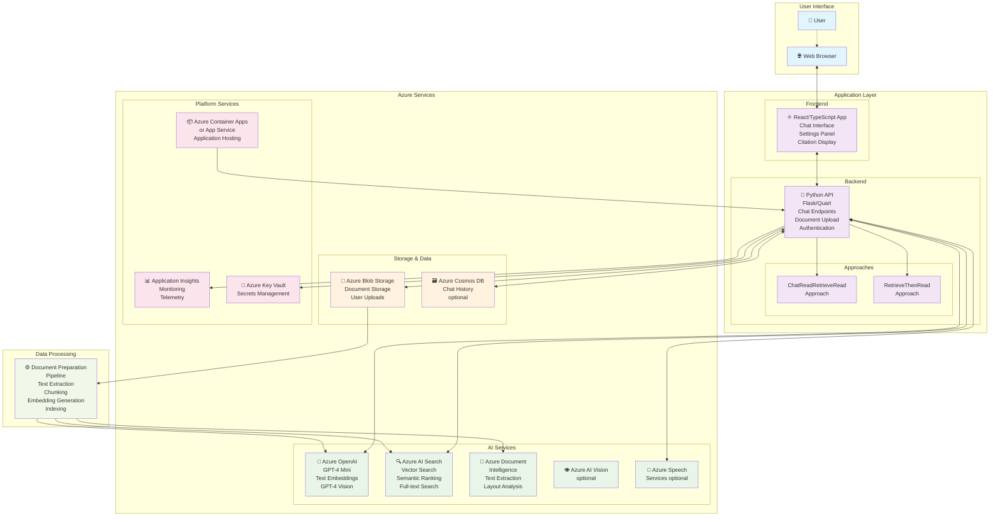
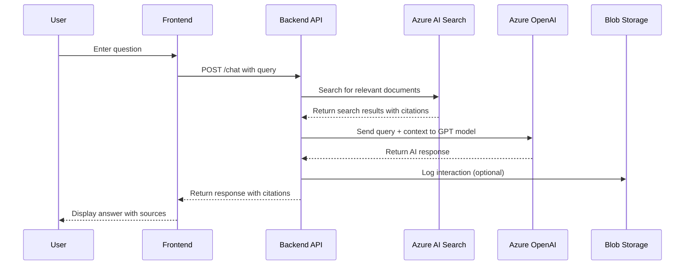
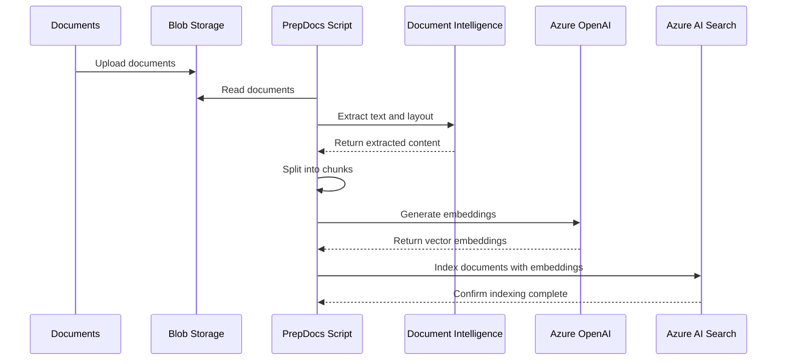

# RAG Chat: Application Architecture

This document provides a detailed architectural overview of this application, a Retrieval Augmented Generation (RAG) application that creates a ChatGPT-like experience over your own documents. It combines Azure OpenAI Service for AI capabilities with Azure AI Search for document indexing and retrieval.

For getting started with the application, see the main [README](../README.md).

## Architecture Diagram

The following diagram illustrates the complete architecture including user interaction flow, application components, and Azure services:

## Chat Query Flow

The following sequence diagram shows how a user query is processed:

## Document Ingestion Flow

The following diagram shows how documents are processed and indexed:

## Key Components

### Frontend (React/TypeScript)

- **Chat Interface**: Main conversational UI
- **Settings Panel**: Configuration options for AI behavior
- **Citation Display**: Shows sources and references
- **Authentication**: Optional user login integration

### Backend (Python)

- **API Layer**: RESTful endpoints for chat, search, and configuration. See [HTTP Protocol](http_protocol.md) for detailed API documentation.
- **Approach Patterns**: Different strategies for processing queries
  - `ChatReadRetrieveRead`: Multi-turn conversation with retrieval
  - `RetrieveThenRead`: Single-turn Q&A with retrieval
- **Authentication**: Optional integration with Azure Active Directory

### Azure Services Integration

- **Azure OpenAI**: Powers the conversational AI capabilities
- **Azure AI Search**: Provides semantic and vector search over documents
- **Azure Blob Storage**: Stores original documents and processed content
- **Application Insights**: Provides monitoring and telemetry

## Optional Features

The architecture supports several optional features that can be enabled. For detailed configuration instructions, see the [optional features guide](deploy_features.md):

- **GPT-4 with Vision**: Process image-heavy documents
- **Speech Services**: Voice input/output capabilities
- **Chat History**: Persistent conversation storage in Cosmos DB
- **Authentication**: User login and access control
- **Private Endpoints**: Network isolation for enhanced security

## Deployment Options

The application can be deployed using:

- **Azure Container Apps** (default): Serverless container hosting
- **Azure App Service**: Traditional PaaS hosting option. See the [App Service hosting guide](appservice.md) for detailed instructions.

Both options support the same feature set and can be configured through the Azure Developer CLI (azd).
