# Architecture Overview

This document provides a detailed architecture diagram of the Azure Search OpenAI demo application, showing the complete RAG (Retrieval Augmented Generation) flow and all components.

## System Architecture

```mermaid
graph TB
    %% User Interface Layer
    User[👤 User] --> WebApp[🌐 React Frontend<br/>TypeScript/Vite]
    
    %% Application Layer
    WebApp --> Backend[🐍 Python Backend<br/>Quart API]
    
    %% Authentication (Optional)
    Backend --> Auth{🔐 Authentication<br/>Enabled?}
    Auth -->|Yes| EntraID[🏢 Microsoft Entra ID<br/>Azure AD]
    Auth -->|No| ProcessRequest[Process Request]
    EntraID --> ProcessRequest
    
    %% Core RAG Flow
    ProcessRequest --> RAGFlow{📋 Request Type}
    RAGFlow -->|Chat| ChatApproach[💬 Chat Approach<br/>chatreadretrieveread.py]
    RAGFlow -->|Ask| AskApproach[❓ Ask Approach<br/>retrievethenread.py]
    RAGFlow -->|Vision| VisionApproach[👁️ Vision Approach<br/>GPT-4V enabled]
    
    %% Search and Retrieval
    ChatApproach --> QueryRewrite[🔄 Query Rewriting<br/>OpenAI API]
    QueryRewrite --> SearchIndex[🔍 Azure AI Search<br/>Vector + Keyword Search]
    AskApproach --> SearchIndex
    VisionApproach --> SearchIndex
    VisionApproach --> VisionAPI[👁️ Azure AI Vision<br/>Image Analysis]
    
    %% Document Storage and Processing
    SearchIndex --> BlobStorage[💾 Azure Blob Storage<br/>Document Storage]
    DocProcessor[📄 Document Processor<br/>prepdocs.py] --> BlobStorage
    DocProcessor --> SearchIndex
    DocProcessor --> FormRecognizer[📋 Azure AI Document Intelligence<br/>Text Extraction]
    DocProcessor --> OpenAIEmbedding[🧮 Azure OpenAI<br/>Embedding Generation]
    
    %% AI Processing
    ChatApproach --> OpenAI[🤖 Azure OpenAI Service<br/>GPT Models]
    AskApproach --> OpenAI
    VisionApproach --> OpenAI
    OpenAIEmbedding --> SearchIndex
    
    %% Response Generation
    OpenAI --> ResponseProcessor[📝 Response Processing<br/>Citations & Sources]
    ResponseProcessor --> WebApp
    
    %% Optional Features
    Backend --> ChatHistory{💭 Chat History<br/>Enabled?}
    ChatHistory -->|Cosmos DB| CosmosDB[🌌 Azure Cosmos DB<br/>Persistent Storage]
    ChatHistory -->|Browser| BrowserStorage[🖥️ Browser Storage<br/>Local Storage]
    ChatHistory -->|Disabled| NoHistory[No Storage]
    
    Backend --> Speech{🎤 Speech<br/>Enabled?}
    Speech -->|Yes| SpeechService[🗣️ Azure Speech Service<br/>STT/TTS]
    Speech -->|No| NoSpeech[No Speech]
    
    %% Monitoring and Observability
    Backend --> AppInsights[📊 Azure Application Insights<br/>Monitoring & Telemetry]
    OpenAI --> AppInsights
    SearchIndex --> AppInsights
    
    %% Deployment Infrastructure
    WebApp --> ContainerApps[📦 Azure Container Apps<br/>Default Hosting]
    Backend --> ContainerApps
    ContainerApps --> ContainerRegistry[📋 Azure Container Registry<br/>Container Images]
    
    %% Alternative Deployment
    WebApp -.-> AppService[🌐 Azure App Service<br/>Alternative Hosting]
    Backend -.-> AppService
    
    %% Security and Access Control
    Backend --> AccessControl{🛡️ Access Control<br/>Enabled?}
    AccessControl -->|Yes| SecurityFilter[🔒 Security Filters<br/>OID/Groups based]
    AccessControl -->|No| PublicAccess[Public Access]
    SecurityFilter --> SearchIndex
    
    %% Styling
    classDef userInterface fill:#e1f5fe
    classDef application fill:#f3e5f5
    classDef azureService fill:#fff3e0
    classDef storage fill:#e8f5e8
    classDef optional fill:#fce4ec
    classDef security fill:#ffebee
    
    class User,WebApp userInterface
    class Backend,ProcessRequest,RAGFlow,ChatApproach,AskApproach,VisionApproach,ResponseProcessor application
    class OpenAI,SearchIndex,FormRecognizer,OpenAIEmbedding,VisionAPI,AppInsights,ContainerApps,ContainerRegistry,AppService,SpeechService azureService
    class BlobStorage,CosmosDB,BrowserStorage storage
    class ChatHistory,Speech,NoHistory,NoSpeech,VisionApproach optional
    class Auth,EntraID,AccessControl,SecurityFilter,PublicAccess security
```

## Key Components

### Frontend Layer
- **React Frontend**: Modern web application built with TypeScript and Vite
- **User Interface**: Provides Chat and Ask interfaces for different interaction modes

### Backend Layer
- **Python API**: Quart-based asynchronous web framework
- **RAG Approaches**: Different strategies for retrieval and generation
  - Chat: Multi-turn conversations with context
  - Ask: Single-turn Q&A
  - Vision: Image-aware processing with GPT-4V

### Azure Services
- **Azure OpenAI Service**: Core AI model hosting (GPT-4, GPT-3.5, Ada embeddings)
- **Azure AI Search**: Vector and keyword search with semantic ranking
- **Azure Blob Storage**: Document storage and content management
- **Azure AI Document Intelligence**: Text extraction from various document formats
- **Azure Container Apps**: Primary hosting platform (scalable, serverless)
- **Azure Application Insights**: Monitoring, logging, and telemetry

### Optional Components
- **Microsoft Entra ID**: Authentication and authorization
- **Azure Cosmos DB**: Persistent chat history storage
- **Azure AI Vision**: Image analysis for vision-enabled scenarios
- **Azure Speech Service**: Speech-to-text and text-to-speech capabilities

### Data Flow

1. **Document Ingestion**: Documents are processed by `prepdocs.py`, which extracts text using Azure AI Document Intelligence and generates embeddings using Azure OpenAI
2. **User Query**: User submits a question through the React frontend
3. **Authentication** (Optional): User identity is verified against Microsoft Entra ID
4. **Query Processing**: Backend determines the appropriate RAG approach based on request type
5. **Search & Retrieval**: Query is executed against Azure AI Search to find relevant documents
6. **AI Generation**: Retrieved content is combined with the user query and sent to Azure OpenAI for response generation
7. **Response**: AI-generated response with citations is returned to the user

### Security Features
- **Access Control**: Optional row-level security based on user identity
- **Security Filters**: OID and group-based filtering of search results
- **Private Endpoints**: Network isolation capabilities for enhanced security

## Deployment Options

The application supports two primary deployment modes:
- **Azure Container Apps** (Default): Serverless container hosting with automatic scaling
- **Azure App Service**: Traditional PaaS hosting option

Both options use Azure Container Registry for container image management and Azure Application Insights for monitoring.