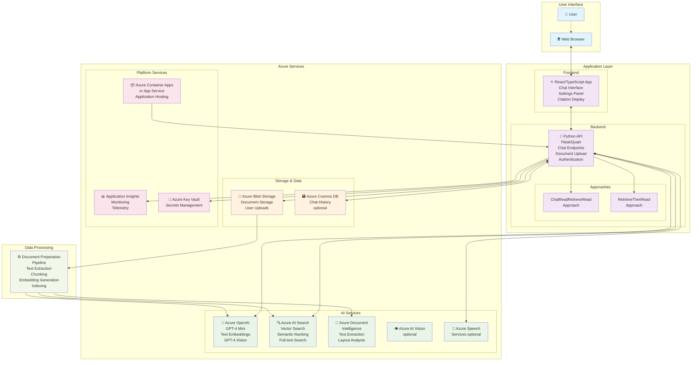
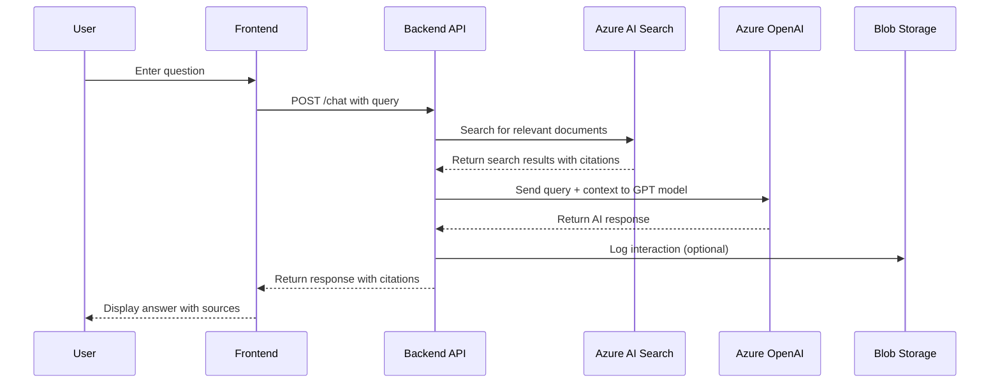
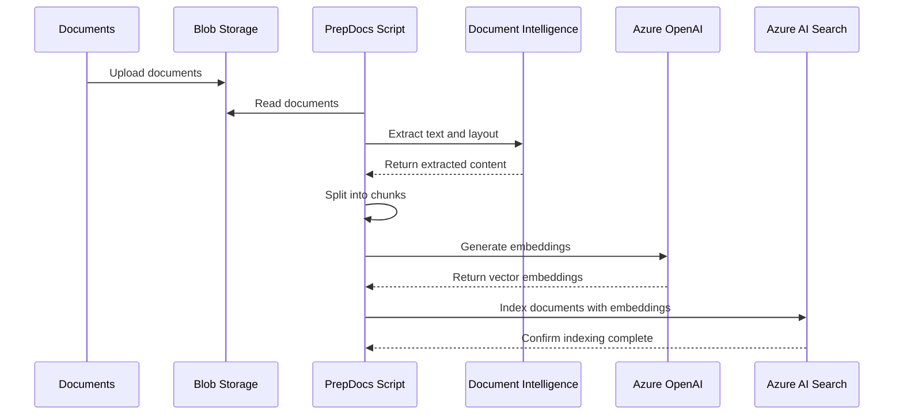

# Czat RAG: Architektura aplikacji

Ten dokument zawiera szczegółowy przegląd architektury tej aplikacji, aplikacji Retrieval Augmented Generation (RAG), która tworzy doświadczenie podobne do ChatGPT nad własnymi dokumentami. Łączy Azure OpenAI Service dla możliwości AI z Azure AI Search do indeksowania i wyszukiwania dokumentów.

Aby rozpocząć pracę z aplikacją, zobacz główny [README](../README.pl.md).

## Diagram architektury

Poniższy diagram ilustruje kompletną architekturę, w tym przepływ interakcji użytkownika, komponenty aplikacji i usługi Azure:

## Przepływ zapytania czatu

Poniższy diagram sekwencji pokazuje, jak przetwarzane jest zapytanie użytkownika:

## Przepływ pozyskiwania dokumentów

Poniższy diagram pokazuje, jak dokumenty są przetwarzane i indeksowane:

## Kluczowe komponenty

### Frontend (React/TypeScript)

- **Interfejs czatu**: Główny interfejs konwersacyjny
- **Panel ustawień**: Opcje konfiguracji dla zachowania AI
- **Wyświetlanie cytatów**: Pokazuje źródła i referencje
- **Uwierzytelnianie**: Opcjonalna integracja logowania użytkownika

### Backend (Python)

- **Warstwa API**: Endpointy RESTful dla czatu, wyszukiwania i konfiguracji. Zobacz [Protokół HTTP](http_protocol.md) *(angielski)* po szczegółową dokumentację API.
- **Wzorce podejść**: Różne strategie przetwarzania zapytań
  - `ChatReadRetrieveRead`: Konwersacja wieloetapowa z wyszukiwaniem
  - `RetrieveThenRead`: Jednoetapowe Q&A z wyszukiwaniem
- **Uwierzytelnianie**: Opcjonalna integracja z Azure Active Directory

### Integracja usług Azure

- **Azure OpenAI**: Zasila możliwości konwersacyjne AI
- **Azure AI Search**: Zapewnia wyszukiwanie semantyczne i wektorowe nad dokumentami
- **Azure Blob Storage**: Przechowuje oryginalne dokumenty i przetworzoną zawartość
- **Application Insights**: Zapewnia monitorowanie i telemetrię

## Opcjonalne funkcje

Architektura obsługuje kilka opcjonalnych funkcji, które można włączyć. Po szczegółowe instrukcje konfiguracji zobacz [przewodnik opcjonalnych funkcji](deploy_features.md) *(angielski)*:

- **GPT-4 z Vision**: Przetwarzaj dokumenty zawierające dużo obrazów
- **Usługi mowy**: Możliwości wejścia/wyjścia głosowego
- **Historia czatu**: Trwałe przechowywanie rozmów w Cosmos DB
- **Uwierzytelnianie**: Logowanie użytkownika i kontrola dostępu
- **Prywatne punkty końcowe**: Izolacja sieciowa dla zwiększonego bezpieczeństwa

## Opcje wdrożenia

Aplikację można wdrożyć przy użyciu:

- **Azure Container Apps** (domyślnie): Hosting kontenerów bez serwera
- **Azure App Service**: Tradycyjna opcja hostingu PaaS. Zobacz [przewodnik hostingu App Service](appservice.md) *(angielski)* po szczegółowe instrukcje.

Obie opcje obsługują ten sam zestaw funkcji i można je skonfigurować za pomocą Azure Developer CLI (azd).
