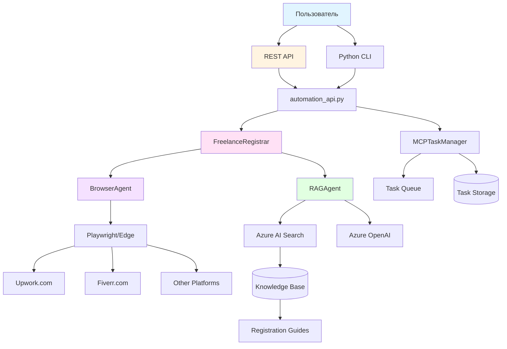
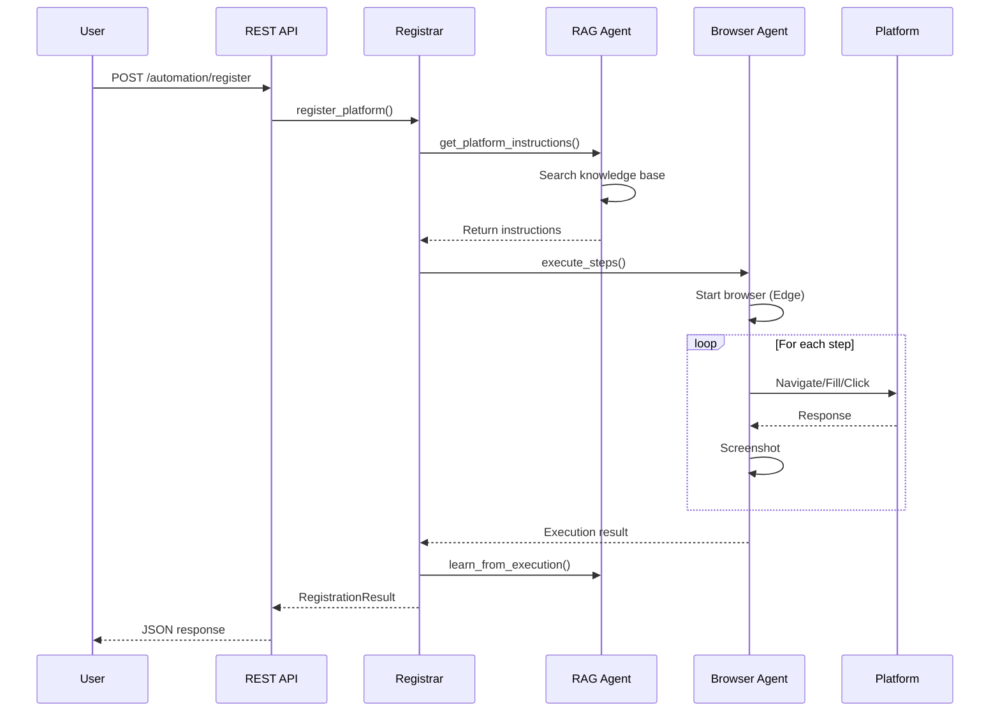
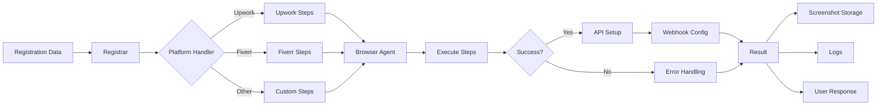
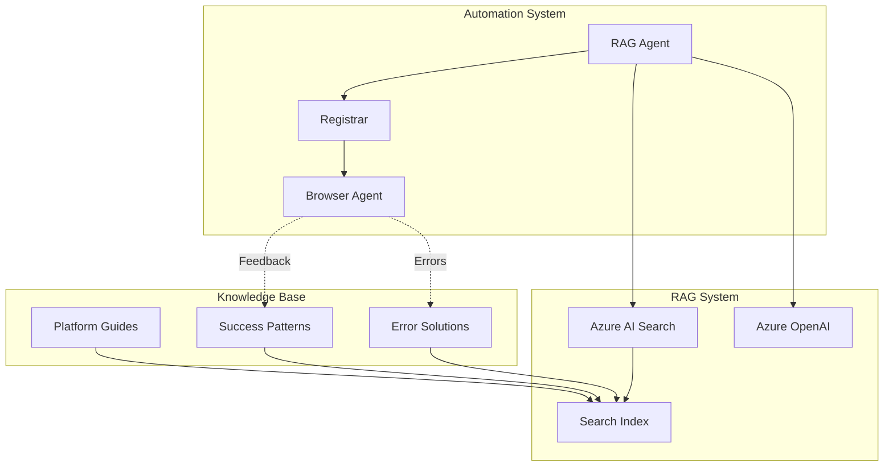
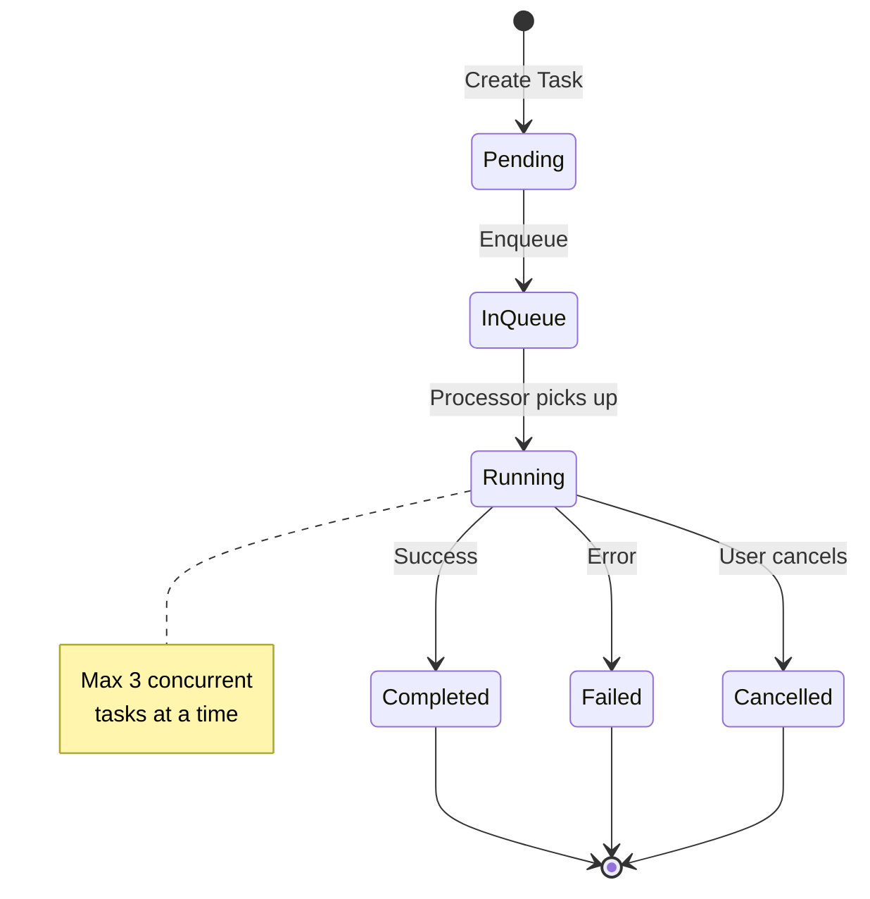
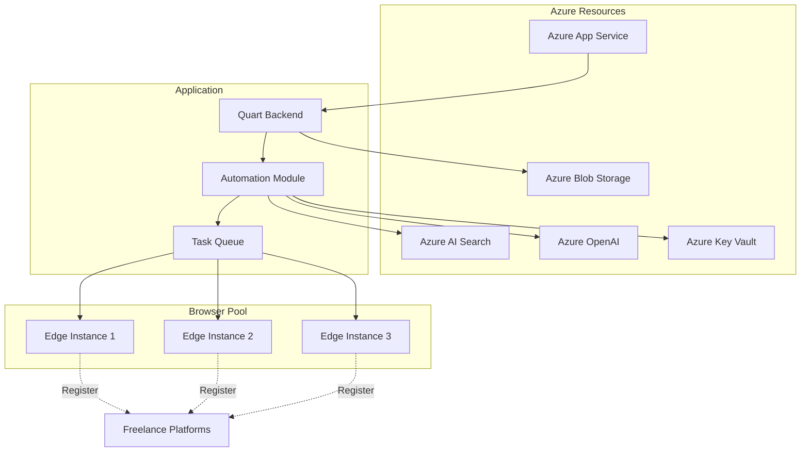
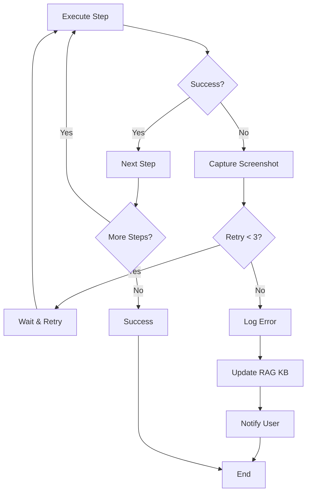
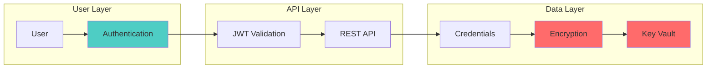
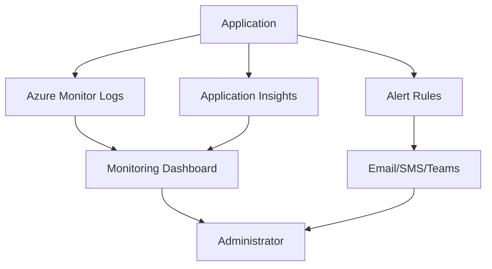

# Архитектура Системы Автоматизации

## Общая архитектура

## Поток регистрации

## Компоненты

### 1. BrowserAgent
Управление браузером Playwright:
- Запуск Edge/Chromium
- Навигация по страницам
- Заполнение форм
- Скриншоты
- Управление cookies

### 2. FreelanceRegistrar
Оркестрация процесса регистрации:
- Platform-specific handlers
- Полный цикл: регистрация → API → webhooks
- Batch processing
- Error handling

### 3. MCPTaskManager
Управление задачами:
- Task queue
- Priority scheduling
- Progress tracking
- Async execution

### 4. RAGAgent
Интеллектуальные решения:
- Поиск инструкций в KB
- Генерация automation steps
- Обучение на результатах

## Поток данных

## Интеграция с RAG системой

## Task Management Flow

## Deployment Architecture

## Error Handling Flow

## Security Architecture

## Масштабирование

### Горизонтальное
- Несколько экземпляров App Service
- Распределенная очередь задач
- Load balancing

### Вертикальное
- Больше concurrent tasks
- Faster browser instances
- Увеличение memory/CPU

## Мониторинг

## Компоненты модуля automation

| Компонент | Ответственность | Зависимости |
|-----------|----------------|-------------|
| `browser_agent.py` | Browser automation | Playwright |
| `freelance_registrar.py` | Platform registration | BrowserAgent |
| `mcp_integration.py` | Task management | asyncio, dataclasses |
| `rag_agent.py` | RAG intelligence | Azure Search, OpenAI |
| `automation_api.py` | REST endpoints | Quart |

## Расширение системы

### Добавление новой платформы

1. Создать handler в `freelance_registrar.py`
2. Определить registration steps
3. Добавить в PLATFORM_HANDLERS
4. Обновить документацию в KB
5. Добавить тесты

### Добавление нового типа задачи

1. Расширить TaskType enum
2. Добавить обработчик в execute_task()
3. Обновить API endpoints
4. Документировать

## Производительность

### Оптимизации

- **Browser pooling**: Переиспользование инстансов
- **Parallel execution**: До 3 одновременно
- **Caching**: Кеширование RAG результатов
- **Rate limiting**: Защита от блокировок

### Метрики

- Время регистрации: ~2-5 минут
- Success rate: 85-95%
- Concurrent tasks: 3 default, до 10
- Memory per task: ~200-300MB

---

Эта архитектура обеспечивает:
✅ Масштабируемость
✅ Отказоустойчивость
✅ Безопасность
✅ Расширяемость
