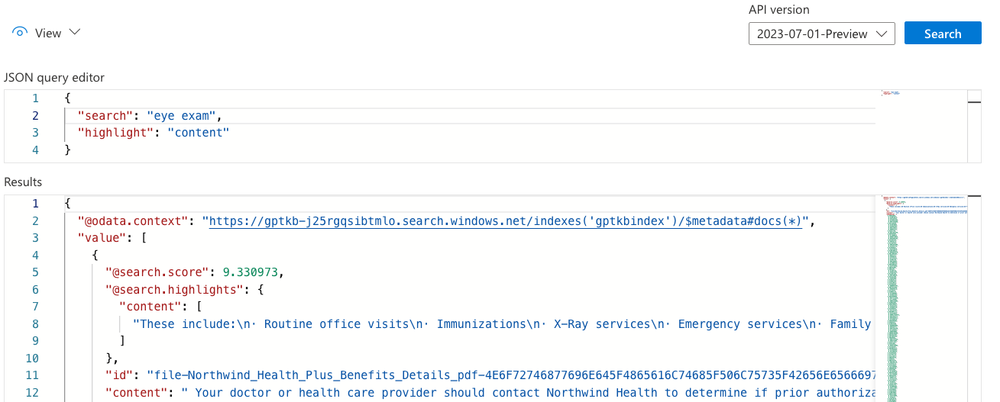

# Customizing the Chat App

This guide provides more details for customizing the Chat App.

- [Using your own data](#using-your-own-data)
- [Customizing the UI](#customizing-the-ui)
- [Customizing the backend](#customizing-the-backend)
  - [Chat/Ask approaches](#chatask-approaches)
- [Improving answer quality](#improving-answer-quality)
  - [Identify the problem point](#identify-the-problem-point)
  - [Improving OpenAI ChatCompletion results](#improving-openai-chatcompletion-results)
  - [Improving Azure AI Search results](#improving-azure-ai-search-results)
  - [Evaluating answer quality](#evaluating-answer-quality)

## Using your own data

The Chat App is designed to work with any PDF documents. The sample data is provided to help you get started quickly, but you can easily replace it with your own data. You'll want to first remove all the existing data, then add your own. See the [data ingestion guide](data_ingestion.md) for more details.

## Customizing the UI

The frontend is built using [React](https://reactjs.org/) and [Fluent UI components](https://react.fluentui.dev/). The frontend components are stored in the `app/frontend/src` folder. The typical components you'll want to customize are:

- `app/frontend/index.html`: To change the page title
- `app/frontend/src/pages/layout/Layout.tsx`: To change the header text and logo
- `app/frontend/src/pages/chat/Chat.tsx`: To change the large heading
- `app/frontend/src/components/Example/ExampleList.tsx`: To change the example questions

## Customizing the backend

The backend is built using [Quart](https://quart.palletsprojects.com/), a Python framework for asynchronous web applications. The backend code is stored in the `app/backend` folder.

### Chat/Ask tabs

Typically, the primary backend code you'll want to customize is the `app/backend/approaches` folder, which contains the classes powering the Chat and Ask tabs. Each class uses a different RAG (Retrieval Augmented Generation) approach, which include system messages that should be changed to match your data

#### Chat approach

The chat tab uses the approach programmed in [chatreadretrieveread.py](https://github.com/Azure-Samples/azure-search-openai-demo/blob/main/app/backend/approaches/chatreadretrieveread.py).

1. It calls the OpenAI ChatCompletion API (with a temperature of 0) to turn the user question into a good search query.
2. It queries Azure AI Search for search results for that query (optionally using the vector embeddings for that query).
3. It then combines the search results and original user question, and calls the OpenAI ChatCompletion API (with a temperature of 0.7) to answer the question based on the sources. It includes the last 4K of message history as well (or however many tokens are allowed by the deployed model).

The `system_message_chat_conversation` variable is currently tailored to the sample data since it starts with "Assistant helps the company employees with their healthcare plan questions, and questions about the employee handbook." Change that to match your data.

##### Chat with vision

If you followed the instructions in [docs/gpt4v.md](docs/gpt4v.md) to enable the GPT-4 Vision model and then select "Use GPT-4 Turbo with Vision", then the chat tab will use the `chatreadretrievereadvision.py` approach instead. This approach is similar to the `chatreadretrieveread.py` approach, with a few differences:

1. Step 1 is the same as before, except it uses the GPT-4 Vision model instead of the default GPT-3.5 model.
2. For this step, it also calculates a vector embedding for the user question using [the Computer Vision vectorize text API](https://learn.microsoft.com/azure/ai-services/computer-vision/how-to/image-retrieval#call-the-vectorize-text-api), and passes that to the Azure AI Search to compare against the `imageEmbeddings` fields in the indexed documents. For each matching document, it downloads the image blob and converts it to a base 64 encoding.
3. When it combines the search results and user question, it includes the base 64 encoded images, and sends along both the text and images to the GPT4 Vision model (similar to this [documentation example](https://platform.openai.com/docs/guides/vision/quick-start)). The model generates a response that includes citations to the images, and the UI renders the base64 encoded images when a citation is clicked.

#### Ask tab

The ask tab uses the approach programmed in [retrievethenread.py](https://github.com/Azure-Samples/azure-search-openai-demo/blob/main/app/backend/approaches/retrievethenread.py).

1. It queries Azure AI Search for search results for the user question (optionally using the vector embeddings for that question).
2. It then combines the search results and user question, and calls the OpenAI ChatCompletion API (with a temperature of 0.3) to answer the question based on the sources.

The `system_chat_template` variable is currently tailored to the sample data since it starts with "You are an intelligent assistant helping Contoso Inc employees with their healthcare plan questions and employee handbook questions." Change that to match your data.

#### Read with vision

If you followed the instructions in [docs/gpt4v.md](docs/gpt4v.md) to enable the GPT-4 Vision model and then select "Use GPT-4 Turbo with Vision", then the ask tab will use the `retrievethenreadvision.py` approach instead. This approach is similar to the `retrievethenread.py` approach, with a few differences:

1. For this step, it also calculates a vector embedding for the user question using [the Computer Vision vectorize text API](https://learn.microsoft.com/azure/ai-services/computer-vision/how-to/image-retrieval#call-the-vectorize-text-api), and passes that to the Azure AI Search to compare against the `imageEmbeddings` fields in the indexed documents. For each matching document, it downloads the image blob and converts it to a base 64 encoding.
2. When it combines the search results and user question, it includes the base 64 encoded images, and sends along both the text and images to the GPT4 Vision model (similar to this [documentation example](https://platform.openai.com/docs/guides/vision/quick-start)). The model generates a response that includes citations to the images, and the UI renders the base64 encoded images when a citation is clicked.

The `system_message_chat_conversation` variable is currently tailored to the sample data since it starts with "You are an intelligent assistant helping analyze the Annual Financial Report of Contoso Ltd". Change that to match your data.

#### Making settings overrides permanent

The UI provides a "Developer Settings" menu for customizing the approaches, like disabling semantic ranker or using vector search.
Those settings are passed in the "context" field of the request to the backend, and are not saved permanently.
However, if you find a setting that you do want to make permanent, there are two approaches:

1. Change the defaults in the frontend. You'll find the defaults in `Chat.tsx` and `Ask.tsx`. For example, this line of code sets the default retrieval mode to Hybrid:

```typescript
const [retrievalMode, setRetrievalMode] = useState<RetrievalMode>(RetrievalMode.Hybrid);
```

You can change the default to Text by changing the code to:

```typescript
const [retrievalMode, setRetrievalMode] = useState<RetrievalMode>(RetrievalMode.Text);
```

2. Change the overrides in the backend. Each of the approaches has a `run` method that takes a `context` parameter, and the first line of code extracts the overrides from that `context`. That's where you can override any of the settings. For example, to change the retrieval mode to text:

```python
overrides = context.get("overrides", {})
overrides["retrieval_mode"] = "text"
```

By changing the setting on the backend, you can safely remove the Developer Settings UI from the frontend, if you don't wish to expose that to your users.

## Improving answer quality

Once you are running the chat app on your own data and with your own tailored system prompt,
the next step is to test the app with questions and note the quality of the answers.
If you notice any answers that aren't as good as you'd like, here's a process for improving them.

### Identify the problem point

The first step is to identify where the problem is occurring. For example, if using the Chat tab, the problem could be:

1. OpenAI ChatCompletion API is not generating a good search query based on the user question
2. Azure AI Search is not returning good search results for the query
3. OpenAI ChatCompletion API is not generating a good answer based on the search results and user question

You can look at the "Thought process" tab in the chat app to see each of those steps,
and determine which one is the problem.

### Improving OpenAI ChatCompletion results

If the problem is with the ChatCompletion API calls (steps 1 or 3 above), you can try changing the relevant prompt.

Once you've changed the prompt, make sure you ask the same question multiple times to see if the overall quality has improved, and [run an evaluation](#evaluating-answer-quality) when you're satisfied with the changes. The ChatCompletion API can yield different results every time, even for a temperature of 0.0, but especially for a higher temperature than that (like our default of 0.7 for step 3).

You can also try changing the ChatCompletion parameters, like temperature, to see if that improves results for your domain.

### Improving Azure AI Search results

If the problem is with Azure AI Search (step 2 above), the first step is to check what search parameters you're using. Generally, the best results are found with hybrid search (text + vectors) plus the additional semantic re-ranking step, and that's what we've enabled by default. There may be some domains where that combination isn't optimal, however.

##### Configuring parameters in the app

You can change many of the search parameters in the "Developer settings" in the frontend and see if results improve for your queries. The most relevant options:


#### Configuring parameters in the Azure Portal

You may find it easier to experiment with search options with the index explorer in the Azure Portal.
Open up the Azure AI Search resource, select the Indexes tab, and select the index there.

Then use the JSON view of the search explorer, and make sure you specify the same options you're using in the app. For example, this query represents a search with semantic ranker configured:

```json
{
  "search": "eye exams",
  "queryType": "semantic",
  "semanticConfiguration": "default",
  "queryLanguage": "en-us",
  "speller": "lexicon",
  "top": 3
}
```

You can also use the `highlight` parameter to see what text is being matched in the `content` field in the search results.

```json
{
    "search": "eye exams",
    "highlight": "content"
    ...
}
```



The search explorer works well for testing text, but is harder to use with vectors, since you'd also need to compute the vector embedding and send it in. It is probably easier to use the app frontend for testing vectors/hybrid search.


### Evaluating answer quality

Once you've made changes to the prompts or settings, you'll want to rigorously evaluate the results to see if they've improved. You can use tools in [the AI RAG Chat evaluator](https://github.com/Azure-Samples/ai-rag-chat-evaluator) repository to run evaluations, review results, and compare answers across runs.
