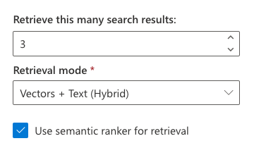
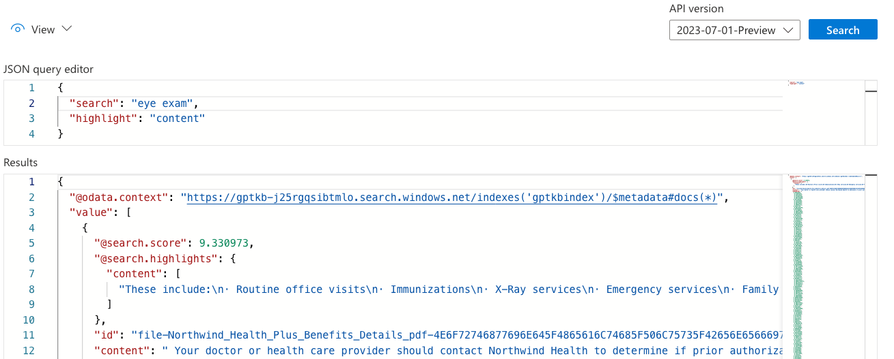

# RAG chat: Customizing the chat app

[📺 Watch: (RAG Deep Dive series) Customizing the app](https://www.youtube.com/watch?v=D3slfMqydHc)

> **Tip:** We recommend using GitHub Copilot Agent mode when adding new features or making code changes. This project includes an [AGENTS.md](../AGENTS.md) file that guides Copilot to generate code following project conventions.

This guide provides more details for customizing the RAG chat app.

- [Using your own data](#using-your-own-data)
- [Customizing the UI](#customizing-the-ui)
- [Customizing the backend](#customizing-the-backend)
  - [Chat approach](#chat-approach)
- [Improving answer quality](#improving-answer-quality)
  - [Identify the problem point](#identify-the-problem-point)
  - [Improving OpenAI ChatCompletion results](#improving-openai-chatcompletion-results)
  - [Improving Azure AI Search results](#improving-azure-ai-search-results)
  - [Evaluating answer quality](#evaluating-answer-quality)

## Using your own data

The Chat App is designed to work with any PDF documents. The sample data is provided to help you get started quickly, but you can easily replace it with your own data. You'll want to first remove all the existing data, then add your own. See the [data ingestion guide](data_ingestion.md) for more details.

## Customizing the UI

The frontend is built using [React](https://reactjs.org/) and [Fluent UI components](https://react.fluentui.dev/). The frontend components are stored in the `app/frontend/src` folder. To modify the page title, header text, example questions, and other UI elements, you can customize the `app/frontend/src/locales/{en/es/fr/jp/it}/translation.json` file for different languages(English is the default). The primary strings and labels used throughout the application are defined within these files.

## Customizing the backend

The backend is built using [Quart](https://quart.palletsprojects.com/), a Python framework for asynchronous web applications. The backend code is stored in the `app/backend` folder. The frontend and backend communicate over HTTP using JSON or streamed NDJSON responses. Learn more in the [HTTP Protocol guide](http_protocol.md).

### Chat approach

Typically, the primary backend code you'll want to customize is the `app/backend/approaches` folder, which contains the code and prompts powering the RAG flow.

The RAG flow is implemented in [chatreadretrieveread.py](https://github.com/Azure-Samples/azure-search-openai-demo/blob/main/app/backend/approaches/chatreadretrieveread.py).

1. **Query rewriting**: It calls the OpenAI ChatCompletion API to turn the user question into a good search query, using the prompt from [query_rewrite.system.jinja2](https://github.com/Azure-Samples/azure-search-openai-demo/blob/main/app/backend/approaches/prompts/query_rewrite.system.jinja2) and tools from [chat_query_rewrite_tools.json](https://github.com/Azure-Samples/azure-search-openai-demo/blob/main/app/backend/approaches/prompts/chat_query_rewrite_tools.json).
2. **Search**: It queries Azure AI Search for search results for that query (optionally using the vector embeddings for that query).
3. **Answering**: It then calls the OpenAI ChatCompletion API to answer the question based on the sources, using the prompts from [chat_answer.system.jinja2](https://github.com/Azure-Samples/azure-search-openai-demo/blob/main/app/backend/approaches/prompts/chat_answer.system.jinja2) and [chat_answer.user.jinja2](https://github.com/Azure-Samples/azure-search-openai-demo/blob/main/app/backend/approaches/prompts/chat_answer.user.jinja2). That call includes the past message history as well (or as many messages fit inside the model's token limit).

The prompts are currently tailored to the sample data since they start with "Assistant helps the company employees with their healthcare plan questions, and questions about the employee handbook." Modify the [query_rewrite.system.jinja2](https://github.com/Azure-Samples/azure-search-openai-demo/blob/main/app/backend/approaches/prompts/query_rewrite.system.jinja2), [chat_answer.system.jinja2](https://github.com/Azure-Samples/azure-search-openai-demo/blob/main/app/backend/approaches/prompts/chat_answer.system.jinja2), and [chat_answer.user.jinja2](https://github.com/Azure-Samples/azure-search-openai-demo/blob/main/app/backend/approaches/prompts/chat_answer.user.jinja2) prompts to match your data.

#### Chat with multimodal feature

If you followed the instructions in [the multimodal guide](multimodal.md) to enable multimodal RAG,
there are several differences in the chat approach:

1. **Query rewriting**: Unchanged.
2. **Search**: For this step, it calculates a vector embedding for the user question using [the Azure AI Vision vectorize text API](https://learn.microsoft.com/azure/ai-services/computer-vision/how-to/image-retrieval#call-the-vectorize-text-api), and passes that to the Azure AI Search to compare against the image embedding fields in the indexed documents. For each matching document, it downloads each associated image from Azure Blob Storage and converts it to a base 64 encoding.
3. **Answering**: When it combines the search results and user question, it includes the base 64 encoded images, and sends along both the text and images to the multimodal LLM. The model generates a response that includes citations to the images, and the UI renders the images when a citation is clicked.

The settings can be customized to disable calculating the image vector embeddings or to disable sending image inputs to the LLM, if desired.

#### Making settings overrides permanent

The UI provides a "Developer Settings" menu for customizing the approaches, like disabling semantic ranker or using vector search.
Those settings are passed in the "context" field of the request to the backend, and are not saved permanently.
However, if you find a setting that you do want to make permanent, there are two approaches:

1. Change the defaults in the frontend. You'll find the defaults in `Chat.tsx`. For example, this line of code sets the default retrieval mode to Hybrid:

    ```typescript
    const [retrievalMode, setRetrievalMode] = useState<RetrievalMode>(RetrievalMode.Hybrid);
    ```

    You can change the default to Text by changing the code to:

    ```typescript
    const [retrievalMode, setRetrievalMode] = useState<RetrievalMode>(RetrievalMode.Text);
    ```

2. Change the overrides in the backend. Each of the approaches has a `run` method that takes a `context` parameter, and the first line of code extracts the overrides from that `context`. That's where you can override any of the settings. For example, to change the retrieval mode to text:

    ```python
    overrides = context.get("overrides", {})
    overrides["retrieval_mode"] = "text"
    ```

    By changing the setting on the backend, you can safely remove the Developer Settings UI from the frontend, if you don't wish to expose that to your users.

## Improving answer quality

Once you are running the chat app on your own data and with your own tailored system prompt,
the next step is to test the app with questions and note the quality of the answers.
If you notice any answers that aren't as good as you'd like, here's a process for improving them.

### Identify the problem point

The first step is to identify where the problem is occurring. For example, if using the Chat tab, the problem could be:

1. OpenAI ChatCompletion API is not generating a good search query based on the user question
2. Azure AI Search is not returning good search results for the query
3. OpenAI ChatCompletion API is not generating a good answer based on the search results and user question

You can look at the "Thought process" tab in the chat app to see each of those steps,
and determine which one is the problem.

### Improving OpenAI ChatCompletion results

If the problem is with the ChatCompletion API calls (steps 1 or 3 above), you can try changing the relevant prompt.

Once you've changed the prompt, make sure you ask the same question multiple times to see if the overall quality has improved, and [run an evaluation](#evaluating-answer-quality) when you're satisfied with the changes. The ChatCompletion API can yield different results every time, even for a temperature of 0.0, but especially for a higher temperature than that (like our default of 0.7 for step 3).

You can also try changing the ChatCompletion parameters, like temperature, to see if that improves results for your domain.

### Improving Azure AI Search results

If the problem is with Azure AI Search (step 2 above), the first step is to check what search parameters you're using. Generally, the best results are found with hybrid search (text + vectors) plus the additional semantic re-ranking step, and that's what we've enabled by default. There may be some domains where that combination isn't optimal, however. Check out this blog post which [evaluates AI search strategies](https://techcommunity.microsoft.com/blog/azure-ai-services-blog/azure-ai-search-outperforming-vector-search-with-hybrid-retrieval-and-ranking-ca/3929167) for a better understanding of the differences, or watch this [RAG Deep Dive video on AI Search](https://www.youtube.com/watch?v=ugJy9QkgLYg).

#### Configuring parameters in the app

You can change many of the search parameters in the "Developer settings" in the frontend and see if results improve for your queries. The most relevant options:



#### Configuring parameters in the Azure Portal

You may find it easier to experiment with search options with the index explorer in the Azure Portal.
Open up the Azure AI Search resource, select the Indexes tab, and select the index there.

Then use the JSON view of the search explorer, and make sure you specify the same options you're using in the app. For example, this query represents a search with semantic ranker configured:

```json
{
  "search": "eye exams",
  "queryType": "semantic",
  "semanticConfiguration": "default",
  "queryLanguage": "en-us",
  "speller": "lexicon",
  "top": 3
}
```

You can also use the `highlight` parameter to see what text is being matched in the `content` field in the search results.

```json
{
    "search": "eye exams",
    "highlight": "content"
    ...
}
```



The search explorer works well for testing text, but is harder to use with vectors, since you'd also need to compute the vector embedding and send it in. It is probably easier to use the app frontend for testing vectors/hybrid search.

#### Other approaches to improve search results

Here are additional ways for improving the search results:

- Adding additional metadata to the "content" field, like the document title, so that it can be matched in the search results. Modify [searchmanager.py](https://github.com/Azure-Samples/azure-search-openai-demo/blob/main/app/backend/prepdocslib/searchmanager.py) to include more text in the `content` field.
- Making additional fields searchable by the full text search step. For example, the "sourcepage" field is not currently searchable, but you could make that into a `SearchableField` with `searchable=True` in [searchmanager.py](https://github.com/Azure-Samples/azure-search-openai-demo/blob/main/app/backend/prepdocslib/searchmanager.py). A change like that requires [re-building the index](https://learn.microsoft.com/azure/search/search-howto-reindex#change-an-index-schema).
- Using function calling to search by particular fields, like searching by the filename. See this blog post on [function calling for structured retrieval](https://blog.pamelafox.org/2024/03/rag-techniques-using-function-calling.html).
- Using a different splitting strategy for the documents, or modifying the existing ones, to improve the chunks that are indexed. You can find the currently available splitters in [textsplitter.py](https://github.com/Azure-Samples/azure-search-openai-demo/blob/main/app/backend/prepdocslib/textsplitter.py).

### Evaluating answer quality

Once you've made changes to the prompts or settings, you'll want to rigorously evaluate the results to see if they've improved. Follow the [evaluation guide](./evaluation.md) to learn how to run evaluations, review results, and compare answers across runs.
