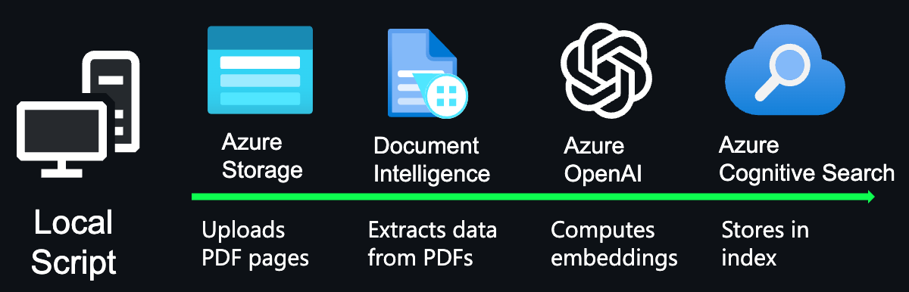

# Indexing documents for the Chat App

This guide provides more details for using the `prepdocs` script to index documents for the Chat App.

## Overview of the manual indexing process

The `scripts/prepdocs.py` script is responsible for both uploading and indexing documents. The typical usage is to call it using `scripts/prepdocs.sh` (Mac/Linux) or `scripts/prepdocs.ps1` (Windows), as these scripts will set up a Python virtual environment and pass in the required parameters based on the current `azd` environment. Whenever `azd up` or `azd provision` is run, the script is called automatically.

The script uses the following steps to index documents:

1. If it doesn't yet exist, create a new index in Azure Cognitive Search.
2. Upload the PDFs to Azure Blob Storage.
3. Split the PDFs into chunks of text.
4. Upload the chunks to Azure Cognitive Search. If using vectors (the default), also compute the embeddings and upload those alongside the text.

### Chunking

We're often asked why we need to break up the PDFs into chunks when Azure Cognitive Search supports searching large documents.

Chunking allows us to limit the amount of information we send to OpenAI due to token limits. By breaking up the content, it allows us to easily find potential chunks of text that we can inject into OpenAI. The method of chunking we use leverages a sliding window of text such that sentences that end one chunk will start the next. This allows us to reduce the chance of losing the context of the text.

If needed, you can modify the chunking algorithm in `scripts/prepdocslib/textsplitter.py`.

## Indexing additional documents

To upload more PDFs, put them in the data/ folder and run `./scripts/prepdocs.sh` or `./scripts/prepdocs.ps1`.

A [recent change](https://github.com/Azure-Samples/azure-search-openai-demo/pull/835) added checks to see what's been uploaded before. The prepdocs script now writes an .md5 file with an MD5 hash of each file that gets uploaded. Whenever the prepdocs script is re-run, that hash is checked against the current hash and the file is skipped if it hasn't changed.

## Removing documents

You may want to remove documents from the index. For example, if you're using the sample data, you may want to remove the documents that are already in the index before adding your own.

To remove all documents, use the `--removeall` flag. Open either `scripts/prepdocs.sh` or `scripts/prepdocs.ps1` and add `--removeall` to the command at the bottom of the file. Then run the script as usual.

You can also remove individual documents by using the `--remove` flag. Open either `scripts/prepdocs.sh` or `scripts/prepdocs.ps1`, add `--remove` to the command at the bottom of the file, and replace `/data/*` with `/data/YOUR-DOCUMENT-FILENAME-GOES-HERE.pdf`. Then run the script as usual.
