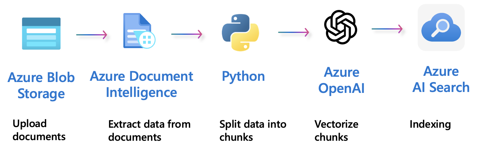
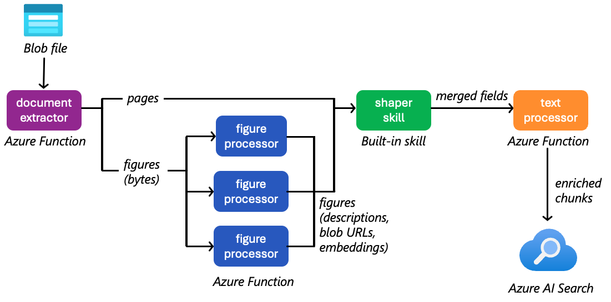

# RAG chat: Data ingestion

The [azure-search-openai-demo](/) project can set up a full RAG chat app on Azure AI Search and OpenAI so that you can chat on custom data, like internal enterprise data or domain-specific knowledge sets. For full instructions on setting up the project, consult the [main README](/README.md), and then return here for detailed instructions on the data ingestion component.

The chat app provides two ways to ingest data: manual ingestion and cloud ingestion. Both approaches use the same code for processing the data, but the manual ingestion runs locally while cloud ingestion runs in Azure Functions as Azure AI Search custom skills.

- [Supported document formats](#supported-document-formats)
- [Ingestion stages](#ingestion-stages)
  - [Document extraction](#document-extraction)
  - [Figure processing](#figure-processing)
  - [Text processing](#text-processing)
- [Local ingestion](#local-ingestion)
  - [Categorizing data for enhanced search](#enhancing-search-functionality-with-data-categorization)
  - [Indexing additional documents](#indexing-additional-documents)
  - [Removing documents](#removing-documents)
- [Cloud ingestion](#cloud-ingestion)
  - [Enabling cloud ingestion](#enabling-cloud-ingestion)
  - [Indexer architecture](#indexer-architecture)
  - [Indexing of additional documents](#indexing-of-additional-documents)
  - [Removal of documents](#removal-of-documents)
  - [Scheduled indexing](#scheduled-indexing)
- [Debugging tips](#debugging-tips)

## Supported document formats

In order to ingest a document format, we need a tool that can turn it into text. By default, the manual indexing uses Azure Document Intelligence (DI in the table below), but we also have local parsers for several formats. The local parsers are not as sophisticated as Azure Document Intelligence, but they can be used to decrease charges.

| Format | Manual indexing                      | Integrated Vectorization |
| ------ | ------------------------------------ | ------------------------ |
| PDF    | Yes (DI or local with PyPDF)         | Yes                      |
| HTML   | Yes (DI or local with BeautifulSoup) | Yes                      |
| DOCX, PPTX, XLSX   | Yes (DI)                             | Yes                      |
| Images (JPG, PNG, BPM, TIFF, HEIFF)| Yes (DI) | Yes                      |
| TXT    | Yes (Local)                          | Yes                      |
| JSON   | Yes (Local)                          | Yes                      |
| CSV    | Yes (Local)                          | Yes                      |

## Ingestion stages

The ingestion pipeline consists of three main stages that transform raw documents into searchable content in Azure AI Search. These stages apply to both [local ingestion](#local-ingestion) and [cloud ingestion](#cloud-ingestion).

### Document extraction

The first stage extracts text and structured content from source documents using parsers tailored to each file format. For PDF, HTML, DOCX, PPTX, XLSX, and image files, the pipeline defaults to using [Azure Document Intelligence](https://learn.microsoft.com/azure/ai-services/document-intelligence/overview) to extract text, tables, and figures with layout information. Alternatively, local parsers like PyPDF and BeautifulSoup can be used to reduce costs for simpler documents. For TXT, JSON, and CSV files, lightweight local parsers extract the content directly.

During extraction, tables are converted to HTML markup to preserve their structure, and figures (when multimodal is enabled) are identified with bounding boxes and placeholders.

The output from this stage is a list of pages, each containing the extracted text with embedded table HTML and figure placeholders like `<figure id="fig1"></figure>`.

### Figure processing

This stage is optional and only applies when the multimodal feature is enabled *and* the document itself has figures. See [multimodal feature documentation](./multimodal.md) for more details.

When multimodal support is enabled, figures extracted in the previous stage are enriched with descriptions and embeddings. Each figure is:

1. **Cropped and saved**: The figure image is cropped from the PDF using its bounding box coordinates and saved as a PNG file.
2. **Described**: A text description is generated using either Azure OpenAI's GPT-4 Vision model or Azure AI Content Understanding, depending on configuration.
3. **Uploaded**: The figure image is uploaded to Azure Blob Storage and assigned a URL.
4. **Embedded** (optional): If image embeddings are enabled, a vector embedding is computed for the figure using Azure AI Vision.

The output from this stage is enriched figure metadata, including the description text, storage URL, and optional embedding vector.

### Text processing

The final stage combines the extracted text with figure descriptions, splits the content into searchable chunks, and computes embeddings.

### Figure merging

First, figure placeholders in the page text are replaced with full HTML markup that includes the figure caption and generated description, creating a cohesive text narrative that incorporates visual content.

#### Chunking

Next, the combined text is split into chunks using a sentence-aware splitter that respects semantic boundaries. The default chunk size is approximately 1000 characters (roughly 400-500 tokens for English), with a 10% overlap between consecutive chunks to preserve context across boundaries. The splitter uses a sliding window approach, ensuring that sentences ending one chunk also start the next, which reduces the risk of losing important context at chunk boundaries.

**Why chunk documents?** While Azure AI Search can index full documents, chunking is essential for the RAG pattern because it limits the amount of information sent to OpenAI, which has token limits for context windows. By breaking content into focused chunks, the system can retrieve and inject only the most relevant pieces of text into the LLM prompt, improving both response quality and cost efficiency.

If needed, you can modify the chunking algorithm in `app/backend/prepdocslib/textsplitter.py`. For a deeper, diagram-rich explanation of how the splitter works (figures, recursion, merge heuristics, guarantees, and examples), see the [text splitter documentation](./textsplitter.md).

#### Embedding

Finally, if vector search is enabled, text embeddings are computed for each chunk using Azure OpenAI's embedding models (text-embedding-ada-002, text-embedding-3-small, or text-embedding-3-large). These embeddings are generated in batches for efficiency, with retry logic to handle rate limits.

### Indexing

The final step is to index the chunks into Azure AI Search. Each chunk is stored as a separate document in the search index, with metadata linking it back to the source file and page number. If vector search is enabled, the computed embeddings are also stored alongside the text, enabling efficient similarity searches during query time.

Here's an example of what a final indexed chunk document looks like:

```json
{
    "id": "file-Northwind_Health_Plus_Benefits_Details_pdf-4E6F72746877696E645F4865616C74685F506C75735F42656E65666974735F44657461696C732E706466-page-0",
    "content": "# Zava\n\nNorthwind Health Plus Plan\n...",
    "category": null,
    "sourcepage": "Northwind_Health_Plus_Benefits_Details.pdf#page=1",
    "sourcefile": "Northwind_Health_Plus_Benefits_Details.pdf",
    "storageUrl": "https://std4gfbajn3e3yu.blob.core.windows.net/content/Northwind_Health_Plus_Benefits_Details.pdf",
    "embedding": [0.0123, -0.0456, ...]
}
```

If multimodal is enabled, that document will also include an `"images"` field and figure descriptions in the `"content"` field.

## Local ingestion

The [`prepdocs.py`](../app/backend/prepdocs.py) script is responsible for both uploading and indexing documents. The typical usage is to call it using `scripts/prepdocs.sh` (Mac/Linux) or `scripts/prepdocs.ps1` (Windows), as these scripts will set up a Python virtual environment and pass in the required parameters based on the current `azd` environment. You can pass additional arguments directly to the script, for example `scripts/prepdocs.ps1 --removeall`. Whenever `azd up` or `azd provision` is run, the script is called automatically.



The script uses the following steps to index documents:

1. If it doesn't yet exist, create a new index in Azure AI Search.
2. Upload the PDFs to Azure Blob Storage.
3. Split the PDFs into chunks of text.
4. Upload the chunks to Azure AI Search. If using vectors (the default), also compute the embeddings and upload those alongside the text.

### Enhancing search functionality with data categorization

To enhance search functionality, categorize data during the ingestion process with the `--category` argument, for example `scripts/prepdocs.ps1 --category ExampleCategoryName`. This argument specifies the category to which the data belongs, enabling you to filter search results based on these categories.

After running the script with the desired category, ensure these categories are added to the 'Include Category' dropdown list. This can be found in the developer settings in [`Settings.tsx`](https://github.com/Azure-Samples/azure-search-openai-demo/blob/main/app/frontend/src/components/Settings/Settings.tsx). The default option for this dropdown is "All". By including specific categories, you can refine your search results more effectively.

### Indexing additional documents

To upload more PDFs, put them in the data/ folder and run `./scripts/prepdocs.sh` or `./scripts/prepdocs.ps1`.

The prepdocs script writes an .md5 file with an MD5 hash of each file that gets uploaded. Whenever the prepdocs script is re-run, that hash is checked against the current hash and the file is skipped if it hasn't changed.

### Removing documents

You may want to remove documents from the index. For example, if you're using the sample data, you may want to remove the documents that are already in the index before adding your own.

To remove all documents, use `./scripts/prepdocs.sh --removeall` or `./scripts/prepdocs.ps1 --removeall`.

You can also remove individual documents by using the `--remove` flag. Open either `scripts/prepdocs.sh` or `scripts/prepdocs.ps1` and replace `/data/*` with `/data/YOUR-DOCUMENT-FILENAME-GOES-HERE.pdf`. Then run `scripts/prepdocs.sh --remove` or `scripts/prepdocs.ps1 --remove`.

## Cloud ingestion

This project includes an optional feature to perform data ingestion in the cloud using Azure Functions as custom skills for Azure AI Search indexers. This approach offloads the ingestion workload from your local machine to the cloud, allowing for more scalable and efficient processing of large datasets.

### Enabling cloud ingestion

1. If you've previously deployed, delete the existing search index or create a new index. This feature cannot be used on existing index. In the newly created index schema, a new field 'parent_id' is added. This is used internally by the indexer to manage life cycle of chunks. Run this command to set a new index name:

    ```shell
    azd env set AZURE_SEARCH_INDEX cloudindex
    ```

2. Run this command:

    ```shell
    azd env set USE_CLOUD_INGESTION true
    ```

3. Open `azure.yaml` and un-comment the document-extractor, figure-processor, and text-processor sections. Those are the Azure Functions apps that will be deployed and serve as Azure AI Search skills.

4. (Recommended) Increase the capacity for the embedding model to the maximum quota allowed for your region/subscription, so that the Azure Functions can generate embeddings without hitting rate limits:

    ```shell
    azd env set AZURE_OPENAI_EMB_DEPLOYMENT_CAPACITY 400
    ```

5. Provision the new Azure Functions resources, deploy the function apps, and update the search indexer with:

    ```shell
    azd up
    ```

6. That will upload the documents in the `data/` folder to the Blob storage container, create the indexer and skillset, and run the indexer to ingest the data. You can monitor the indexer status from the portal.

7. When you have new documents to ingest, you can upload documents to the Blob storage container and run the indexer from the Azure Portal to ingest new documents.

### Indexer architecture

The cloud ingestion pipeline uses four Azure Functions as custom skills within an Azure AI Search indexer. Each function corresponds to a stage in the ingestion process. Here's how it works:



1. **User uploads documents** to Azure Blob Storage (content container)
2. **Azure AI Search Indexer** monitors the blob container and orchestrates processing
3. **Custom skills** process documents through three stages:
   - **Document Extractor** (Skill #1): Extracts text and figure metadata from source documents
   - **Figure Processor** (Skill #2): Enriches figures with descriptions and embeddings
   - **Shaper Skill** (Skill #3): Built-in Azure AI Search skill that consolidates enriched data
   - **Text Processor** (Skill #4): Combines text with enriched figures, chunks content, and generates embeddings
4. **Azure AI Search Index** receives the final processed chunks with embeddings

The functions are defined in the `app/functions/` directory, and the custom skillset is configured in the `app/backend/setup_cloud_ingestion.py` script.

#### [Document Extractor Function](app/functions/document_extractor/)

- Implements the [document extraction](#document-extraction) stage
- Emits markdown text with `<figure id="...">` placeholders and figure metadata

#### [Figure Processor Function](app/functions/figure_processor/)

- Implements the [figure processing](#figure-processing) stage
- Emits enriched figure metadata with descriptions, URLs, and embeddings

#### [Shaper Skill](https://learn.microsoft.com/azure/search/cognitive-search-skill-shaper)

- Consolidates enrichments from the figure processor back into the main document context
- Required because Azure AI Search's enrichment tree isolates data by context
- The Shaper explicitly combines:
  - Original `pages` array from `document_extractor`
  - Enriched `figures` array with descriptions, URLs, and embeddings from `figure_processor`
  - File metadata (file_name, storageUrl)
- Creates a `consolidated_document` object that the text processor can consume

#### [Text Processor Function](app/functions/text_processor/)

- Implements the [text processing](#text-processing) stage (figure merging, chunking, embedding)
- Receives the consolidated document with enriched figures from the Shaper skill
- Emits search-ready chunks with figure references and embeddings

### Indexing of additional documents

To add additional documents to the index, first upload them to your data source (Blob storage, by default).
Then navigate to the Azure portal and run the indexer. The Azure AI Search indexer will identify the new documents and ingest them into the index.

### Removal of documents

To remove documents from the index, remove them from your data source (Blob storage, by default).
Then navigate to the Azure portal and run the indexer. The Azure AI Search indexer will take care of removing those documents from the index.

### Scheduled indexing

If you would like the indexer to run automatically, you can set it up to [run on a schedule](https://learn.microsoft.com/azure/search/search-howto-schedule-indexers).

## Debugging tips

If you are not sure if a file successfully uploaded, you can query the index from the Azure Portal or from the REST API. Open the index and paste the queries below into the search bar.

To see all the filenames uploaded to the index:

```json
{
  "search": "*",
  "count": true,
  "top": 1,
  "facets": ["sourcefile"]
}
```

To search for specific filenames:

```json
{
  "search": "*",
  "count": true,
  "top": 1,
  "filter": "sourcefile eq 'employee_handbook.pdf'",
  "facets": ["sourcefile"]
}
```
