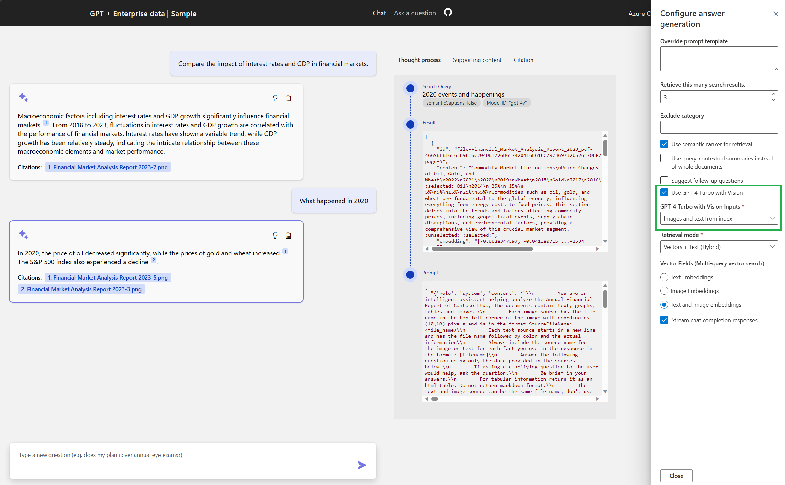

# Using GPT-4 Turbo with Vision

This repository now includes an example of integrating GPT-4 Turbo with Vision with Azure AI Search. This feature enables indexing and searching images and graphs, such as financial documents, in addition to text-based content.

## Feature Overview

- **Document Handling:** Source documents are split into pages and saved as PNG files in blob storage. Each file's name and page number are embedded for reference.
- **Data Extraction:** Text data is extracted using OCR.
- **Data Indexing:** Text and image embeddings, generated using Azure AI Vision ([Azure AI Vision Embeddings](https://learn.microsoft.com/azure/ai-services/computer-vision/how-to/image-retrieval)), are indexed in Azure AI Search along with the raw text.
- **Search and Response:** Searches can be conducted using vectors or hybrid methods. Responses are generated by GPT-4 Turbo with Vision based on the retrieved content.

## Getting Started

### Prerequisites

- Create a [Computer Vision account in Azure Portal first](https://ms.portal.azure.com/#create/Microsoft.CognitiveServicesComputerVision), so that you can agree to the Responsible AI terms for that resource. You can delete that account after agreeing.
- The ability to deploy a GPT-4 Turbo with Vision model in the [supported regions](https://learn.microsoft.com/azure/ai-services/openai/concepts/models#gpt-4-and-gpt-4-turbo-preview-model-availability). If you're not sure, try to create a deployment from your Azure OpenAI deployments page. You should be able to select:

   | Model | Version |
   |--|--|
   |`gpt-4`|`vision-preview`|

- Ensure that you can deploy the Azure OpenAI resource group in [a region where all required components are available](https://learn.microsoft.com/azure/cognitive-services/openai/concepts/models#model-summary-table-and-region-availability):
  - Azure OpenAI models
    - gpt-35-turbo
    - text-embedding-ada-002
    - gpt-4v
  - [Azure AI Vision](https://learn.microsoft.com/azure/ai-services/computer-vision/)

### Setup and Usage

1. **Update repository:**
   Pull the latest changes.

2. **Enable GPT-4 Turbo with Vision:**

   First, make sure you do *not* have integrated vectorization enabled, since that is currently incompatible:

   ```shell
   azd env set USE_FEATURE_INT_VECTORIZATION false
   ```

   Then set the environment variable for enabling vision support:

   ```shell
   azd env set USE_GPT4V true
   ```

   When set, that flag will provision a Computer Vision resource and gpt-4o model, upload image versions of PDFs to Blob storage, upload embeddings of images in a new `imageEmbedding` field, and enable the vision approach in the UI.

3. **Clean old deployments (optional):**
   Run `azd down --purge` for a fresh setup.

4. **Start the application:**
   Execute `azd up` to build, provision, deploy, and initiate document preparation.

5. **Web Application Usage:**
    
   - Access the developer options in the web app and select "Use GPT vision model".
   - Sample questions will be updated for testing.
   - Interact with the questions to view responses.
   - The 'Thought Process' tab shows the retrieved data and its processing by the GPT vision model.

Feel free to explore and contribute to enhancing this feature. For questions or feedback, use the repository's issue tracker.
