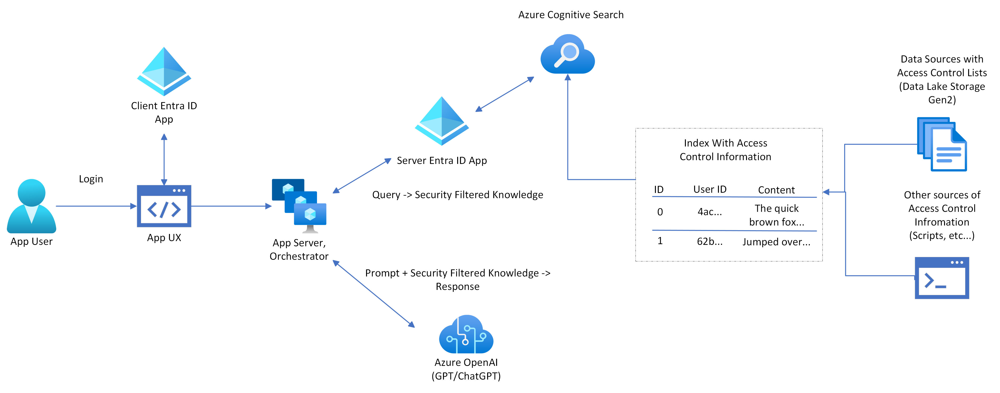

# Setting up optional login and document level access control

## Table of Contents

- [Requirements](#requirements)
- [Setting up Microsoft Entra applications](#setting-up-microsoft-entra-applications)
  - [Automatic Setup](#automatic-setup)
  - [Manual Setup](#manual-setup)
    - [Server App](#server-app)
    - [Client App](#client-app)
    - [Configure Server App Known Client Applications](#configure-server-app-known-client-applications)
    - [Testing](#testing)
    - [Programmatic Access With Authentication](#programmatic-access-with-authentication)
  - [Troubleshooting](#troubleshooting)
- [Adding data with document level access control](#adding-data-with-document-level-access-control)
  - [Using the Add Documents API](#using-the-add-documents-api)
  - [Azure Data Lake Storage Gen2 and prepdocs](#azure-data-lake-storage-gen2-setup)
- [Environment variables reference](#environment-variables-reference)
  - [Authentication behavior by environment](#authentication-behavior-by-environment)

This guide demonstrates how to add an optional login and document level access control system to the sample. This system can be used to restrict access to indexed data to specific users based on what [Microsoft Entra groups](https://learn.microsoft.com/entra/fundamentals/how-to-manage-groups) they are a part of, or their [user object id](https://learn.microsoft.com/partner-center/find-ids-and-domain-names#find-the-user-object-id).



## Requirements

**IMPORTANT:** In order to add optional login and document level access control, you'll need the following in addition to the normal sample requirements

- **Azure account permissions**: Your Azure account must have [permission to manage applications in Microsoft Entra](https://learn.microsoft.com/entra/identity/role-based-access-control/permissions-reference#cloud-application-administrator).

## Setting up Microsoft Entra applications

Two Microsoft Entra applications must be registered in order to make the optional login and document level access control system work correctly. One app is for the client UI. The client UI is implemented as a [single page application](https://learn.microsoft.com/entra/identity-platform/scenario-spa-app-registration). The other app is for the API server. The API server uses a [confidential client](https://learn.microsoft.com/entra/identity-platform/msal-client-applications) to call the [Microsoft Graph API](https://learn.microsoft.com/graph/use-the-api).

### Automatic Setup

The easiest way to setup the two apps is to use the `azd` CLI. We've written scripts that will automatically create the two apps and configure them for use with the sample. To trigger the automatic setup, run the following commands:

1. Run `azd env set AZURE_USE_AUTHENTICATION true` to enable the login UI and use App Service authentication by default.
1. Ensure access control is enabled on your search index. If your index doesn't exist yet, run prepdocs with `AZURE_USE_AUTHENTICATION` set to `true`. If your index already exists, run `pwsh ./scripts/manageacl.ps1 --acl-action enable_acls`.
1. (Optional) To require access control when using the app, run `azd env set AZURE_ENFORCE_ACCESS_CONTROL true`. Authentication is always required to search on documents with access control assigned, regardless of if unauthenticated access is enabled or not.
1. (Optional) To allow authenticated users to search on documents that have no access controls assigned, even when access control is required, run `azd env set AZURE_ENABLE_GLOBAL_DOCUMENT_ACCESS true`.
1. (Optional) To allow unauthenticated users to use the app, even when access control is enforced, run `azd env set AZURE_ENABLE_UNAUTHENTICATED_ACCESS true`. `AZURE_ENABLE_GLOBAL_DOCUMENT_ACCESS` should also be set to true if you want unauthenticated users to be able to search on documents with no access control.
1. Run `azd env set AZURE_AUTH_TENANT_ID <YOUR-TENANT-ID>` to set the tenant ID associated with authentication.
1. If your auth tenant ID is different from your currently logged in tenant ID, run `azd auth login --tenant-id <YOUR-TENANT-ID>` to login to the authentication tenant simultaneously.
1. Run `azd up` to deploy the app.

### Manual Setup

The following instructions explain how to setup the two apps using the Azure Portal.

#### Server App

- Sign in to the [Azure portal](https://portal.azure.com/).
- Select the Microsoft Entra ID service.
- In the left hand menu, select **Application Registrations**.
- Select **New Registration**.
  - In the **Name** section, enter a meaningful application name. This name will be displayed to users of the app, for example `Azure Search OpenAI Chat API`.
  - Under **Supported account types**, select **Accounts in this organizational directory only**.
- Select **Register** to create the application
- In the app's registration screen, find the **Application (client) ID**.
  - Run the following `azd` command to save this ID: `azd env set AZURE_SERVER_APP_ID <Application (client) ID>`.

- Microsoft Entra supports three types of credentials to authenticate an app using the [client credentials](https://learn.microsoft.com/entra/identity-platform/v2-oauth2-client-creds-grant-flow): passwords (app secrets), certificates, and federated identity credentials. For a higher level of security, either [certificates](https://learn.microsoft.com/entra/identity-platform/howto-create-self-signed-certificate) or federated identity credentials are recommended. This sample currently uses an app secret for ease of provisioning.

- Select **Certificates & secrets** in the left hand menu.
- In the **Client secrets** section, select **New client secret**.
  - Type a description, for example `Azure Search OpenAI Chat Key`.
  - Select one of the available key durations.
  - The generated key value will be displayed after you select **Add**.
  - Copy the generated key value and run the following `azd` command to save this ID: `azd env set AZURE_SERVER_APP_SECRET <generated key value>`.
- Select **API Permissions** in the left hand menu. By default, the [delegated `User.Read`](https://learn.microsoft.com/graph/permissions-reference#user-permissions) permission should be present. This permission is required to read the signed-in user's profile to get the security information used for document level access control. If this permission is not present, it needs to be added to the application.
  - Select **Add a permission**, and then **Microsoft Graph**.
  - Select **Delegated permissions**.
  - Search for and and select `User.Read`.
  - Select **Add permissions**.
- Select **Expose an API** in the left hand menu. The server app works by using the [On Behalf Of Flow](https://learn.microsoft.com/entra/identity-platform/v2-oauth2-on-behalf-of-flow#protocol-diagram), which requires the server app to expose at least 1 API.
  - The application must define a URI to expose APIs. Select **Add** next to **Application ID URI**.
    - By default, the Application ID URI is set to `api://<application client id>`. Accept the default by selecting **Save**.
  - Under **Scopes defined by this API**, select **Add a scope**.
  - Fill in the values as indicated:
    - For **Scope name**, use **access_as_user**.
    - For **Who can consent?**, select **Admins and users**.
    - For **Admin consent display name**, type **Access Azure Search OpenAI Chat API**.
    - For **Admin consent description**, type **Allows the app to access Azure Search OpenAI Chat API as the signed-in user.**.
    - For **User consent display name**, type **Access Azure Search OpenAI Chat API**.
    - For **User consent description**, type **Allow the app to access Azure Search OpenAI Chat API on your behalf**.
    - Leave **State** set to **Enabled**.
    - Select **Add scope** at the bottom to save the scope.
- (Optional) Enable group claims. Include which Microsoft Entra groups the user is part of as part of the login in the [optional claims](https://learn.microsoft.com/entra/identity-platform/optional-claims). The groups are used for [optional security filtering](https://learn.microsoft.com/azure/search/search-security-trimming-for-azure-search) in the search results.
  - In the left hand menu, select **Token configuration**
  - Under **Optional claims**, select **Add groups claim**
  - Select which [group types](https://learn.microsoft.com/entra/identity/hybrid/connect/how-to-connect-fed-group-claims) to include in the claim. Note that a [overage claim](https://learn.microsoft.com/entra/identity-platform/access-token-claims-reference#groups-overage-claim) will be emitted if the user is part of too many groups. In this case, the API server will use the [Microsoft Graph](https://learn.microsoft.com/graph/api/user-list-memberof?view=graph-rest-*0&tabs=http) to list the groups the user is part of instead of relying on the groups in the claim.
  - Select **Add** to save your changes

#### Client App

- Sign in to the [Azure portal](https://portal.azure.com/).
- Select the Microsoft Entra ID service.
- In the left hand menu, select **Application Registrations**.
- Select **New Registration**.
  - In the **Name** section, enter a meaningful application name. This name will be displayed to users of the app, for example `Azure Search OpenAI Chat Web App`.
  - Under **Supported account types**, select **Accounts in this organizational directory only**.
  - Under `Redirect URI (optional)` section, select `Single-page application (SPA)` in the combo-box and enter the following redirect URI:
    - If you are running the sample locally, use `http://localhost:50505/redirect`.
    - If you are running the sample on Azure, use the endpoint provided by `azd up`: `https://<your-endpoint>.azurewebsites.net/redirect`.
    - If you are running the sample from Github Codespaces, use the Codespaces endpoint: `https://<your-codespace>-50505.app.github.dev/`
- Select **Register** to create the application
- In the app's registration screen, find the **Application (client) ID**.
  - Run the following `azd` command to save this ID: `azd env set AZURE_CLIENT_APP_ID <Application (client) ID>`.
- In the left hand menu, select **Authentication**.
  - Under **Implicit grant and hybrid flows**, select **ID Tokens (used for implicit and hybrid flows)**
  - Select **Save**
- In the left hand menu, select **API permissions**. You will add permission to access the **access_as_user** API on the server app. This permission is required for the [On Behalf Of Flow](https://learn.microsoft.com/entra/identity-platform/v2-oauth2-on-behalf-of-flow#protocol-diagram) to work.
  - Select **Add a permission**, and then **My APIs**.
  - In the list of applications, select your server application **Azure Search OpenAI Chat API**
  - Ensure **Delegated permissions** is selected.
  - In the **Select permissions** section, select the **access_as_user** permission
  - Select **Add permissions**.

#### Configure Server App Known Client Applications

Consent from the user must be obtained for use of the client and server app. The client app can prompt the user for consent through a dialog when they log in. The server app has no ability to show a dialog for consent. Client apps can be [added to the list of known clients](https://learn.microsoft.com/entra/identity-platform/v2-oauth2-on-behalf-of-flow#gaining-consent-for-the-middle-tier-application) to access the server app, so a consent dialog is shown for the server app.

- Navigate to the server app registration
- In the left hand menu, select **Manifest**
- Replace `"knownClientApplications": []` with `"knownClientApplications": ["<client application id>"]`
- Select **Save**

#### Testing

If you are running setup for the first time, ensure you have run `azd env set AZURE_ADLS_GEN2_STORAGE_ACCOUNT <YOUR-STORAGE_ACCOUNT>` before running `azd up`. If you do not set this environment variable, your index will not be initialized with access control support when `prepdocs` is run for the first time. To manually enable access control in your index, use the [manual setup script](#azure-data-lake-storage-gen2-setup).

Ensure you run `azd env set AZURE_USE_AUTHENTICATION` to enable the login UI once you have setup the two Microsoft Entra apps before you deploy or run the application. The login UI will not appear unless all [required environment variables](#environment-variables-reference) have been setup.

In both the chat and ask a question modes, under **Developer settings** optional **Use oid security filter** and **Use groups security filter** checkboxes will appear. The oid (User ID) filter maps to the `oids` field in the search index and the groups (Group ID) filter maps to the `groups` field in the search index. If `AZURE_ENFORCE_ACCESS_CONTROL` has been set, then both the **Use oid security filter** and **Use groups security filter** options are always enabled and cannot be disabled.

#### Programmatic Access with Authentication

If you want to use the chat endpoint without the UI and still use authentication, you must disable [App Service built-in authentication](https://learn.microsoft.com/azure/app-service/overview-authentication-authorization) and use only the app's MSAL-based authentication flow. Ensure the `AZURE_DISABLE_APP_SERVICES_AUTHENTICATION` environment variable is set before deploying.

Get an access token that can be used for calling the chat API using the following code:

```python
from azure.identity import DefaultAzureCredential
import os

token = DefaultAzureCredential().get_token(f"api://{os.environ['AZURE_SERVER_APP_ID']}/access_as_user", tenant_id=os.getenv('AZURE_AUTH_TENANT_ID', os.getenv('AZURE_TENANT_ID')))

print(token.token)
```

### Troubleshooting

- If your primary tenant restricts the ability to create Entra applications, you'll need to use a separate tenant to create the Entra applications. You can create a new tenant by following [these instructions](https://learn.microsoft.com/entra/identity-platform/quickstart-create-new-tenant). Then run `azd env set AZURE_AUTH_TENANT_ID <YOUR-AUTH-TENANT-ID>` before running `azd up`.
- If any Entra apps need to be recreated, you can avoid redeploying the app by [changing the app settings in the portal](https://learn.microsoft.com/azure/app-service/configure-common?tabs=portal#configure-app-settings). Any of the [required environment variables](#environment-variables-reference) can be changed. Once the environment variables have been changed, restart the web app.
- It's possible a consent dialog will not appear when you log into the app for the first time. If this consent dialog doesn't appear, you will be unable to use the security filters because the API server app does not have permission to read your authorization information. A consent dialog can be forced to appear by adding `"prompt": "consent"` to the `loginRequest` property in [`authentication.py`](../app/backend/core/authentication.py)
- It's possible that your tenant admin has placed a restriction on consent to apps with [unverified publishers](https://learn.microsoft.com/entra/identity-platform/publisher-verification-overview). In this case, only admins may consent to the client and server apps, and normal user accounts are unable to use the login system until the admin consents on behalf of the entire organization.
- It's possible that your tenant admin requires [admin approval of all new apps](https://learn.microsoft.com/entra/identity/enterprise-apps/manage-consent-requests). Regardless of whether you select the delegated or admin permissions, the app will not work without tenant admin consent.

## Adding data with document level access control

The sample supports 2 main strategies for adding data with document level access control.

- [Using the Add Documents API](#using-the-add-documents-api). Sample scripts are provided which use the Azure AI Search Service Add Documents API to directly manage access control information on _existing documents_ in the index.
- [Using prepdocs and Azure Data Lake Storage Gen 2](#azure-data-lake-storage-gen2-setup). Sample scripts are provided which set up an [Azure Data Lake Storage Gen 2](https://learn.microsoft.com/azure/storage/blobs/data-lake-storage-introduction) account, set the [access control information](https://learn.microsoft.com/azure/storage/blobs/data-lake-storage-access-control) on files and folders stored there, and ingest those documents into the search index with their  access control information.

### Using the Add Documents API

Manually enable document level access control on a search index and manually set access control values using the [manageacl.ps1](../scripts/manageacl.ps1) script.

Run `azd up` or use `azd env set` to manually set `AZURE_SEARCH_SERVICE` and `AZURE_SEARCH_INDEX` environment variables prior to running the script.

The script supports the following commands. Note that the syntax is the same regardless of whether [manageacl.ps1](../scripts/manageacl.ps1) or [manageacl.sh](../scripts/manageacl.sh) is used. All commands support `-v` for verbose logging.

- `./scripts/manageacl.ps1 --acl-action enable_acls`: Creates the required `oids` (User ID) and `groups` (Group IDs) [security filter](https://learn.microsoft.com/azure/search/search-security-trimming-for-azure-search) fields for document level access control on your index, as well as the `storageUrl` field for storing the Blob storage URL. Does nothing if these fields already exist.

  Example usage:

  ```shell
  ./scripts/manageacl.ps1  -v --acl-action enable_acls
  ```

- `./scripts/manageacl.ps1 --acl-type [oids or groups]--acl-action view --url [https://url.pdf]`: Prints access control values associated with either User IDs or Group IDs for the document at the specified URL.

  Example to view all Group IDs:

  ```shell
  ./scripts/manageacl.ps1 -v --acl-type groups --acl-action view --url https://st12345.blob.core.windows.net/content/Benefit_Options.pdf
  ```

- `./scripts/manageacl.ps1 --url [https://url.pdf] --acl-type [oids or groups]--acl-action add --acl [ID of group or user]`: Adds an access control value associated with either User IDs or Group IDs for the document at the specified URL.

  Example to add a Group ID:

  ```shell
  ./scripts/manageacl.ps1 -v --acl-type groups --acl-action add --acl xxxxxxxx-xxxx-xxxx-xxxx-xxxxxxxxxxxx --url https://st12345.blob.core.windows.net/content/Benefit_Options.pdf
  ```

- `./scripts/manageacl.ps1 --url [https://url.pdf] --acl-type [oids or groups]--acl-action remove_all`: Removes all access control values associated with either User IDs or Group IDs for a specific document.

  Example to remove all Group IDs:

  ```shell
  ./scripts/manageacl.ps1 -v --acl-type groups --acl-action remove_all --url https://st12345.blob.core.windows.net/content/Benefit_Options.pdf
  ```

- `./scripts/manageacl.ps1 --url [https://url.pdf] --acl-type [oids or groups]--acl-action remove --acl [ID of group or user]`: Removes an access control value associated with either User IDs or Group IDs for a specific document.

  Example to remove a specific User ID:

  ```shell
  ./scripts/manageacl.ps1 -v --acl-type oids --acl-action remove --acl xxxxxxxx-xxxx-xxxx-xxxx-xxxxxxxxxxxx --url https://st12345.blob.core.windows.net/content/Benefit_Options.pdf
  ```

### Azure Data Lake Storage Gen2 Setup

[Azure Data Lake Storage Gen2](https://learn.microsoft.com/azure/storage/blobs/data-lake-storage-introduction) implements an [access control model](https://learn.microsoft.com/azure/storage/blobs/data-lake-storage-access-control) that can be used for document level access control. The [adlsgen2setup.ps1](../scripts/adlsgen2setup.ps1) script uploads the sample data included in the [data](./data) folder to a Data Lake Storage Gen2 storage account. The [Storage Blob Data Owner](https://learn.microsoft.com/azure/storage/blobs/data-lake-storage-access-control-model#role-based-access-control-azure-rbac) role is required to use the script.

In order to use this script, an existing Data Lake Storage Gen2 storage account is required. Run `azd env set AZURE_ADLS_GEN2_STORAGE_ACCOUNT <your-storage-account>` prior to running the script.

To run the script, run the following command: `/scripts/adlsgen2setup.ps1`. The script performs the following steps:

- Creates example [groups](https://learn.microsoft.com/entra/fundamentals/how-to-manage-groups) listed in the [sampleacls.json](../scripts/sampleacls.json) file.
- Creates a filesystem / container `gptkbcontainer` in the storage account.
- Creates the directories listed in the [sampleacls.json](../scripts/sampleacls.json) file.
- Uploads the sample PDFs referenced in the [sampleacls.json](../scripts/sampleacls.json) file into the appropriate directories.
- [Recursively sets Access Control Lists (ACLs)](https://learn.microsoft.com/azure/storage/blobs/data-lake-storage-acl-cli) using the information from the [sampleacls.json](../scripts/sampleacls.json) file.

In order to use the sample access control, you need to join these groups in your Microsoft Entra tenant.

Note that this optional script may not work in Codespaces if your administrator has applied a [Conditional Access policy](https://learn.microsoft.com/entra/identity/conditional-access/overview) to your tenant.

#### Azure Data Lake Storage Gen2 Prep Docs

Once a Data Lake Storage Gen2 storage account has been setup with sample data and access control lists, [prepdocs.py](../app/backend/prepdocs.py) can be used to automatically process PDFs in the storage account and store them with their [access control lists in the search index](https://learn.microsoft.com/azure/storage/blobs/data-lake-storage-access-control).

To run this script with a Data Lake Storage Gen2 account, first set the following environment variables:

- `AZURE_ADLS_GEN2_STORAGE_ACCOUNT`: Name of existing [Data Lake Storage Gen2 storage account](https://learn.microsoft.com/azure/storage/blobs/data-lake-storage-introduction).
- (Optional) `AZURE_ADLS_GEN2_FILESYSTEM`: Name of existing Data Lake Storage Gen2 filesystem / container in the storage account. If empty, `gptkbcontainer` is used.
- (Optional) `AZURE_ADLS_GEN2_FILESYSTEM_PATH`: Specific path in the Data Lake Storage Gen2 filesystem / container to process. Only PDFs contained in this path will be processed.

Once the environment variables are set, run the script using the following command: `/scripts/prepdocs.ps1` or `/scripts/prepdocs.sh`.

## Environment variables reference

The following environment variables are used to setup the optional login and document level access control:

- `AZURE_USE_AUTHENTICATION`: Enables Entra ID login and document level access control. Set to true before running `azd up`.
- `AZURE_ENFORCE_ACCESS_CONTROL`: Enforces Entra ID based login and document level access control on documents with access control assigned. Set to true before running `azd up`. If `AZURE_ENFORCE_ACCESS_CONTROL` is enabled and `AZURE_ENABLE_UNAUTHENTICATED_ACCESS` is not enabled, then authentication is required to use the app.
- `AZURE_ENABLE_GLOBAL_DOCUMENT_ACCESS`: Allows users to search on documents that have no access controls assigned
- `AZURE_ENABLE_UNAUTHENTICATED_ACCESS`: Allows unauthenticated users to access the chat app, even when `AZURE_ENFORCE_ACCESS_CONTROL` is enabled. `AZURE_ENABLE_GLOBAL_DOCUMENT_ACCESS` should be set to true to allow unauthenticated users to search on documents that have no access control assigned. Unauthenticated users cannot search on documents with access control assigned.
- `AZURE_DISABLE_APP_SERVICES_AUTHENTICATION`: Disables [use of built-in authentication for App Services](https://learn.microsoft.com/azure/app-service/overview-authentication-authorization). An authentication flow based on the MSAL SDKs is used instead. Useful when you want to provide programmatic access to the chat endpoints with authentication.
- `AZURE_SERVER_APP_ID`: (Required) Application ID of the Microsoft Entra app for the API server.
- `AZURE_SERVER_APP_SECRET`: [Client secret](https://learn.microsoft.com/entra/identity-platform/v2-oauth2-client-creds-grant-flow) used by the API server to authenticate using the Microsoft Entra server app.
- `AZURE_CLIENT_APP_ID`: Application ID of the Microsoft Entra app for the client UI.
- `AZURE_AUTH_TENANT_ID`: [Tenant ID](https://learn.microsoft.com/entra/fundamentals/how-to-find-tenant) associated with the Microsoft Entra tenant used for login and document level access control. Defaults to `AZURE_TENANT_ID` if not defined.
- `AZURE_ADLS_GEN2_STORAGE_ACCOUNT`: (Optional) Name of existing [Data Lake Storage Gen2 storage account](https://learn.microsoft.com/azure/storage/blobs/data-lake-storage-introduction) for storing sample data with [access control lists](https://learn.microsoft.com/azure/storage/blobs/data-lake-storage-access-control). Only used with the optional Data Lake Storage Gen2 [setup](#azure-data-lake-storage-gen2-setup) and [prep docs](#azure-data-lake-storage-gen2-prep-docs) scripts.
- `AZURE_ADLS_GEN2_FILESYSTEM`: (Optional) Name of existing [Data Lake Storage Gen2 filesystem](https://learn.microsoft.com/azure/storage/blobs/data-lake-storage-introduction) for storing sample data with [access control lists](https://learn.microsoft.com/azure/storage/blobs/data-lake-storage-access-control). Only used with the optional Data Lake Storage Gen2 [setup](#azure-data-lake-storage-gen2-setup) and [prep docs](#azure-data-lake-storage-gen2-prep-docs) scripts.
- `AZURE_ADLS_GEN2_FILESYSTEM_PATH`: (Optional) Name of existing path in a [Data Lake Storage Gen2 filesystem](https://learn.microsoft.com/azure/storage/blobs/data-lake-storage-introduction) for storing sample data with [access control lists](https://learn.microsoft.com/azure/storage/blobs/data-lake-storage-access-control). Only used with the optional Data Lake Storage Gen2 [prep docs](#azure-data-lake-storage-gen2-prep-docs) script.

### Authentication behavior by environment

This application uses an in-memory token cache. User sessions are only available in memory while the application is running. When the application server is restarted, all users will need to log-in again.

The following table describes the impact of the `AZURE_USE_AUTHENTICATION` and `AZURE_ENFORCE_ACCESS_CONTROL` variables depending on the environment you are deploying the application in:

| AZURE_USE_AUTHENTICATION | AZURE_ENFORCE_ACCESS_CONTROL | Environment | Default Behavior |
|-|-|-|-|
| True | False | App Services | Use integrated auth <br /> Login page blocks access to app <br /> User can opt-into access control in developer settings <br /> Allows unrestricted access to sources |
| True | True | App Services | Use integrated auth <br /> Login page blocks access to app <br /> User must use access control |
| True | False | Local or Codespaces | Do not use integrated auth <br /> Can use app without login <br /> User can opt-into access control in developer settings <br /> Allows unrestricted access to sources |
| True | True | Local or Codespaces | Do not use integrated auth <br /> Cannot use app without login <br /> Behavior is chat box is greyed out with default “Please login message” <br /> User must use login button to make chat box usable <br /> User must use access control when logged in |
| False | False | All | No login or access control |
| False | True | All | Invalid setting |
