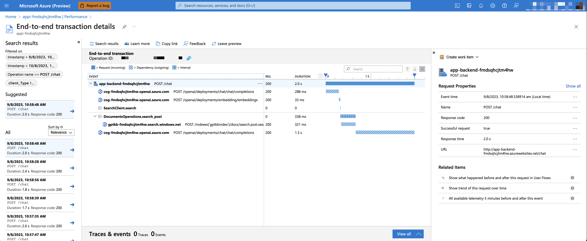

# RAG chat: Monitoring with Application Insights

By default, deployed apps use Application Insights for the tracing of each request, along with the logging of errors.

* [Performance](#performance)
* [Failures](#failures)
* [Dashboard](#dashboard)
* [Customizing the traces](#customizing-the-traces)

## Performance

To see the performance data, go to the Application Insights resource in your resource group, click on the "Investigate -> Performance" blade and navigate to any HTTP request to see the timing data.
To inspect the performance of chat requests, use the "Drill into Samples" button to see end-to-end traces of all the API calls made for any chat request:



## Failures

To see any exceptions and server errors, navigate to the "Investigate -> Failures" blade and use the filtering tools to locate a specific exception. You can see Python stack traces on the right-hand side.

## Dashboard

You can see chart summaries on a dashboard by running the following command:

```shell
azd monitor
```

You can modify the contents of that dashboard by updating `infra/backend-dashboard.bicep`, which is a Bicep file that defines the dashboard contents and layout.

## Customizing the traces

The tracing is done using these OpenTelemetry Python packages:

* [azure-monitor-opentelemetry](https://pypi.org/project/azure-monitor-opentelemetry/)
* [opentelemetry-instrumentation-asgi](https://pypi.org/project/opentelemetry-instrumentation-asgi/)
* [opentelemetry-instrumentation-httpx](https://pypi.org/project/opentelemetry-instrumentation-httpx/)
* [opentelemetry-instrumentation-aiohttp-client](https://pypi.org/project/opentelemetry-instrumentation-aiohttp-client/)
* [opentelemetry-instrumentation-openai](https://pypi.org/project/opentelemetry-instrumentation-openai/)

Those packages are configured in the `app.py` file:

```python
if os.getenv("APPLICATIONINSIGHTS_CONNECTION_STRING"):
    configure_azure_monitor()
    # This tracks HTTP requests made by aiohttp:
    AioHttpClientInstrumentor().instrument()
    # This tracks HTTP requests made by httpx:
    HTTPXClientInstrumentor().instrument()
    # This tracks OpenAI SDK requests:
    OpenAIInstrumentor().instrument()
    # This middleware tracks app route requests:
    app.asgi_app = OpenTelemetryMiddleware(app.asgi_app)
```

You can pass in parameters to `configure_azure_monitor()` to customize the tracing, like to add custom span processors.
You can also set [OpenTelemetry environment variables](https://opentelemetry.io/docs/reference/specification/sdk-environment-variables/) to customize the tracing, like to set the sampling rate.
See the [azure-monitor-opentelemetry](https://pypi.org/project/azure-monitor-opentelemetry/) documentation for more details.

By default, [opentelemetry-instrumentation-openai](https://pypi.org/project/opentelemetry-instrumentation-openai/) traces all requests made to the OpenAI API, including the messages and responses. To disable that for privacy reasons, set the `TRACELOOP_TRACE_CONTENT=false` environment variable.

To set environment variables, update `appEnvVariables` in `infra/main.bicep` and re-run `azd up`.
