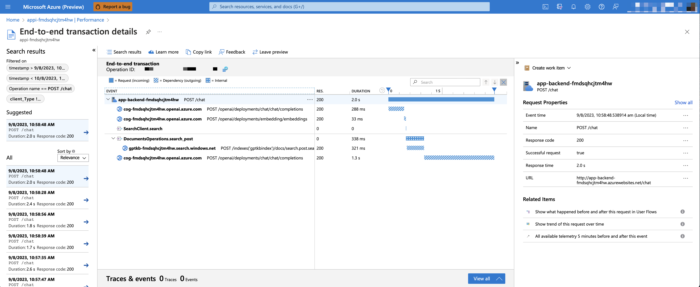

# Czat RAG: Monitorowanie za pomocą Application Insights

Domyślnie wdrożone aplikacje używają Application Insights do śledzenia każdego żądania wraz z rejestrowaniem błędów.

* [Wydajność](#wydajność)
* [Błędy](#błędy)
* [Pulpit nawigacyjny](#pulpit-nawigacyjny)
* [Dostosowywanie śladów](#dostosowywanie-śladów)

## Wydajność

Aby zobaczyć dane dotyczące wydajności, przejdź do zasobu Application Insights w swojej grupie zasobów, kliknij blok "Investigate -> Performance" i przejdź do dowolnego żądania HTTP, aby zobaczyć dane dotyczące czasu.
Aby sprawdzić wydajność żądań czatu, użyj przycisku "Drill into Samples", aby zobaczyć kompleksowe ślady wszystkich wywołań API wykonanych dla dowolnego żądania czatu:



## Błędy

Aby zobaczyć wszelkie wyjątki i błędy serwera, przejdź do bloku "Investigate -> Failures" i użyj narzędzi filtrowania, aby zlokalizować konkretny wyjątek. Możesz zobaczyć ślady stosu Python po prawej stronie.

## Pulpit nawigacyjny

Możesz zobaczyć podsumowania wykresów na pulpicie nawigacyjnym, uruchamiając następujące polecenie:

```shell
azd monitor
```

Możesz modyfikować zawartość tego pulpitu nawigacyjnego, aktualizując `infra/backend-dashboard.bicep`, który jest plikiem Bicep definiującym zawartość i układ pulpitu nawigacyjnego.

## Dostosowywanie śladów

Śledzenie odbywa się za pomocą tych pakietów OpenTelemetry Python:

* [azure-monitor-opentelemetry](https://pypi.org/project/azure-monitor-opentelemetry/)
* [opentelemetry-instrumentation-asgi](https://pypi.org/project/opentelemetry-instrumentation-asgi/)
* [opentelemetry-instrumentation-httpx](https://pypi.org/project/opentelemetry-instrumentation-httpx/)
* [opentelemetry-instrumentation-aiohttp-client](https://pypi.org/project/opentelemetry-instrumentation-aiohttp-client/)
* [opentelemetry-instrumentation-openai](https://pypi.org/project/opentelemetry-instrumentation-openai/)

Te pakiety są konfigurowane w pliku `app.py`:

```python
if os.getenv("APPLICATIONINSIGHTS_CONNECTION_STRING"):
    configure_azure_monitor()
    # To śledzi żądania HTTP wykonane przez aiohttp:
    AioHttpClientInstrumentor().instrument()
    # To śledzi żądania HTTP wykonane przez httpx:
    HTTPXClientInstrumentor().instrument()
    # To śledzi żądania OpenAI SDK:
    OpenAIInstrumentor().instrument()
    # To middleware śledzi żądania trasy aplikacji:
    app.asgi_app = OpenTelemetryMiddleware(app.asgi_app)
```

Możesz przekazać parametry do `configure_azure_monitor()`, aby dostosować śledzenie, na przykład aby dodać niestandardowe procesory zakresu.
Możesz również ustawić [zmienne środowiskowe OpenTelemetry](https://opentelemetry.io/docs/reference/specification/sdk-environment-variables/), aby dostosować śledzenie, na przykład aby ustawić współczynnik próbkowania.
Zobacz dokumentację [azure-monitor-opentelemetry](https://pypi.org/project/azure-monitor-opentelemetry/) po więcej szczegółów.

Domyślnie [opentelemetry-instrumentation-openai](https://pypi.org/project/opentelemetry-instrumentation-openai/) śledzi wszystkie żądania wykonane do API OpenAI, w tym wiadomości i odpowiedzi. Aby wyłączyć to ze względów prywatności, ustaw zmienną środowiskową `TRACELOOP_TRACE_CONTENT=false`.

Aby ustawić zmienne środowiskowe, zaktualizuj `appEnvVariables` w `infra/main.bicep` i uruchom ponownie `azd up`.
