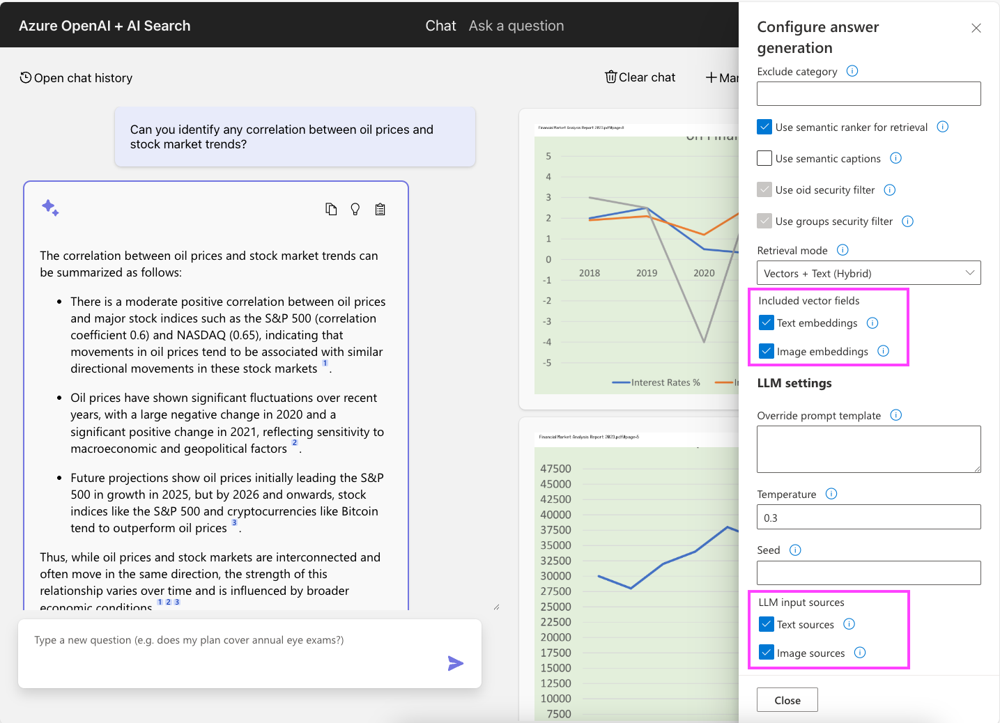

# RAG chat: Support for multimodal documents

This repository includes an optional feature that uses multimodal embedding models and multimodal chat completion models
to better handle documents that contain images, such as financial reports with charts and graphs.

With this feature enabled, the data ingestion process will extract images from your documents
using Document Intelligence, store the images in Azure Blob Storage, vectorize the images using the Azure AI Vision service, and store the image embeddings in the Azure AI Search index.

During the RAG flow, the app will perform a multi-vector query using both text and image embeddings, and then send any images associated with the retrieved document chunks to the chat completion model for answering questions. This feature assumes that your chat completion model supports multimodal inputs, such as `gpt-4o`, `gpt-4o-mini`, `gpt-5`, or `gpt-5-mini`.

With this feature enabled, the following changes are made:

* **Search index**: We add a new field "images" to the Azure AI Search index to store information about the images associated with a chunk. The field is a complex field that contains the embedding returned by the multimodal Azure AI Vision API, the bounding box, and the URL of the image in Azure Blob Storage.
* **Data ingestion**: In addition to the usual data ingestion flow, the document extraction process will extract images from the documents using Document Intelligence, store the images in Azure Blob Storage with a citation at the top border, and vectorize the images using the Azure AI Vision service.
* **Question answering**: We search the index using both the text and multimodal embeddings. We send both the text and the image to the LLM, and ask it to answer the question based on both kinds of sources.
* **Citations**: The frontend displays both image sources and text sources, to help users understand how the answer was generated.

## Prerequisites

* The use of a chat completion model that supports multimodal inputs. The default model for the repository is currently `gpt-4.1-mini`, which does support multimodal inputs. The `gpt-4o-mini` technically supports multimodal inputs, but due to how image tokens are calculated, you need a much higher deployment capacity to use it effectively. Please try `gpt-4.1-mini` first, and experiment with other models later.

## Deployment

1. **Enable multimodal capabilities**

   Set the azd environment variable to enable the multimodal feature:

   ```shell
   azd env set USE_MULTIMODAL true
   ```

2. **Provision the multimodal resources**

   Either run `azd up` if you haven't run it before, or run `azd provision` to provision the multimodal resources. This will create a new Azure AI Vision account and update the Azure AI Search index to include the new image embedding field.

3. **Re-index the data:**

   If you have already indexed data, you will need to re-index it to include the new image embeddings.
   We recommend creating a new Azure AI Search index to avoid conflicts with the existing index.

   ```shell
   azd env set AZURE_SEARCH_INDEX multimodal-index
   ```

   Then delete the `.md5` hash files in the data folder(s) and run the data ingestion process again to re-index the data:

   Linux/Mac:

   ```shell
   ./scripts/prepdocs.sh
   ```

   Windows:

   ```shell
   .\scripts\prepdocs.ps1
   ```

4. **Try out the feature:**

   

   * If you're using the sample data, try one of the sample questions about the financial documents.
   * Check the "Thought process" tab to see how the multimodal approach was used
   * Check the "Supporting content" tab to see the text and images that were used to generate the answer.
   * Open "Developer settings" and try different options for "Included vector fields" and "LLM input sources" to see how they affect the results.

## Customize the multimodal approach

You can customize the RAG flow approach with a few additional environment variables.
You can also modify those settings in the "Developer Settings" in the chat UI,
to experiment with different options before committing to them.

### Control vector retrieval

Set variables to control whether Azure AI Search will do retrieval using the text embeddings, image embeddings, or both.
By default, it will retrieve using both text and image embeddings.

To disable retrieval with text embeddings, run:

```shell
azd env set RAG_SEARCH_TEXT_EMBEDDINGS false
```

To disable retrieval with image embeddings, run:

```shell
azd env set RAG_SEARCH_IMAGE_EMBEDDINGS false
```

Many developers may find that they can turn off image embeddings and still have high quality retrieval, since the text embeddings are based off text chunks that include figure descriptions.

### Control LLM input sources

Set variables to control whether the chat completion model will use text inputs, image inputs, or both:

To disable text inputs, run:

```shell
azd env set RAG_SEND_TEXT_SOURCES false
```

To disable image inputs, run:

```shell
azd env set RAG_SEND_IMAGE_SOURCES false
```

It is unlikely that you would want to turn off text sources, unless your RAG is based on documents that are 100% image-based.
However, you may want to turn off image inputs to save on token costs and improve performance,
and you may still see good results with just text inputs, since the inputs contain the figure descriptions.

## Compatibility

* This feature *is* compatible with the [reasoning models](./reasoning.md) feature, as long as you use a model that [supports image inputs](https://learn.microsoft.com/azure/ai-services/openai/how-to/reasoning?tabs=python-secure%2Cpy#api--feature-support).
