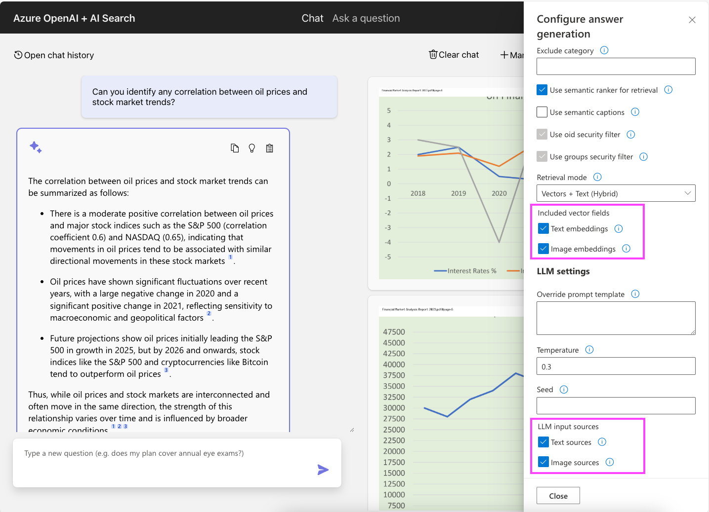

# Czat RAG: Obsługa dokumentów multimodalnych

To repozytorium zawiera opcjonalną funkcję, która wykorzystuje multimodalne modele osadzania i multimodalne modele zakończenia czatu
do lepszego obsługi dokumentów zawierających obrazy, takich jak raporty finansowe z wykresami i grafikami.

Gdy ta funkcja jest włączona, proces pozyskiwania danych będzie wyodrębniał obrazy z dokumentów
używając Document Intelligence, przechowywał obrazy w Azure Blob Storage, wektoryzował obrazy za pomocą usługi Azure AI Vision i przechowywał osadzenia obrazów w indeksie Azure AI Search.

Podczas przepływu RAG aplikacja wykona zapytanie wielowektorowe używając zarówno osadzeń tekstowych, jak i obrazowych, a następnie wyśle wszelkie obrazy powiązane z pobranymi fragmentami dokumentów do modelu zakończenia czatu w celu odpowiadania na pytania. Ta funkcja zakłada, że model zakończenia czatu obsługuje wielomodalne wejścia, takie jak `gpt-4o`, `gpt-4o-mini`, `gpt-5` lub `gpt-5-mini`.

Gdy ta funkcja jest włączona, wprowadzane są następujące zmiany:

* **Indeks wyszukiwania**: Dodajemy nowe pole "images" do indeksu Azure AI Search do przechowywania informacji o obrazach powiązanych z fragmentem. Pole jest złożoną strukturą zawierającą osadzenie zwrócone przez multimodalny Azure AI Vision API, ramkę ograniczającą i URL obrazu w Azure Blob Storage.
* **Pozyskiwanie danych**: Oprócz zwykłego przepływu pozyskiwania danych, proces ekstrakcji dokumentów będzie wyodrębniał obrazy z dokumentów za pomocą Document Intelligence, przechowywał obrazy w Azure Blob Storage z cytowaniem na górnej krawędzi i wektoryzował obrazy za pomocą usługi Azure AI Vision.
* **Odpowiadanie na pytania**: Przeszukujemy indeks używając zarówno osadzeń tekstowych, jak i multimodalnych. Wysyłamy zarówno tekst, jak i obraz do LLM i prosimy go o odpowiedź na pytanie na podstawie obu rodzajów źródeł.
* **Cytowania**: Frontend wyświetla zarówno źródła obrazów, jak i źródła tekstowe, aby pomóc użytkownikom zrozumieć, jak została wygenerowana odpowiedź.

## Wymagania wstępne

* Użycie modelu zakończenia czatu, który obsługuje wielomodalne wejścia. Domyślny model dla repozytorium to obecnie `gpt-4.1-mini`, który obsługuje wielomodalne wejścia. `gpt-4o-mini` technicznie obsługuje wielomodalne wejścia, ale ze względu na sposób obliczania tokenów obrazu potrzebujesz znacznie wyższej pojemności wdrożenia, aby skutecznie go używać. Proszę najpierw spróbować `gpt-4.1-mini` i eksperymentować z innymi modelami później.

## Wdrożenie

1. **Włącz możliwości multimodalne**

   Ustaw zmienną środowiskową azd, aby włączyć funkcję multimodalną:

   ```shell
   azd env set USE_MULTIMODAL true
   ```

2. **Aprowizuj zasoby multimodalne**

   Uruchom `azd up`, jeśli nie uruchomiłeś go wcześniej, lub uruchom `azd provision`, aby aprowizować zasoby multimodalne. To utworzy nowe konto Azure AI Vision i zaktualizuje indeks Azure AI Search, aby uwzględnić nowe pole osadzania obrazu.

3. **Ponownie zaindeksuj dane:**

   Jeśli już zaindeksowałeś dane, musisz je ponownie zaindeksować, aby uwzględnić nowe osadzenia obrazów.
   Zalecamy utworzenie nowego indeksu Azure AI Search, aby uniknąć konfliktów z istniejącym indeksem.

   ```shell
   azd env set AZURE_SEARCH_INDEX multimodal-index
   ```

   Następnie usuń pliki skrótu `.md5` w folderze(ach) danych i uruchom ponownie proces pozyskiwania danych:

   Linux/Mac:

   ```shell
   ./scripts/prepdocs.sh
   ```

   Windows:

   ```shell
   .\scripts\prepdocs.ps1
   ```

4. **Wypróbuj funkcję:**

   

   * Jeśli używasz przykładowych danych, spróbuj jednego z przykładowych pytań dotyczących dokumentów finansowych.
   * Sprawdź zakładkę "Thought process", aby zobaczyć, jak zostało użyte podejście multimodalne
   * Sprawdź zakładkę "Supporting content", aby zobaczyć tekst i obrazy, które zostały użyte do wygenerowania odpowiedzi.
   * Otwórz "Developer settings" i wypróbuj różne opcje dla "Included vector fields" i "LLM input sources", aby zobaczyć, jak wpływają na wyniki.

## Dostosuj podejście multimodalne

Możesz dostosować podejście przepływu RAG za pomocą kilku dodatkowych zmiennych środowiskowych.
Możesz również modyfikować te ustawienia w "Developer Settings" w interfejsie czatu,
aby eksperymentować z różnymi opcjami przed zatwierdzeniem ich.

### Kontroluj wyszukiwanie wektorowe

Ustaw zmienne, aby kontrolować, czy Azure AI Search będzie wykonywał wyszukiwanie za pomocą osadzeń tekstowych, osadzeń obrazów czy obu.
Domyślnie będzie wyszukiwał za pomocą zarówno osadzeń tekstowych, jak i obrazowych.

Aby wyłączyć wyszukiwanie z osadzeniami tekstowymi, uruchom:

```shell
azd env set RAG_SEARCH_TEXT_EMBEDDINGS false
```

Aby wyłączyć wyszukiwanie z osadzeniami obrazów, uruchom:

```shell
azd env set RAG_SEARCH_IMAGE_EMBEDDINGS false
```

Wielu programistów może stwierdzić, że mogą wyłączyć osadzenia obrazów i nadal mieć wysoką jakość wyszukiwania, ponieważ osadzenia tekstowe są oparte na fragmentach tekstu, które zawierają opisy figur.

### Kontroluj źródła wejściowe LLM

Ustaw zmienne, aby kontrolować, czy model zakończenia czatu będzie używał wejść tekstowych, wejść obrazowych czy obu:

Aby wyłączyć wejścia tekstowe, uruchom:

```shell
azd env set RAG_SEND_TEXT_SOURCES false
```

Aby wyłączyć wejścia obrazowe, uruchom:

```shell
azd env set RAG_SEND_IMAGE_SOURCES false
```

Jest mało prawdopodobne, że chciałbyś wyłączyć źródła tekstowe, chyba że Twoje RAG opiera się na dokumentach, które są w 100% oparte na obrazach.
Jednak możesz chcieć wyłączyć wejścia obrazowe, aby zaoszczędzić na kosztach tokenów i poprawić wydajność,
i nadal możesz widzieć dobre wyniki z samymi wejściami tekstowymi, ponieważ wejścia zawierają opisy figur.

## Kompatybilność

* Ta funkcja *jest* kompatybilna z funkcją [modeli rozumowania](./reasoning.pl.md), pod warunkiem że używasz modelu, który [obsługuje wejścia obrazowe](https://learn.microsoft.com/azure/ai-services/openai/how-to/reasoning?tabs=python-secure%2Cpy#api--feature-support).
