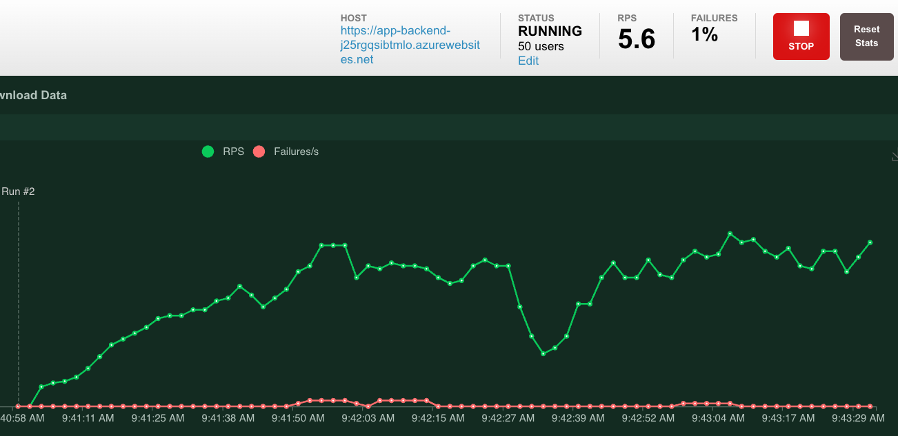

# Productionizing the Chat App

This sample is designed to be a starting point for your own production application,
but you should do a thorough review of the security and performance before deploying
to production. Here are some things to consider:

## Azure resource configuration

* **OpenAI Capacity**: The default TPM (tokens per minute) is set to 30K. That is equivalent
  to approximately 30 conversations per minute (assuming 1K per user message/response).
  You can increase the capacity by changing the `chatGptDeploymentCapacity` and `embeddingDeploymentCapacity`
  parameters in `infra/main.bicep` to your account's maximum capacity.
  You can also view the Quotas tab in [Azure OpenAI studio](https://oai.azure.com/)
  to understand how much capacity you have.
* **Azure Storage**: The default storage account uses the `Standard_LRS` SKU.
  To improve your resiliency, we recommend using `Standard_ZRS` for production deployments,
  which you can specify using the `sku` property under the `storage` module in `infra/main.bicep`.
* **Azure Cognitive Search**: The default search service uses the `Standard` SKU
  with the free semantic search option, which gives you 1000 free queries a month.
  Assuming your app will experience more than 1000 questions, you should either change `semanticSearch`
  to "standard" or disable semantic search entirely in the `/app/backend/approaches` files.
  If you see errors about search service capacity being exceeded, you may find it helpful to increase
  the number of replicas by changing `replicaCount` in `infra/core/search/search-services.bicep`
  or manually scaling it from the Azure Portal.
* **Azure App Service**: The default app service plan uses the `Basic` SKU with 1 CPU core and 1.75 GB RAM.
  We recommend using a Premium level SKU, starting with 1 CPU core.
  You can use auto-scaling rules or scheduled scaling rules,
  and scale up the maximum/minimum based on load.

## Additional security measures

* **Authentication**: By default, the deployed app is publicly accessible.
  We recommend restricting access to authenticated users.
  See [Enabling authentication](../README.md#enabling-authentication) to learn how to enable authentication.
* **Networking**: We recommend deploying inside a Virtual Network. If the app is only for
  internal enterprise use, use a private DNS zone. Also consider using Azure API Management (APIM)
  for firewalls and other forms of protection.
  For more details, read [Azure OpenAI Landing Zone reference architecture](https://techcommunity.microsoft.com/t5/azure-architecture-blog/azure-openai-landing-zone-reference-architecture/ba-p/3882102).

## Load testing

We recommend running a loadtest for your expected number of users.
You can use the [locust tool](https://docs.locust.io/) with the `locustfile.py` in this sample
or set up a loadtest with Azure Load Testing.

To use locust, first install the dev requirements that includes locust:

```shell
python3 -m pip install -r requirements-dev.txt
```

Or manually install locust:

```shell
python3 -m pip install locust
```

Then run the locust command:

```shell
locust
```

Open the locust UI at http://localhost:8089/, the URI displayed in the terminal.

Start a new test with the URI of your website, e.g. `https://my-chat-app.azurewebsites.net`.
Do *not* end the URI with a slash. You can start by pointing at your localhost if you're concerned
more about load on OpenAI/Cognitive Search than the host platform.

For the number of users and spawn rate, we recommend starting with 20 users and 1 users/second.
From there, you can keep increasing the number of users to simulate your expected load.

Here's an example loadtest for 50 users and a spawn rate of 1 per second:



After each test, check the local or App Service logs to see if there are any errors.
