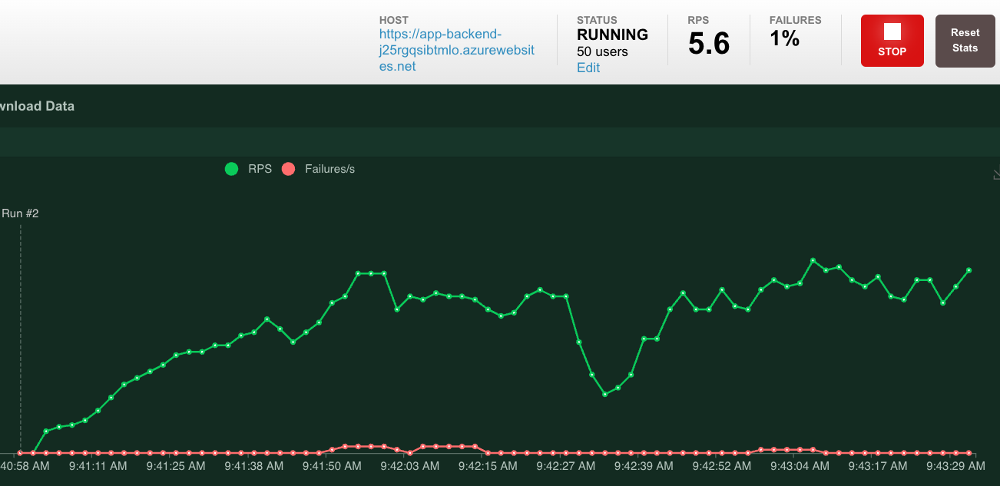

# Czat RAG: Produkcjonizacja aplikacji

Ten przykład został zaprojektowany jako punkt wyjścia dla własnej aplikacji produkcyjnej,
ale powinieneś przeprowadzić dokładny przegląd bezpieczeństwa i wydajności przed wdrożeniem
do produkcji. Oto kilka rzeczy do rozważenia:

* [Konfiguracja zasobów Azure](#konfiguracja-zasobów-azure)
* [Dodatkowe środki bezpieczeństwa](#dodatkowe-środki-bezpieczeństwa)
* [Testowanie obciążenia](#testowanie-obciążenia)
* [Ocena](#ocena)

## Konfiguracja zasobów Azure

### Pojemność OpenAI

Domyślny TPM (tokeny na minutę) jest ustawiony na 30K. To jest równoważne
około 30 rozmowom na minutę (zakładając 1K na wiadomość/odpowiedź użytkownika).
Możesz zwiększyć pojemność, zmieniając parametry `chatGptDeploymentCapacity` i `embeddingDeploymentCapacity`
w `infra/main.bicep` do maksymalnej pojemności swojego konta.
Możesz również wyświetlić zakładkę Quotas w [Azure OpenAI studio](https://oai.azure.com/),
aby zrozumieć, ile pojemności masz.

Jeśli maksymalny TPM nie jest wystarczający dla oczekiwanego obciążenia, masz kilka opcji:

* Użyj mechanizmu wycofywania, aby ponowić próbę żądania. Jest to pomocne, jeśli napotykasz krótkoterminowy przydział z powodu wybuchów aktywności, ale nie przekraczasz długoterminowego przydziału. Biblioteka [tenacity](https://tenacity.readthedocs.io/en/latest/) jest dobrą opcją do tego, a ten [pull request](https://github.com/Azure-Samples/azure-search-openai-demo/pull/500) pokazuje, jak zastosować ją do tej aplikacji.

* Jeśli konsekwentnie przekraczasz TPM, rozważ wdrożenie load balancera między instancjami OpenAI. Większość programistów implementuje to za pomocą Azure API Management lub load balancerów opartych na kontenerach. Możliwe jest również natywne podejście Pythona integrujące się z biblioteką OpenAI Python API. Instrukcje integracji z tym przykładem znajdziesz w:
  * [Skaluj Azure OpenAI dla Python z Azure API Management](https://learn.microsoft.com/azure/developer/python/get-started-app-chat-scaling-with-azure-api-management)
  * [Skaluj Azure OpenAI dla czatu Python używając RAG z Azure Container Apps](https://learn.microsoft.com/azure/developer/python/get-started-app-chat-scaling-with-azure-container-apps)
  * [Pull request: Skaluj Azure OpenAI dla Python z Python openai-priority-loadbalancer](https://github.com/Azure-Samples/azure-search-openai-demo/pull/1626)

### Azure Storage

Domyślne konto magazynu używa SKU `Standard_LRS`.
Aby poprawić odporność, zalecamy używanie `Standard_ZRS` dla wdrożeń produkcyjnych,
co możesz określić za pomocą właściwości `sku` w module `storage` w `infra/main.bicep`.

### Azure AI Search

Domyślna usługa wyszukiwania używa SKU "Basic"
z opcją darmowego rankera semantycznego, która daje 1000 darmowych zapytań miesięcznie.
Po 1000 zapytaniach otrzymasz komunikat o błędzie o przekroczeniu darmowej pojemności rankera semantycznego.

* Zakładając, że Twoja aplikacja będzie doświadczać więcej niż 1000 pytań miesięcznie,
  powinieneś uaktualnić SKU rankera semantycznego z "free" na SKU "standard":

  ```shell
  azd env set AZURE_SEARCH_SEMANTIC_RANKER standard
  ```

  Lub całkowicie wyłącz wyszukiwanie semantyczne:

  ```shell
  azd env set AZURE_SEARCH_SEMANTIC_RANKER disabled
  ```

* Usługa wyszukiwania może obsługiwać dość duże indeksy, ale ma limity na SKU dotyczące rozmiarów pamięci, maksymalnych wymiarów wektorowych itp. Możesz chcieć uaktualnić SKU do warstwy Standard lub Storage Optimized, w zależności od oczekiwanego obciążenia.
Jednak [nie możesz zmienić SKU](https://learn.microsoft.com/azure/search/search-sku-tier#tier-upgrade-or-downgrade) istniejącej usługi wyszukiwania, więc będziesz musiał ponownie zaindeksować dane lub ręcznie je skopiować.
Możesz zmienić SKU, ustawiając zmienną środowiskową azd `AZURE_SEARCH_SERVICE_SKU` na [dozwolone SKU](https://learn.microsoft.com/azure/templates/microsoft.search/searchservices?pivots=deployment-language-bicep#sku).

  ```shell
  azd env set AZURE_SEARCH_SERVICE_SKU standard
  ```

  Zobacz [dokumentację limitów usługi Azure AI Search](https://learn.microsoft.com/azure/search/search-limits-quotas-capacity) po więcej szczegółów.

* Jeśli widzisz błędy o przekroczeniu pojemności usługi wyszukiwania, może być pomocne zwiększenie
liczby replik, zmieniając `replicaCount` w `infra/core/search/search-services.bicep`
lub ręcznie skalując ją z Azure Portal.

### Azure App Service

Domyślny plan usługi aplikacji używa SKU `Basic` z 1 rdzeniem CPU i 1,75 GB RAM.
Zalecamy używanie SKU poziomu Premium, zaczynając od 1 rdzenia CPU.
Możesz używać reguł skalowania automatycznego lub zaplanowanych reguł skalowania
i skalować maksimum/minimum na podstawie obciążenia.

### Azure Container Apps

Domyślna aplikacja kontenerowa używa profilu obciążenia "Consumption" z 1 rdzeniem CPU i 2 GB RAM,
i regułami skalowania, które pozwalają na skalowanie aż do 0 replik, gdy jest bezczynna.
Dla produkcji rozważ zwiększenie rdzeni CPU i pamięci lub
[przełączenie na profil obciążenia "Dedicated"](azure_container_apps.md#dostosowywanie-profilu-obciążenia),
i skonfiguruj reguły skalowania, aby utrzymać co najmniej dwie repliki działające przez cały czas.
Dowiedz się więcej w [dokumentacji Azure Container Apps](https://learn.microsoft.com/azure/container-apps).

## Dodatkowe środki bezpieczeństwa

* **Uwierzytelnianie**: Domyślnie wdrożona aplikacja jest publicznie dostępna.
  Zalecamy ograniczenie dostępu do uwierzytelnionych użytkowników.
  Zobacz [Włączanie uwierzytelniania](./deploy_features.md#enabling-authentication) *(angielski)*, aby dowiedzieć się, jak włączyć uwierzytelnianie.
* **Networking**: Zalecamy [wdrażanie wewnątrz Virtual Network](./deploy_private.pl.md). Jeśli aplikacja jest tylko do
  wewnętrznego użytku korporacyjnego, użyj prywatnej strefy DNS. Rozważ również użycie Azure API Management (APIM)
  dla zapór i innych form ochrony.
  Po więcej szczegółów przeczytaj [architekturę referencyjną Azure OpenAI Landing Zone](https://techcommunity.microsoft.com/blog/azurearchitectureblog/azure-openai-landing-zone-reference-architecture/3882102).

## Testowanie obciążenia

Zalecamy przeprowadzenie testu obciążenia dla oczekiwanej liczby użytkowników.
Możesz użyć [narzędzia locust](https://docs.locust.io/) z `locustfile.py` w tym przykładzie
lub skonfigurować test obciążenia z Azure Load Testing.

Najpierw upewnij się, że masz zainstalowany pakiet locust w środowisku Python:

```shell
python -m pip install locust
```

Następnie uruchom polecenie locust, określając nazwę klasy User do użycia z `locustfile.py`. Dostarczyliśmy klasę `ChatUser`, która symuluje użytkownika zadającego pytania i otrzymującego odpowiedzi.

```shell
locust ChatUser
```

Otwórz interfejs locust pod [http://localhost:8089/](http://localhost:8089/), URI wyświetlony w terminalu.

Rozpocznij nowy test z URI Twojej strony internetowej, np. `https://my-chat-app.azurewebsites.net`.
*Nie* kończ URI ukośnikiem. Możesz zacząć od wskazania na localhost, jeśli bardziej martwisz się
o obciążenie OpenAI/AI Search niż platformę hosta.

W przypadku liczby użytkowników i szybkości spawn zalecamy rozpoczęcie od 20 użytkowników i 1 użytkownika/sekundę.
Stamtąd możesz zwiększać liczbę użytkowników, aby symulować oczekiwane obciążenie.

Oto przykładowy test obciążenia dla 50 użytkowników i szybkości spawn 1 na sekundę:



Po każdym teście sprawdź logi lokalne lub App Service, aby sprawdzić, czy są jakieś błędy.

## Ocena

Zanim udostępnisz swoją aplikację czatu użytkownikom, będziesz chciał rygorystycznie ocenić jakość odpowiedzi. Możesz użyć narzędzi w [repozytorium AI RAG Chat evaluator](https://github.com/Azure-Samples/ai-rag-chat-evaluator) do uruchamiania ocen, przeglądania wyników i porównywania odpowiedzi w różnych przebiegach.
