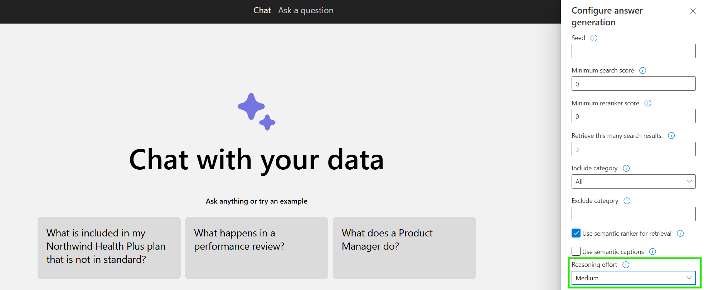
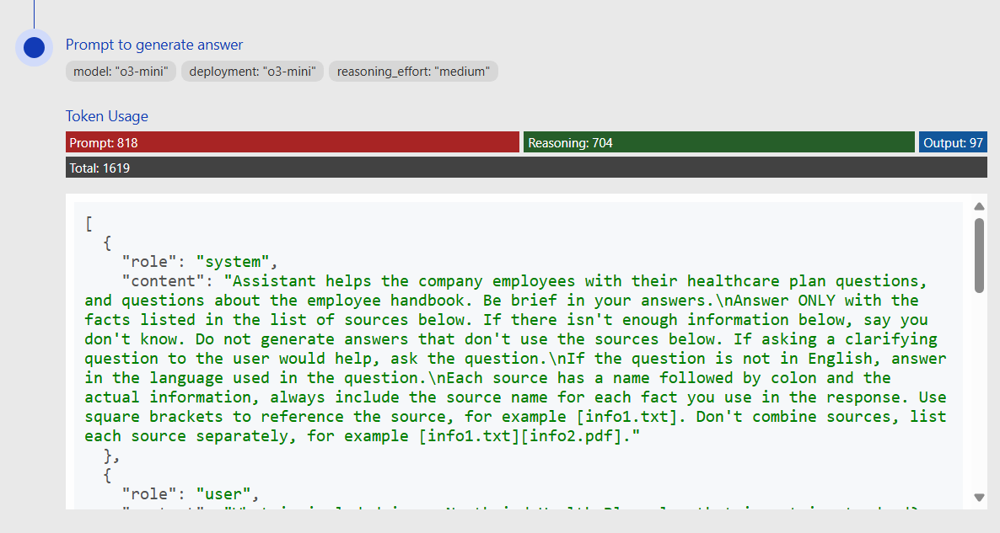

# RAG chat: Using reasoning models

This repository includes an optional feature that uses reasoning models to generate responses based on retrieved content. These models spend more time processing and understanding the user's request.

## Using the feature

### Supported Models

* gpt-5
* gpt-5-mini
* gpt-5-nano
* o4-mini
* o3
* o3-mini
* o1

### Prerequisites

* The ability to deploy a reasoning model in the [supported regions](https://learn.microsoft.com/azure/ai-services/openai/concepts/models#standard-deployment-model-availability). If you're not sure, try to create a o3-mini deployment from your Azure OpenAI deployments page.

### Deployment

1. **Enable reasoning:**

   Set the environment variables for your Azure OpenAI GPT deployments to your reasoning model

   For gpt-5:

   ```shell
   azd env set AZURE_OPENAI_CHATGPT_MODEL gpt-5
   azd env set AZURE_OPENAI_CHATGPT_DEPLOYMENT gpt-5
   azd env set AZURE_OPENAI_CHATGPT_DEPLOYMENT_VERSION 2025-08-07
   azd env set AZURE_OPENAI_CHATGPT_DEPLOYMENT_SKU GlobalStandard
   azd env set AZURE_OPENAI_API_VERSION 2025-04-01-preview
   ```

   For gpt-5-mini:

   ```shell
   azd env set AZURE_OPENAI_CHATGPT_MODEL gpt-5-mini
   azd env set AZURE_OPENAI_CHATGPT_DEPLOYMENT gpt-5-mini
   azd env set AZURE_OPENAI_CHATGPT_DEPLOYMENT_VERSION 2025-08-07
   azd env set AZURE_OPENAI_CHATGPT_DEPLOYMENT_SKU GlobalStandard
   azd env set AZURE_OPENAI_API_VERSION 2025-04-01-preview
   ```

   For gpt-5-nano:

   ```shell
   azd env set AZURE_OPENAI_CHATGPT_MODEL gpt-5-nano
   azd env set AZURE_OPENAI_CHATGPT_DEPLOYMENT gpt-5-nano
   azd env set AZURE_OPENAI_CHATGPT_DEPLOYMENT_VERSION 2025-08-07
   azd env set AZURE_OPENAI_CHATGPT_DEPLOYMENT_SKU GlobalStandard
   azd env set AZURE_OPENAI_API_VERSION 2025-04-01-preview
   ```

   For o4-mini:

   ```shell
   azd env set AZURE_OPENAI_CHATGPT_MODEL o4-mini
   azd env set AZURE_OPENAI_CHATGPT_DEPLOYMENT o4-mini
   azd env set AZURE_OPENAI_CHATGPT_DEPLOYMENT_VERSION 2025-04-16
   azd env set AZURE_OPENAI_CHATGPT_DEPLOYMENT_SKU GlobalStandard
   azd env set AZURE_OPENAI_API_VERSION 2025-04-01-preview
   ```

   For o3:

   ```shell
   azd env set AZURE_OPENAI_CHATGPT_MODEL o3
   azd env set AZURE_OPENAI_CHATGPT_DEPLOYMENT o3
   azd env set AZURE_OPENAI_CHATGPT_DEPLOYMENT_VERSION 2025-04-16
   azd env set AZURE_OPENAI_CHATGPT_DEPLOYMENT_SKU GlobalStandard
   azd env set AZURE_OPENAI_API_VERSION 2025-04-01-preview
   ```

   For o3-mini: (No vision support)

   ```shell
   azd env set AZURE_OPENAI_CHATGPT_MODEL o3-mini
   azd env set AZURE_OPENAI_CHATGPT_DEPLOYMENT o3-mini
   azd env set AZURE_OPENAI_CHATGPT_DEPLOYMENT_VERSION 2025-01-31
   azd env set AZURE_OPENAI_CHATGPT_DEPLOYMENT_SKU GlobalStandard
   azd env set AZURE_OPENAI_API_VERSION 2024-12-01-preview
   ```

   For o1: (No streaming support)

   ```shell
   azd env set AZURE_OPENAI_CHATGPT_MODEL o1
   azd env set AZURE_OPENAI_CHATGPT_DEPLOYMENT o1
   azd env set AZURE_OPENAI_CHATGPT_DEPLOYMENT_VERSION 2024-12-17
   azd env set AZURE_OPENAI_CHATGPT_DEPLOYMENT_SKU GlobalStandard
   azd env set AZURE_OPENAI_API_VERSION 2024-12-01-preview
   ```

2. **(Optional) Set default reasoning effort**

   You can configure how much effort the reasoning model spends on processing and understanding the user's request. Valid options are `minimal` (for GPT-5 models only), `low`, `medium`, and `high`. Reasoning effort defaults to `medium` if not set.

   Set the environment variable for reasoning effort:

   ```shell
   azd env set AZURE_OPENAI_REASONING_EFFORT minimal
   ```

3. **Update the infrastructure and application:**

   Execute `azd up` to provision the infrastructure changes (only the new model, if you ran `up` previously) and deploy the application code with the updated environment variables.

4. **Try out the feature:**

   Open the web app and start a new chat. The reasoning model will be used for all chat completion requests, including the query rewriting step.

5. **Experiment with reasoning effort:**

   Select the developer options in the web app and change "Reasoning Effort" to `low`, `medium`, or `high`. This will override the default reasoning effort of "medium".

   

6. **Understand token usage:**

   The reasoning models use additional billed tokens behind the scenes for the thinking process.
   To see the token usage, select the lightbulb icon on a chat answer. This will open the "Thought process" tab, which shows the reasoning model's thought process and the token usage for each chat completion.

   
