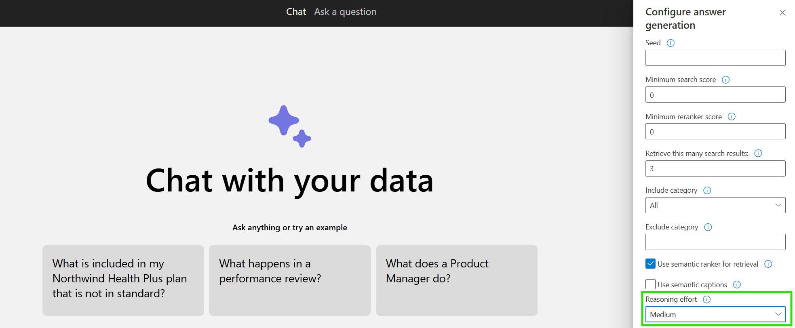

# RAG chat: Using reasoning models

The default model for this repository is gpt-5.4-mini, a reasoning model. Reasoning models spend more time processing and understanding the user's request, leading to higher quality responses. To use this feature, ensure you are deploying a reasoning model, like the gpt-5 series, which is the current default. To switch to a different GPT-5 reasoning model, follow the steps in [Using different chat models](./deploy_features.md#using-different-chat-models).

## Supported models

We support the GPT-5 model family, but not the earlier o-series models, due to API incompatibilities.

## Configuring reasoning

1. **(Optional) Set default reasoning effort**

   You can configure how much effort the reasoning model spends on processing and understanding the user's request. Valid options are `minimal` (for base gpt-5 models), `none`, `low`, `medium`, and `high` (for gpt-5.1+), and `xhigh` (for gpt-5.4+). Reasoning effort defaults to `low` if not set.

   Set the environment variable for reasoning effort:

   ```shell
   azd env set AZURE_OPENAI_REASONING_EFFORT minimal
   ```

2. **Update the infrastructure and application:**

   Execute `azd up` to provision any infrastructure changes (like a changed model) and deploy the application code with the updated environment variables.

3. **Try out the feature:**

   Open the web app and start a new chat. The reasoning model will be used for all Responses API requests, including the query rewriting step.

4. **Experiment with reasoning effort:**

   Select the developer options in the web app and change "Reasoning Effort". The available options depend on the deployed model. This will override the default reasoning effort of "medium".

   

5. **Understand token usage:**

   The reasoning models use additional billed tokens behind the scenes for the thinking process.
   To see the token usage, select the lightbulb icon on a chat answer. This will open the "Thought process" tab, which shows the reasoning model's thought process and the token usage for each response.

   
