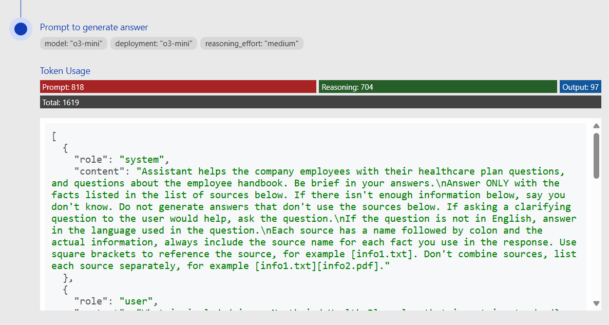

# Czat RAG: Korzystanie z modeli rozumowania

To repozytorium zawiera opcjonalną funkcję, która wykorzystuje modele rozumowania do generowania odpowiedzi na podstawie pobranej zawartości. Te modele spędzają więcej czasu na przetwarzaniu i rozumieniu żądania użytkownika.

## Korzystanie z funkcji

### Obsługiwane modele

* gpt-5
* gpt-5-mini
* gpt-5-nano
* o4-mini
* o3
* o3-mini
* o1

### Wymagania wstępne

* Możliwość wdrożenia modelu rozumowania w [obsługiwanych regionach](https://learn.microsoft.com/azure/ai-services/openai/concepts/models#standard-deployment-model-availability). Jeśli nie jesteś pewien, spróbuj utworzyć wdrożenie o3-mini ze strony wdrożeń Azure OpenAI.

### Wdrożenie

1. **Włącz rozumowanie:**

   Ustaw zmienne środowiskowe dla wdrożeń Azure OpenAI GPT na model rozumowania

   Dla gpt-5:

   ```shell
   azd env set AZURE_OPENAI_CHATGPT_MODEL gpt-5
   azd env set AZURE_OPENAI_CHATGPT_DEPLOYMENT gpt-5
   azd env set AZURE_OPENAI_CHATGPT_DEPLOYMENT_VERSION 2025-08-07
   azd env set AZURE_OPENAI_CHATGPT_DEPLOYMENT_SKU GlobalStandard
   ```

   Dla gpt-5-mini:

   ```shell
   azd env set AZURE_OPENAI_CHATGPT_MODEL gpt-5-mini
   azd env set AZURE_OPENAI_CHATGPT_DEPLOYMENT gpt-5-mini
   azd env set AZURE_OPENAI_CHATGPT_DEPLOYMENT_VERSION 2025-08-07
   azd env set AZURE_OPENAI_CHATGPT_DEPLOYMENT_SKU GlobalStandard
   ```

   Dla gpt-5-nano:

   ```shell
   azd env set AZURE_OPENAI_CHATGPT_MODEL gpt-5-nano
   azd env set AZURE_OPENAI_CHATGPT_DEPLOYMENT gpt-5-nano
   azd env set AZURE_OPENAI_CHATGPT_DEPLOYMENT_VERSION 2025-08-07
   azd env set AZURE_OPENAI_CHATGPT_DEPLOYMENT_SKU GlobalStandard
   ```

   Dla o4-mini:

   ```shell
   azd env set AZURE_OPENAI_CHATGPT_MODEL o4-mini
   azd env set AZURE_OPENAI_CHATGPT_DEPLOYMENT o4-mini
   azd env set AZURE_OPENAI_CHATGPT_DEPLOYMENT_VERSION 2025-04-16
   azd env set AZURE_OPENAI_CHATGPT_DEPLOYMENT_SKU GlobalStandard
   ```

   Dla o3:

   ```shell
   azd env set AZURE_OPENAI_CHATGPT_MODEL o3
   azd env set AZURE_OPENAI_CHATGPT_DEPLOYMENT o3
   azd env set AZURE_OPENAI_CHATGPT_DEPLOYMENT_VERSION 2025-04-16
   azd env set AZURE_OPENAI_CHATGPT_DEPLOYMENT_SKU GlobalStandard
   ```

   Dla o3-mini: (Brak obsługi wizji)

   ```shell
   azd env set AZURE_OPENAI_CHATGPT_MODEL o4-mini
   azd env set AZURE_OPENAI_CHATGPT_DEPLOYMENT o4-mini
   azd env set AZURE_OPENAI_CHATGPT_DEPLOYMENT_VERSION 2025-04-16
   azd env set AZURE_OPENAI_CHATGPT_DEPLOYMENT_SKU GlobalStandard
   ```

   Dla o1: (Brak obsługi strumieniowania)

   ```shell
   azd env set AZURE_OPENAI_CHATGPT_MODEL o1
   azd env set AZURE_OPENAI_CHATGPT_DEPLOYMENT o1
   azd env set AZURE_OPENAI_CHATGPT_DEPLOYMENT_VERSION 2024-12-17
   azd env set AZURE_OPENAI_CHATGPT_DEPLOYMENT_SKU GlobalStandard
   ```

2. **(Opcjonalnie) Ustaw domyślny wysiłek rozumowania**

   Możesz skonfigurować, ile wysiłku model rozumowania poświęca na przetwarzanie i rozumienie żądania użytkownika. Prawidłowe opcje to `minimal` (tylko dla modeli GPT-5), `low`, `medium` i `high`. Wysiłek rozumowania domyślnie wynosi `medium`, jeśli nie jest ustawiony.

   Ustaw zmienną środowiskową dla wysiłku rozumowania:

   ```shell
   azd env set AZURE_OPENAI_REASONING_EFFORT minimal
   ```

3. **Zaktualizuj infrastrukturę i aplikację:**

   Wykonaj `azd up`, aby aprowizować zmiany w infrastrukturze (tylko nowy model, jeśli wcześniej uruchomiłeś `up`) i wdrożyć kod aplikacji ze zaktualizowanymi zmiennymi środowiskowymi.

4. **Wypróbuj funkcję:**

   Otwórz aplikację internetową i rozpocznij nowy czat. Model rozumowania będzie używany do wszystkich żądań zakończenia czatu, w tym kroku przepisywania zapytania.

5. **Eksperymentuj z wysiłkiem rozumowania:**

   Wybierz opcje deweloperskie w aplikacji internetowej i zmień "Reasoning Effort" na `low`, `medium` lub `high`. To zastąpi domyślny wysiłek rozumowania "medium".

   

6. **Zrozum użycie tokenów:**

   Modele rozumowania używają dodatkowych płatnych tokenów w tle dla procesu myślenia.
   Aby zobaczyć użycie tokenów, wybierz ikonę żarówki na odpowiedzi czatu. To otworzy zakładkę "Thought process", która pokazuje proces myślenia modelu rozumowania i użycie tokenów dla każdego zakończenia czatu.

   
