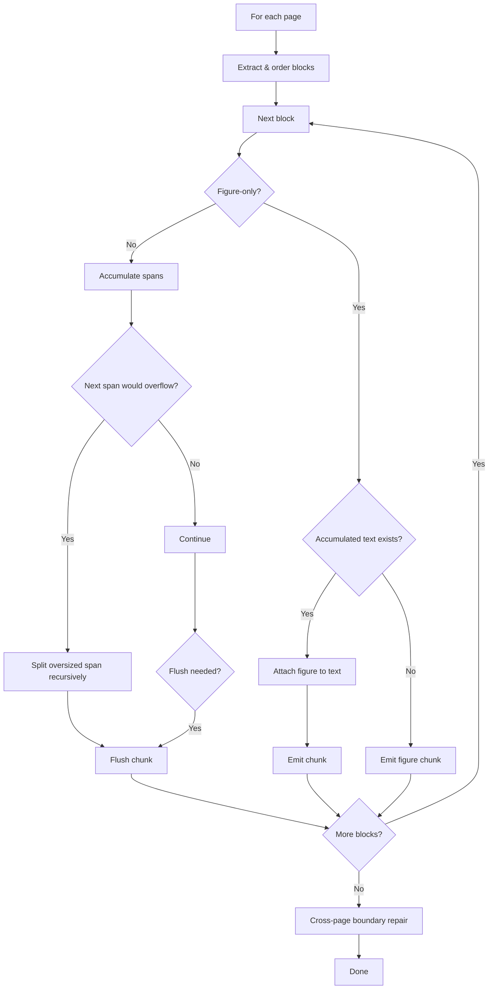
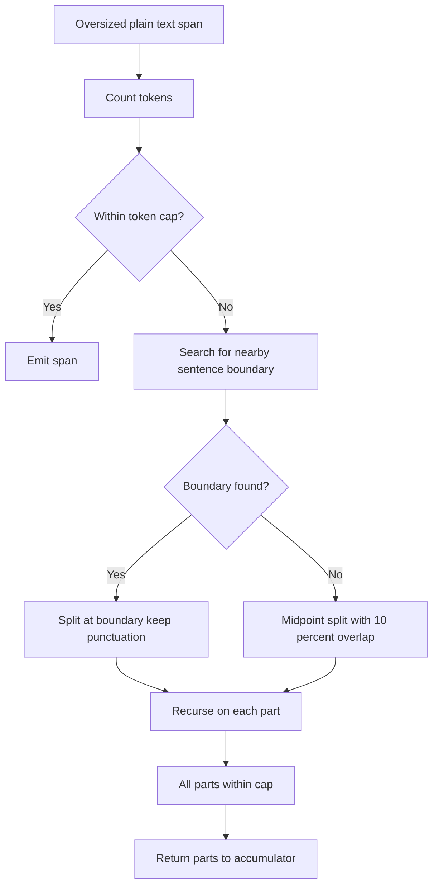

# RAG Chat: Text splitting algorithm overview

This document explains the chunking logic implemented in the [data ingestion pipeline](./data_ingestion.md). The [splitter module](../app/backend/prepdocslib/textsplitter.py) contains both a `SimpleTextSplitter` (used only for JSON files) and a `SentenceTextSplitter` (used for all other formats). This document focuses on the `SentenceTextSplitter` since its approach is far more complicated, and it can be difficult to follow the code.

* [High-level overview](#high-level-overview)
* [Splitting algorithm](#splitting-algorithm)
* [Recursive handling of oversized spans](#recursive-handling-of-oversized-spans)
* [Cross-page boundary repair](#cross-page-boundary-repair)
* [Chunk normalization](#chunk-normalization)
* [Semantic overlap](#semantic-overlap)
* [Examples](#examples)

## High-level overview

The `SentenceTextSplitter` is designed to:

1. Produce semantically coherent chunks that align with sentence boundaries.
2. Respect a maximum token count per chunk (hard limit of 500 tokens) plus a soft character length guideline (default 1,000 characters with a 20% overflow tolerance for merges / normalization). Size limit does not apply to figure blocks (chunks containing a `<figure>` may exceed the token limit; figures are never split).
3. Keep structural figure placeholders (`<figure>...</figure>`) atomic: never split internally and always attach them to preceding accumulated text if any exists.
4. Repair mid‑sentence page breaks when possible, while enforcing token + soft character budgets.
5. Avoid empty outputs or unclosed figure tags.
6. Perform a light normalization pass (trim only minimal leading/trailing whitespace that would cause small overflows; do not modify figure chunks).

The splitter includes these components:

* Pre-processing of figures: figure blocks are extracted first and treated as atomic before any span splitting or recursion on plain text.
* An accumulator that appends sentence‑like spans until the next addition would breach character or token limits, then flushes a chunk. Default hard token cap is 500 per chunk. Sentence segmentation is based on sentence-ending punctuation ( `. ! ?` plus CJK equivalents).
* [Recursive subdivision of oversized individual spans](#recursive-handling-of-oversized-spans) based on first looking for a sentence boundary, then a word break, and falling back to a midpoint split with overlap.
* [Cross‑page merge of text chunks](#cross-page-boundary-repair) when combined size fits within the allowed chunk size; otherwise a trailing sentence segment may be shifted forward to the next chunk.
* [A pass that adds semantic overlap](#semantic-overlap) to each chunk by appending a trimmed prefix of the next chunk (10% of max section length) onto the end of the previous chunk. The next chunk itself is left unchanged. Figures are never overlapped or duplicated.

## Splitting algorithm



The diagram uses this terminology to describe the units at different stages:

* **Block**: Either one intact `<figure>...</figure>` element (figure‑only) or a contiguous figure‑free text segment (may contain multiple sentences). Blocks never cross page boundaries.
* **Span**: A sentence‑like slice derived from a text block.
* **Chunk**: An emitted output, which will get indexed individually in Azure AI Search. A chunk may consist of one or more spans, a figure, or text plus an attached figure.

## Recursive handling of oversized spans

When a span is too large, recursive splitting applies. After figure extraction, recursion applies only to plain text spans (there is no separate figure-aware recursion path).

Steps:

1. Measure token count for the span.
2. If within the token cap, emit it as-is (subject to normal accumulation logic).
3. Otherwise, search outward from the midpoint (within the central third of the text) first for a sentence-ending punctuation boundary.
4. If none is found, search the same window for a word-break character (space or supported punctuation) to avoid splitting inside a word.
5. If a boundary is found (sentence or word break), split just after that character (it remains in the first half) and recurse on each half.
6. If no acceptable boundary is found within the search window, split at the midpoint with a symmetric 10% overlap. The overlap portion appears duplicated: once at the end of the first half and again at the start of the second.
7. Recurse until all pieces are within the token cap.

> Note: The 10% overlap is computed on raw character length (`len(text)`), not tokens, so the duplicated region is 2 × floor(0.10 * character_count) characters. Token counts can differ across the two halves.
> Clarification: Recursion is triggered only when the *span itself* exceeds the token cap. If adding a span to the current accumulator would overflow but the span alone fits, the accumulator is flushed—recursion is not used in that case.



## Cross-page boundary repair

Page boundaries frequently slice a sentence in half, due to the way PDFs and other document formats handle text layout. The repair phase tries to re‑stitch this so downstream retrieval does not see an artificial break.

There are two strategies, attempted in order:

1. Full merge (ideal path)
2. Trailing sentence fragment carry‑forward

### 1. Full merge

We first try to simply glue the last chunk of Page N to the first chunk of Page N+1. This is only allowed when ALL of these hold:

* Previous chunk does not already end in sentence‑terminating punctuation.
* First new chunk starts with a lowercase letter (heuristic for continuation), is not detected as a heading / list, and does not begin with a `<figure>`.
* The concatenated text fits BOTH: token limit (500) AND soft length budget (<= 1.2 × 1000 chars after normalization).

If all pass, the two chunks are merged into one, with an injected whitespace between them if necessary.

### 2. Trailing sentence fragment carry‑forward

If a full merge would violate limits, we do a more surgical repair: pull only the dangling sentence fragment from the end of the previous chunk and move it forward so it reunites with its continuation at the start of the next page.

Key differences from semantic overlap:

* Carry‑forward MOVES text (no duplication except any recursive split overlap that may occur later). Semantic overlap DUPLICATES a small preview from the next chunk.
* Carry‑forward only activates across a page boundary when a full merge is too large. Semantic overlap is routine and size‑capped.

## Chunk normalization

After chunk assembly and any cross-page merging logic, a normalization step applies:

* Figure-containing chunks are left completely untouched (treated as atomic units).
* Leading spaces are trimmed only if they alone cause the chunk to exceed the soft character budget.
* If a chunk is just a few characters (≤ 3) over the soft limit due solely to trailing whitespace, that trailing whitespace is stripped.
* No aggressive reflow or internal whitespace collapsing is performed; the intent is to preserve original formatting while preventing trivial overflows created by boundary adjustments.

## Semantic overlap

To boost recall, each chunk (except the very last in the stream) tries to borrow a small forward-looking sliver from the start of the following chunk. That sliver is appended to the end of the earlier chunk; the later chunk itself stays pristine so sentence boundaries remain clean for highlighting.

How it works:

* Size: About one tenth of the configured max character length is targeted.
* Source: Always taken from the beginning of the next chunk (never from the tail of the previous one).
* Boundary seeking: The algorithm may extend a little past the initial slice to end on sentence punctuation (preferred) or, failing that, a word break; if neither appears it trims back partial trailing words.
* When applied:
  * Always between adjacent non‑figure chunks on the same page.
  * Across a page boundary only if the prior chunk ends mid‑sentence, the next starts lowercase, and the next line doesn’t look like a heading or figure.
* Safety limits: Skipped or shrunk if adding it would breach token or soft character limits (with a modest overflow allowance); trimmed at natural breaks until it fits.
* Figures: Any chunk containing a `<figure>` is excluded (no giving or receiving overlap).
* De‑duplication: If the earlier chunk already ends with the would‑be prefix, nothing is added.

Difference from the recursive split overlap: recursive overlap is a fallback used only when breaking a single oversized span with no safe boundary— it duplicates a midpoint region in both resulting pieces. Semantic overlap, by contrast, is a one‑directional "look‑ahead" duplication added after chunks are otherwise finalized.

## Examples

Each example shows the raw input first, then the emitted output chunks. For brevity, these examples use a smaller token limit than the actual limit of 500 tokens per chunk.

### Example 1: Simple page

⬅️ **Input:**

```text
Sentence one. Sentence two is slightly longer. Final short one.
```

➡️ **Output (1 chunk):**

```text
Chunk 0:
Sentence one. Sentence two is slightly longer. Final short one.
```

💬 **Explanation:**

All sentences fit within limits so a single chunk is emitted.

### Example 2: Atomic block in middle

⬅️ **Input:**

```text
Heading line
Intro before the figure. <figure></figure> Text that follows the figure. Another sentence.
```

➡️ **Output (2 chunks):**

```text
Chunk 0:
Heading line
Intro before the figure. <figure></figure>

Chunk 1:
Text that follows the figure. Another sentence.
```

💬 **Explanation:**

Figure remains atomic and is attached to the preceding text; subsequent text flows into the next chunk.

### Example 3: Oversized single span requiring recursive midpoint overlap split

⬅️ **Input (single very long span without nearby punctuation):**

```text
ABCDEFGHIJKLMNOPQRSTUVWXYZabcdefghijklmnopqrstuvwxyz0123456789ABCDEFGHIJKLMNOPQRSTUVWXYZabcdefghijklmnopqrstuvwxyz0123456789
```

➡️ **Output (2 chunks with duplicated 24-char overlap):**

```text
Chunk 0:
ABCDEFGHIJKLMNOPQRSTUVWXYZabcdefghijklmnopqrstuvwxyz0123456789ABCDEFGHIJKL

Chunk 1:
yz0123456789ABCDEFGHIJKLMNOPQRSTUVWXYZabcdefghijklmnopqrstuvwxyz0123456789
```

💬 **Explanation:**

Original length = 124; recursive-fallback overlap = int(124 x 0.10) = 12. Duplicated region length = 2 x overlap = 24 characters: `yz0123456789ABCDEFGHIJKL` (end of Chunk 0 and start of Chunk 1) providing continuity when no sentence boundary was near midpoint.

### Example 3b: Oversized span with word-break fallback

⬅️ **Input (long span lacking sentence punctuation but containing spaces):**

```text
alpha beta gamma delta epsilon zeta eta theta iota kappa lambda ... (continues)
```

➡️ **Output (first split falls on a space, not an arbitrary midpoint overlap):**

```text
Chunk 0:
alpha beta gamma delta epsilon zeta eta

Chunk 1:
theta iota kappa lambda ...
```

💬 **Explanation:**
No sentence-ending punctuation lies near the midpoint, but a space (word break) does, so the splitter chooses that boundary instead of generating a duplicated 10% overlap.

### Example 4: Cross-page merge

⬅️ **Page A:**

```text
The procedure continues to operate
```

⬅️ **Page B:**

```text
under heavy load and completes successfully. Follow-up sentence.
```

➡️ **Output:**

```text
Chunk 0:
The procedure continues to operate under heavy load and completes successfully.

Chunk 1:
Follow-up sentence.
```

💬 **Explanation:**

Mid-sentence boundary satisfied merge conditions; remainder forms a second chunk.

### Example 5: Trailing sentence fragment carry‑forward when merge too large

⬅️ **Page A:**

```text
Intro sentence finishes here. This clause is long but near the limit and the following portion would push it over
```

⬅️ **Page B:**

```text
so the trailing fragment carry‑forward moves this trailing portion forward. Remaining context continues here.
```

➡️ **Output:**

```text
Chunk 0:
Intro sentence finishes here.

Chunk 1:
This clause is long but near the limit and the following portion would push it over so the trailing fragment carry‑forward moves this trailing portion forward. Remaining context continues here.
```

💬 **Explanation:**

A full merge would exceed size limits, so the unfinished clause from the end of Page A is shifted to the start of the next chunk.
