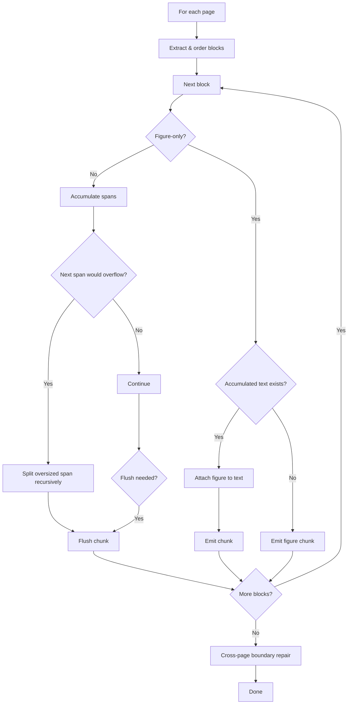
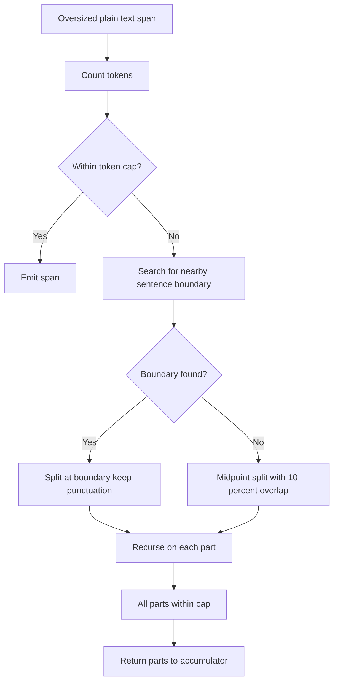

# Czat RAG: Przegląd algorytmu dzielenia tekstu

Ten dokument wyjaśnia logikę dzielenia na fragmenty zaimplementowaną w [potoku pozyskiwania danych](./data_ingestion.pl.md). [Moduł splitter](../app/backend/prepdocslib/textsplitter.py) zawiera zarówno `SimpleTextSplitter` (używany tylko dla plików JSON), jak i `SentenceTextSplitter` (używany dla wszystkich innych formatów). Ten dokument koncentruje się na `SentenceTextSplitter`, ponieważ jego podejście jest znacznie bardziej skomplikowane i może być trudne do śledzenia w kodzie.

* [Ogólny przegląd](#ogólny-przegląd)
* [Algorytm dzielenia](#algorytm-dzielenia)
* [Rekurencyjne obsługiwanie zbyt dużych zakresów](#rekurencyjne-obsługiwanie-zbyt-dużych-zakresów)
* [Naprawa granic między stronami](#naprawa-granic-między-stronami)
* [Normalizacja fragmentów](#normalizacja-fragmentów)
* [Nakładanie semantyczne](#nakładanie-semantyczne)
* [Przykłady](#przykłady)

## Ogólny przegląd

`SentenceTextSplitter` został zaprojektowany, aby:

1. Produkować semantycznie spójne fragmenty, które są wyrównane z granicami zdań.
2. Respektować maksymalną liczbę tokenów na fragment (twardy limit 500 tokenów) plus miękkie wytyczne dotyczące długości znaków (domyślnie 1000 znaków z 20% tolerancją przepełnienia dla scalania / normalizacji). Limit rozmiaru nie ma zastosowania do bloków figur (fragmenty zawierające `<figure>` mogą przekroczyć limit tokenów; figury nigdy nie są dzielone).
3. Utrzymywać strukturalne zastępcze figury (`<figure>...</figure>`) jako atomowe: nigdy nie dzielić wewnętrznie i zawsze dołączać je do poprzedniego zgromadzonego tekstu, jeśli taki istnieje.
4. Naprawiać przerwy stron w środku zdania, gdy to możliwe, przy jednoczesnym egzekwowaniu budżetów tokenów + miękkich znaków.
5. Unikać pustych wyjść lub niezamkniętych tagów figur.
6. Przeprowadzać lekki przebieg normalizacji (przycinać tylko minimalną początkową/końcową białą przestrzeń, która powodowałaby małe przepełnienia; nie modyfikować fragmentów figur).

Splitter zawiera te komponenty:

* Wstępne przetwarzanie figur: bloki figur są najpierw wyodrębniane i traktowane jako atomowe przed jakimkolwiek dzieleniem zakresu lub rekursją na zwykłym tekście.
* Akumulator, który dodaje zakresy podobne do zdań, dopóki następne dodanie nie naruszy limitów znaków lub tokenów, a następnie wypróżnia fragment. Domyślny twardy limit tokenów wynosi 500 na fragment. Segmentacja zdań opiera się na interpunkcji kończącej zdanie (`. ! ?` plus ekwiwalenty CJK).
* [Rekurencyjne podział zbyt dużych poszczególnych zakresów](#rekurencyjne-obsługiwanie-zbyt-dużych-zakresów) w oparciu o najpierw szukanie granicy zdania, następnie przerwy między wyrazami i powrót do podziału w punkcie środkowym z nakładaniem.
* [Scalanie fragmentów tekstu między stronami](#naprawa-granic-między-stronami), gdy połączony rozmiar mieści się w dozwolonym rozmiarze fragmentu; w przeciwnym razie końcowy segment zdania może zostać przesunięty do przodu do następnego fragmentu.
* [Przebieg dodający nakładanie semantyczne](#nakładanie-semantyczne) do każdego fragmentu poprzez dołączenie przyciętego prefiksu następnego fragmentu (10% maksymalnej długości sekcji) na koniec poprzedniego fragmentu. Sam następny fragment pozostaje niezmieniony. Figury nigdy nie są nakładane ani duplikowane.

## Algorytm dzielenia



Diagram używa tej terminologii do opisania jednostek na różnych etapach:

* **Block (Blok)**: Albo jeden nienaruszony element `<figure>...</figure>` (tylko figura), albo ciągły segment tekstu wolny od figur (może zawierać wiele zdań). Bloki nigdy nie przekraczają granic stron.
* **Span (Zakres)**: Wycinek podobny do zdania pochodzący z bloku tekstu.
* **Chunk (Fragment)**: Wyemitowane wyjście, które zostanie indywidualnie zaindeksowane w Azure AI Search. Fragment może składać się z jednego lub więcej zakresów, figury lub tekstu plus dołączonej figury.

## Rekurencyjne obsługiwanie zbyt dużych zakresów

Gdy zakres jest zbyt duży, stosuje się rekurencyjne dzielenie. Po ekstrakcji figur rekursja ma zastosowanie tylko do zakresów zwykłego tekstu (nie ma oddzielnej ścieżki rekursji świadomej figur).

Kroki:

1. Zmierz liczbę tokenów dla zakresu.
2. Jeśli mieści się w limicie tokenów, wyemituj go w obecnej postaci (podlega normalnej logice akumulacji).
3. W przeciwnym razie przeszukaj na zewnątrz od punktu środkowego (w środkowej trzeciej części tekstu) najpierw w poszukiwaniu granicy interpunkcji kończącej zdanie.
4. Jeśli nie zostanie znaleziona, przeszukaj to samo okno w poszukiwaniu znaku przerwy między wyrazami (spacja lub obsługiwana interpunkcja), aby uniknąć dzielenia wewnątrz wyrazu.
5. Jeśli granica zostanie znaleziona (zdanie lub przerwa między wyrazami), podziel tuż po tym znaku (pozostaje w pierwszej połowie) i rekurencyjnie przetwórz każdą połowę.
6. Jeśli w oknie wyszukiwania nie zostanie znaleziona akceptowalna granica, podziel w punkcie środkowym z symetrycznym 10% nakładaniem. Część nakładająca się pojawia się zduplikowana: raz na końcu pierwszej połowy i ponownie na początku drugiej.
7. Rekurencyjnie przetwarzaj, aż wszystkie części będą w limicie tokenów.

> Uwaga: 10% nakładanie jest obliczane na surowej długości znaków (`len(text)`), nie tokenach, więc zduplikowany region ma 2 × floor(0.10 * liczba_znaków) znaków. Liczba tokenów może różnić się w obu połowach.
> Wyjaśnienie: Rekursja jest wyzwalana tylko wtedy, gdy *sam zakres* przekracza limit tokenów. Jeśli dodanie zakresu do bieżącego akumulatora spowodowałoby przepełnienie, ale sam zakres się mieści, akumulator jest opróżniany — rekursja nie jest w tym przypadku używana.



## Naprawa granic między stronami

Granice stron często dzielą zdanie na pół, ze względu na sposób, w jaki pliki PDF i inne formaty dokumentów obsługują układ tekstu. Faza naprawy próbuje to ponownie zszyć, aby wyszukiwanie downstream nie widziało sztucznej przerwy.

Istnieją dwie strategie, próbowane w kolejności:

1. Pełne scalanie (idealna ścieżka)
2. Przenoszenie końcowego fragmentu zdania do przodu

### 1. Pełne scalanie

Najpierw próbujemy po prostu skleić ostatni fragment Strony N z pierwszym fragmentem Strony N+1. Jest to dozwolone tylko wtedy, gdy WSZYSTKIE z poniższych są prawdziwe:

* Poprzedni fragment nie kończy się już interpunkcją kończącą zdanie.
* Pierwszy nowy fragment zaczyna się od małej litery (heurystyka dla kontynuacji), nie jest wykrywany jako nagłówek / lista i nie zaczyna się od `<figure>`.
* Połączony tekst mieści się ZARÓWNO: w limicie tokenów (500) I miękkiego budżetu długości (<= 1.2 × 1000 znaków po normalizacji).

Jeśli wszystkie przechodzą, dwa fragmenty są scalane w jeden, z wstrzykniętą białą przestrzenią między nimi, jeśli to konieczne.

### 2. Przenoszenie końcowego fragmentu zdania do przodu

Jeśli pełne scalanie naruszyłoby limity, wykonujemy bardziej chirurgiczną naprawę: wyciągamy tylko wiszący fragment zdania z końca poprzedniego fragmentu i przenosimy go do przodu, aby połączył się z jego kontynuacją na początku następnej strony.

Kluczowe różnice w stosunku do nakładania semantycznego:

* Przenoszenie do przodu PRZENOSI tekst (brak duplikacji z wyjątkiem ewentualnego nakładania rekurencyjnego podziału, które może wystąpić później). Nakładanie semantyczne DUPLIKUJE małą zapowiedź z następnego fragmentu.
* Przenoszenie do przodu aktywuje się tylko przez granicę strony, gdy pełne scalanie jest zbyt duże. Nakładanie semantyczne jest rutynowe i ograniczone rozmiarem.

## Normalizacja fragmentów

Po złożeniu fragmentu i wszelkiej logice scalania między stronami stosuje się krok normalizacji:

* Fragmenty zawierające figury są całkowicie nietknięte (traktowane jako jednostki atomowe).
* Początkowe spacje są przycinane tylko wtedy, gdy same powodują przekroczenie miękkiego budżetu znaków przez fragment.
* Jeśli fragment jest tylko kilka znaków (≤ 3) powyżej miękkiego limitu wyłącznie z powodu końcowej białej przestrzeni, ta końcowa biała przestrzeń jest usuwana.
* Nie wykonuje się agresywnego przepływania ani zwijania wewnętrznej białej przestrzeni; intencją jest zachowanie oryginalnego formatowania przy jednoczesnym zapobieganiu trywialnym przepełnieniom utworzonym przez dostosowania granic.

## Nakładanie semantyczne

Aby zwiększyć recall, każdy fragment (z wyjątkiem ostatniego w strumieniu) próbuje pożyczyć mały fragment wyprzedzający z początku następnego fragmentu. Ten fragment jest dołączany na końcu wcześniejszego fragmentu; sam późniejszy fragment pozostaje nieskazitelny, więc granice zdań pozostają czyste dla podświetlania.

Jak to działa:

* Rozmiar: Około jedna dziesiąta skonfigurowanej maksymalnej długości znaków jest targetowana.
* Źródło: Zawsze brane z początku następnego fragmentu (nigdy z końca poprzedniego).
* Szukanie granic: Algorytm może rozszerzyć się nieco poza początkowy wycinek, aby zakończyć na interpunkcji zdania (preferowane) lub, jeśli to się nie uda, przerwie między wyrazami; jeśli żadne nie pojawi się, przycina z powrotem częściowe końcowe wyrazy.
* Kiedy stosowane:
  * Zawsze między sąsiednimi fragmentami nie-figur na tej samej stronie.
  * Przez granicę strony tylko wtedy, gdy poprzedni fragment kończy się w środku zdania, następny zaczyna się małą literą, a następna linia nie wygląda jak nagłówek lub figura.
* Limity bezpieczeństwa: Pomijane lub zmniejszane, jeśli dodanie go naruszyłoby limity tokenów lub miękkich znaków (ze skromnym zapasem przepełnienia); przycinane na naturalnych przerwach, dopóki nie pasuje.
* Figury: Każdy fragment zawierający `<figure>` jest wykluczony (ani nie daje, ani nie otrzymuje nakładania).
* De-duplikacja: Jeśli wcześniejszy fragment już kończy się na potencjalnym prefiksie, nic nie jest dodawane.

Różnica w stosunku do rekurencyjnego nakładania podziału: rekurencyjne nakładanie jest awaryjnym rozwiązaniem używanym tylko przy łamaniu pojedynczego zbyt dużego zakresu bez bezpiecznej granicy — duplikuje region punktu środkowego w obu wynikowych częściach. Nakładanie semantyczne, w przeciwieństwie, jest jednokierunkową duplikacją "spojrzenia w przód" dodawaną po tym, jak fragmenty są w inny sposób sfinalizowane.

## Przykłady

Każdy przykład pokazuje najpierw surowe wejście, a następnie wyemitowane fragmenty wyjściowe. Dla zwięzłości te przykłady używają mniejszego limitu tokenów niż rzeczywisty limit 500 tokenów na fragment.

### Przykład 1: Prosta strona

⬅️ **Wejście:**

```text
Sentence one. Sentence two is slightly longer. Final short one.
```

➡️ **Wyjście (1 fragment):**

```text
Chunk 0:
Sentence one. Sentence two is slightly longer. Final short one.
```

💬 **Wyjaśnienie:**

Wszystkie zdania mieszczą się w limitach, więc emitowany jest pojedynczy fragment.

### Przykład 2: Atomowy blok w środku

⬅️ **Wejście:**

```text
Heading line
Intro before the figure. <figure></figure> Text that follows the figure. Another sentence.
```

➡️ **Wyjście (2 fragmenty):**

```text
Chunk 0:
Heading line
Intro before the figure. <figure></figure>

Chunk 1:
Text that follows the figure. Another sentence.
```

💬 **Wyjaśnienie:**

Figura pozostaje atomowa i jest dołączona do poprzedniego tekstu; kolejny tekst przepływa do następnego fragmentu.

### Przykład 3: Zbyt duży pojedynczy zakres wymagający rekurencyjnego nakładania podziału w punkcie środkowym

⬅️ **Wejście (pojedynczy bardzo długi zakres bez pobliskiej interpunkcji):**

```text
ABCDEFGHIJKLMNOPQRSTUVWXYZabcdefghijklmnopqrstuvwxyz0123456789ABCDEFGHIJKLMNOPQRSTUVWXYZabcdefghijklmnopqrstuvwxyz0123456789
```

➡️ **Wyjście (2 fragmenty ze zduplikowanym 24-znakowym nakładaniem):**

```text
Chunk 0:
ABCDEFGHIJKLMNOPQRSTUVWXYZabcdefghijklmnopqrstuvwxyz0123456789ABCDEFGHIJKL

Chunk 1:
yz0123456789ABCDEFGHIJKLMNOPQRSTUVWXYZabcdefghijklmnopqrstuvwxyz0123456789
```

💬 **Wyjaśnienie:**

Oryginalna długość = 124; rekurencyjne nakładanie awaryjne = int(124 x 0.10) = 12. Długość zduplikowanego regionu = 2 x nakładanie = 24 znaki: `yz0123456789ABCDEFGHIJKL` (koniec Chunk 0 i początek Chunk 1) zapewniając ciągłość, gdy żadna granica zdania nie była blisko punktu środkowego.

### Przykład 3b: Zbyt duży zakres z awaryjnym przerwaniem między wyrazami

⬅️ **Wejście (długi zakres bez interpunkcji zdania, ale zawierający spacje):**

```text
alpha beta gamma delta epsilon zeta eta theta iota kappa lambda ... (continues)
```

➡️ **Wyjście (pierwszy podział przypada na spację, a nie dowolne nakładanie punktu środkowego):**

```text
Chunk 0:
alpha beta gamma delta epsilon zeta eta

Chunk 1:
theta iota kappa lambda ...
```

💬 **Wyjaśnienie:**
Żadna interpunkcja kończąca zdanie nie leży blisko punktu środkowego, ale spacja (przerwa między wyrazami) tak, więc splitter wybiera tę granicę zamiast generować zduplikowane 10% nakładanie.

### Przykład 4: Scalanie między stronami

⬅️ **Strona A:**

```text
The procedure continues to operate
```

⬅️ **Strona B:**

```text
under heavy load and completes successfully. Follow-up sentence.
```

➡️ **Wyjście:**

```text
Chunk 0:
The procedure continues to operate under heavy load and completes successfully.

Chunk 1:
Follow-up sentence.
```

💬 **Wyjaśnienie:**

Granica w środku zdania spełniła warunki scalania; reszta tworzy drugi fragment.

### Przykład 5: Przenoszenie końcowego fragmentu zdania do przodu, gdy scalanie jest zbyt duże

⬅️ **Strona A:**

```text
Intro sentence finishes here. This clause is long but near the limit and the following portion would push it over
```

⬅️ **Strona B:**

```text
so the trailing fragment carry‑forward moves this trailing portion forward. Remaining context continues here.
```

➡️ **Wyjście:**

```text
Chunk 0:
Intro sentence finishes here.

Chunk 1:
This clause is long but near the limit and the following portion would push it over so the trailing fragment carry‑forward moves this trailing portion forward. Remaining context continues here.
```

💬 **Wyjaśnienie:**

Pełne scalanie przekroczyłoby limity rozmiaru, więc niezakończona klauzula z końca Strony A jest przesunięta na początek następnego fragmentu.
